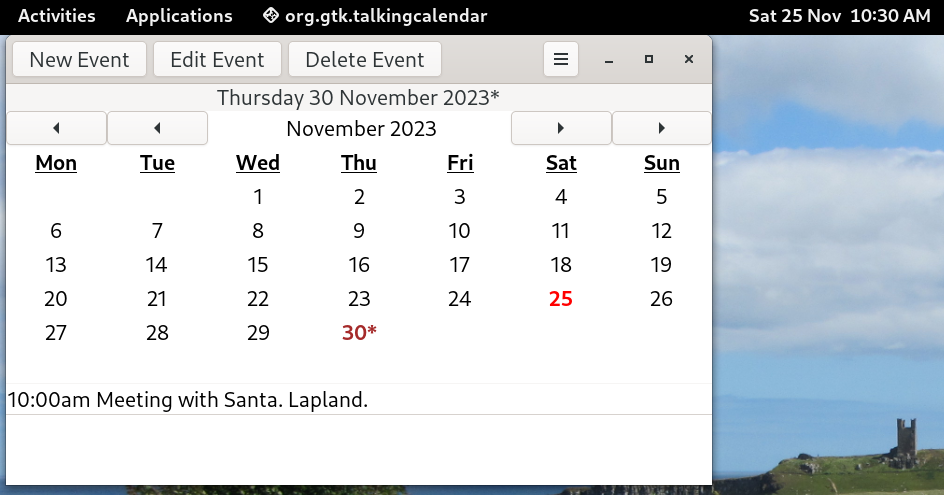
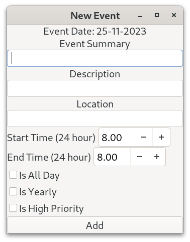
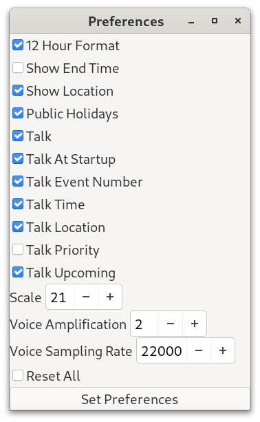
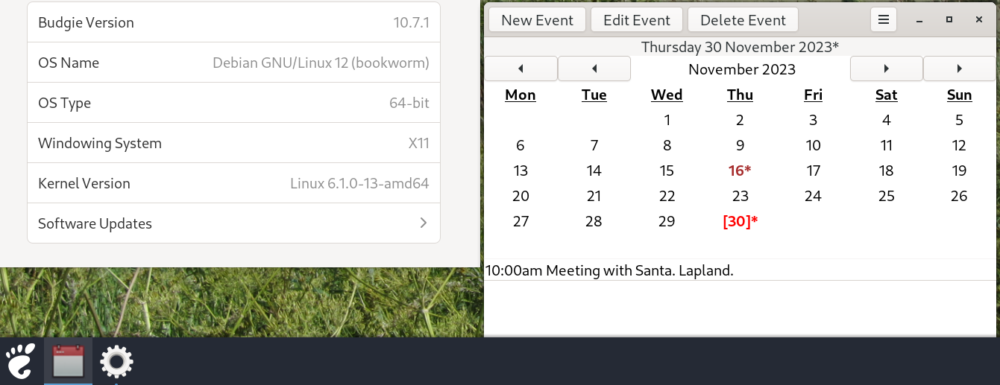

# Talking Calendar

Talking Calendar is a desktop calendar for Linux which has some speech capability. It has been developed using C and [GTK4](https://docs.gtk.org/gtk4/). It uses a built-in diphone speech synthesizer.



## Core Features

* built with C and GTK 4.8.3 (Debian 12)
* bespoke custom calendar which allows dates with events to be marked up
* event summary, location, start and end time can be entered and edited
* priority and is-yearly can be used
* Sqlite3 database used to store events
* built-in diphone speech synthesizer
* binary for 64-bit GTK4 distributions using GTK4.8 (Debian 12)

## Deployment

### Prebuilt Binary

A 64 bit prebuilt binary is available and can be downloaded from the binary directory and can be used with Linux distributions that have GTK4 4.8 (or below) in their repositories such as Ubuntu 22.04, Debian 12 Bookworm, Fedora 35 onwards etc.

Extract the downloaded file which contains the Talking Calendar executable and diphones directory which should be located in the working directory.

Talking Calendar uses an Sqlite3 database for storing events. Sqlite is normally installed by default. With Debian (Ubuntu) based distributions you can check the version of Sqlite installed on your system using the terminal command below.

```
apt policy sqlite3
```

Talking Calendar can also display this information. Use menu->Information. 

Assuming that the GTK4 base libraries are installed the Talking Calendar binary can be run from the terminal using:

```
./talkingcalendar
```

or double click on the "talkingcalendar" file. Make sure it has executable permissions. Right click on it, then select permissions and ensure "Allow executing file as program" is selected. Audio output requires that the alsa-utils package is installed (this is usually installed by default). 

Use a menu editor such as [MenuLibre](https://github.com/bluesabre/menulibre) to create a launcher for Talking Calendar which allows the working directory to be chosen. The calendar database called "calendar.db" is located in the working directory. You can use the information menu item to show the current working directory where the events database should be located.

Alternatively modify the "talkingcalendar.desktop" file provided in the download using your user name and application location and copy it to the ***.local/share/applications/*** directory.


## Calendar Usage

### Adding New Event

* Select event date using the calendar
* Click the New button on the header bar to invoke the "New Event" window
* Enter the event summary (e.g. birthday, anniversary, doctor, dentist etc.)
* Enter the description (optional)
* Enter the location (optional)
* Enter start and end times (or all day)
* Events are sorted by start time when displayed
* Navigate through the year using the calendar to add events



### Editing Existing Event

* Select the event in the list view and click the Edit button on the header bar to edit
* Change details as appropriate

### Preferences

* Use the Preferences window in the hamburger menu to change  options



You can use 12 hour format and event end-times can be shown in the list view. If public holidays is selected then the date label shows the public holiday (UK only) which is also spoken.

Talk options can be changed.

## Talking

* Press spacebar to speak the date and event summary.

### Information

* Use the Information window to show the current working directory (in which the sqlite calendar.db file should be stored) and other system information such as the system font being used. 

* Use the About dialog to display current version.

### Keyboard Shortcuts

```
Speak           Spacebar
Today           Home Key
```

## Startup Applications

Add Talking Calendar to your start-up programs to read out the date and any event details when the computer is switched on.

With GNOME based desktops use the GNOME "Tweak Tool" to add Talking Calendar to your startup applications if required.

## How is Speech Generated?

Words are formed as sequences of elementary speech units. A phoneme is the smallest unit of sound that distinguishes one word from another word and there are 44 phonemes in the English language. A diphone is a sound unit composed of two adjacent partial phonemes i.e. the second half of the first phoneme and the first half of the second phoneme. The synthesizer uses a set of pre-recorded diphone sound samples and concatenates diphone wav files to produce speech output for a given text input.

The folder containing the diphone wav files should be placed into the application binary (executable) working directory. The diphone collection was created by Alan W Black and Kevin Lenzo and more information can be found using the links in the Acknowledgements. The diphone license can be found [here](https://github.com/hypnaceae/DiphoneSynth/blob/master/diphones_license.txt).

The diphone speech synthesizer uses a small dictionary of approximately 56,600 English words. If a word is not recognised by the dictionary it is skipped over. More words will be added in future updates.

### Events Database

Events are stored in an [Sqlite](https://www.sqlite.org/index.html) database. SQLite is a small, fast and full-featured SQL database engine written in C. 

### Backup Restore Events Database

A first attempt of a backup and restore system has been implemented in case the Sqlite events database becomes corrupted (e.g. by using another external program to open it or by attempting to vacuum it). You should backup your events by using the export to CSV file menu item which will create an events.csv file in the working directory (keep this safe and make another copy if necessary). If you then corrupt your database, you can clear all events from the Sqlite database and then use the import from  CSV restore option. If you completely corrupt your Sqlite database called calendar.db then rename it and restart Talking Calendar which will create a new empty database and restore into this. 

I have not tested what will happen if you attempt to vacuum your database externally and then restart Talking Calendar with this.

## Build From Source

The C source code for the Talking Calendar project is provided in the src directory.

[Geany](https://www.geany.org/) can be used as a source code editor for opening, viewing and then compiling the Talking Calendar C code. Geany is lightweight and has an integrated terminal for building the application.

You need the GTK4 development libraries and the gcc compiler. The code has been compiled using GTK 4.6.9 amd64 (Ubuntu 22.04). To determine which version of GTK4 is running on a Linux system use the following terminal command.

```
dpkg -l | grep libgtk*
```

To build Talking Calendar you also need the Sqlite3 development libraries. With Debian and Ubuntu you install these using the commands below.

```
sudo apt install sqlite3
sudo apt install libsqlite3-dev
```

To check the installed version use the command below.

```
sqlite3 --version
```

### Building on Ubuntu and Debian Bookworm

With both  Debian Bookworm and Ubuntu and you need to install the following packages to compile Talking Calendar.

```
apt install build-essential
apt install libgtk-4-dev
apt install libasound2-dev
```

The packages:

```
apt install libglib2.0-dev
apt install alsa-utils
```

are needed but should be installed by default.

With Ubuntu 22.04 the base GTK4 libraries are installed by default. With other Ubuntu based distributions (spins) you may have to install these using the command below.

```
sudo apt install libgtk-4-1
```

Use the MAKEFILE to compile.

```
make
./talkingcalendar
```

Audio requires that the diphone directory containing the diphone wav files be located in the working directory. Example diphones are included  but you can create you own.

### Building on Fedora

With Fedora you need to install the following packages to compile Talking Calendar.

```
sudo dnf install gtk4-devel
sudo dnf install gtk4-devel-docs
sudo dnf install glib-devel
sudo dnf install alsa-lib-devel
```

### Roadmap

* ~~backend sqlite database~~ (done)
* ~~backup and restore database (export/import csv file)~~ (done)
* remove GTK4 classes being depreciated (ongoing - see below)
* check and read out upcoming events (basic code structure completed)
* ~~public holiday calendar marks~~
* expand speech dictionary (ongoing)
* refactor preferences dialog code
* refactor startup code (new install)
* refactor custom calendar code 
* multi-day events 
* calendar styling (see note below -stalled)
* calendar styling: event colour user choice (see note below)
* calendar styling: public holiday calendar colour
* read time
* notifications (see below)
* GTK desktop testing (ongoing see below)
* bug testing (ongoing)
* ~~test building talkingcalendar with GTK 4.12~~ (see below)
* explore packaging options (produce a reference example)

### GTK4 Deprecating Classes (Testing)

GTK have announced that they are [deprecating a number of GTK4 classes](https://blog.gtk.org/2022/10/30/on-deprecations/) as an early outlook at changes that will appear in the next major release that will break API compatibility. The full list of depreciated classes can be found in the list of [GTK4 api classes](https://docs.gtk.org/gtk4/#classes) and generally listed as GTK4.10 or GTK4.12 depreciations. Most current Linux distributions are using GTK4.8. Talking Calendar had been using a number of these classes and so recent work has involved going through the source code line-by-line removing class functions that will be depreciated. 

I have tested building Talking Calendar with ***GTK4.12*** (Ubuntu 23.10). It builds. However, if you take a binary built with GTK4.12 and try to run it on Debian 12 which uses GTK4.8 it fails to run. You need to use a binary built on Debian 12 on Debian 12 and a binary built on Ubuntu 23.10 on Ubuntu 23.10. However, a binary built on Debian 12 with GTK4.8 runs on Ubuntu 23.10. It appears from my testing that a GTK4 app built on a lower version will run on a higher version but the reverse is not true. 

The main reason why I am not currently using a file dialog for saving a backup file is because the functions [gtk_file_chooser_dialog_new](https://docs.gtk.org/gtk4/ctor.FileChooserDialog.new.html) and [gtk_dialog_new_with_buttons](https://docs.gtk.org/gtk4/ctor.Dialog.new_with_buttons.html) are being depreciated in GTK4.10. I believe that you will have to use [GtkFileDialog](https://docs.gtk.org/gtk4/class.FileDialog.html) instead.

GTK developers are planning the [GTK5](https://www.phoronix.com/news/GTK5-Likely-After-GTK-4.12) toolkit discussing making it a Wayland only [release](https://www.phoronix.com/news/GTK5-Might-Drop-X11).

### Calendar Style

Currently, Talking Calendar uses Pango attributes and markup for adding some style and colour to the calendar. Pango is the text layout system used by GDK and GTK.

The platform library [libadwaita](https://gnome.pages.gitlab.gnome.org/libadwaita/doc/main/style-classes.html) used by GNOME desktops uses style classes such as “title-1”, "title-2", and “dim-label” etc. which can be used by GTK4 applications with the gtk_widget_add_css_class() function. An example is shown below.

```
gtk_widget_add_css_class (label, "title-2");
```

As I understand it, GTK4 does not define style classes and this is left to the platform library (libadwaita). GTK4 gives you "labels", "buttons" and other GUI components while libadwaita is used to style these following GNOME's Human Interface Guidelines (HIG). 

I need to do more research into GTK4 styling with a platform library. Consequently, I have placed styling lower down in the road map list as I need to learn how to do this and decide if it is a good idea to lock in the application to a platform library or not. There is a Github discussion on this topic entitled ["Please don't use LibAdwaita library"](https://github.com/xournalpp/xournalpp/discussions/5301).

The [gtk_css_provider_load_from_data()](https://docs.gtk.org/gtk4/method.CssProvider.load_from_data.html) function which I used previously in the GTK3 version of the application is being depreciated and so all code using it has been [removed](https://gitlab.gnome.org/GNOME/gtk/-/commit/f2a297f56d7b0f749ae8b5ef5b853951ff30a89d). I believe gtk_css_provider_load_from_string() could be used instead in GTK 4.12. However, I am using GTK 4.8.3 for developing this application which is found in the Debian 12 package repositories. It appears that you can still use an application-specific styling css file (e.g. styles.css) but although I developed some test code I have not gone down this route in case this approach is depreciated further down the line.

I need to add a feature to allow the user to choose the event and today colours.

Hopefully this all makes some sense to anyone reading this. In summary styling is stalled until I get a better understanding on how best to move forward. I am also monitoring how the Xfce and Budgie desktops move to Wayland as this will help.

### Wayland and X11 Testing (GNOME, Xfce, Budgie)

GTK4 supports [Wayland](https://wayland.freedesktop.org/) which is a replacement for the X11 window system protocol. The XDG_SESSION_TYPE variable stores the type of display server the system is using. To check if you are running Wayland or X11 echo the XDG (Cross Desktop Group) session type as shown below.

```
echo $XDG_SESSION_TYPE
```
It will output either "wayland" or "x11".

The GNOME desktop (i.e. GNOME Shell written in C and GTK) uses the Mutter compositor which supports both Xorg and Wayland and defaults to Wayland when the environment variable is set as shown below.

```
export GDK_BACKEND=wayland
```

To use the X11 back-end you would use.

```
export GDK_BACKEND=x11
```

Talking Calendar runs on both Debian GNOME and Ubuntu GNOME. Both use Mutter and Wayland by default. In these specific use cases Intel® HD Graphics 530 and Intel® HD Graphics 630 integrated graphics units have been used.

I have also tested Talking Calendar on Debian Xfce and Debian Budgie desktops which currently use X11 by default.

Regarding Xfce, I believe they plan to move to using a Wayland compositor<sup>1</sup> and progress can be found in their [roadmap](https://wiki.xfce.org/releng/wayland_roadmap). They are working on a library called [libxfce4windowing](https://gitlab.xfce.org/xfce/libxfce4windowing) which they describe as a windowing concept abstraction library for X11 and Wayland. 

Regarding the [Budgie Desktop](https://github.com/BuddiesOfBudgie/budgie-desktop), running the apt policy command below 
```
apt policy budgie-desktop
```
shows that Debian Bookworm is using the Budgie desktop version 10.7.1-1. Using
```
inxi -Gxx | grep compositor
```
reveals that the compositor is "budgie-wm". The XDG (Cross Desktop Group) session type is X11. 

There is information on the Buddies of Budgie [Wayland blog](https://buddiesofbudgie.org/blog/wayland) about moving to a Wayland only version of Budgie. There is work in progress on a Wayland compositor called Magpie V1.0. As Magpie was originally forked from Mutter I am assuming that they will still be using the GTK4 stack even though there have been statements about using the [Enlightenment Window Manager EFL](https://www.enlightenment.org/) or possibly [Qt](https://www.qt.io) but not [IceWM](https://ice-wm.org/). They are working with libxfce4windowing to replace the [libwnck](https://gitlab.gnome.org/GNOME/libwnck) code. For what I can make out panel management, keyboard input, desktop settings all need to be converted for use with a Wayland compositor and it is planned that all internal communications of these components will be over a [protocol buffer](https://protobuf.dev/overview/) to a centralised daemon.

A screenshot of Talking Calendar running on Budgie 10 (GTK, X11) is shown below.



In summary testing shows that the GTK 4.8 version of Talking Calendar runs on both X11 and Wayland desktops without any known issues. With this Talking Calendar version there is no css styling. It is just raw GTK4 code (see above).

<sup>1</sup>Wayland is a protocol that specifies the communication between a display server and its clients. It is intended to be a replacement for the X11 window system protocol. A Wayland server is called a "compositor". Applications (e.g. Talking Calendar) are Wayland clients. [Weston](https://gitlab.freedesktop.org/wayland/weston) is the reference implementation of a lightweight and functional Wayland compositor. Window decorations are done on the client or window side by a widget toolkit (or natively) and are called client side decorations. Wayland compositors which were written from scratch like Weston or Sway are unlikely to run as a X11 window manager. However, Wayland compositors which were originally X11 window managers (e.g. Kwin, Mutter) can use both X11 and Wayland. 

### Notifications

Work in progress. 

GNotification test code works on Debian Budgie (X11) but not on Debian GNOME (Wayland). Why? I don't know. More research needed. To add Talk Calendar to the GNOME notification list in the desktop settings you add the following to the desktop file.
```
X-GNOME-UsesNotifications=true
```

Also exploring the use of libnotify. This is an implementation of the [Desktop Notifications Specification](https://specifications.freedesktop.org/notification-spec/notification-spec-latest.html) which provides support for GTK and Qt applications and is ***desktop independent***. The library libnotify sends desktop notifications to a notification daemon (server). To use it you need to install the development files for the library i.e. the libnotify-dev package as shown below. 

```
sudo apt install libnotify-dev
```
Notification test code using libnotify works on both Debian GNOME (Wayland) and Debian Budgie(X11).


## Versioning

[SemVer](http://semver.org/) is used for versioning. The version number has the form 0.0.0 representing major, minor and bug fix changes.

Please note that this application called Talking Calendar supercedes my previous and older Talk Calendar programs which have been forked. The code base has been completely re-written and so is not compatible with earlier versions. The Talking Calendar application uses an Sqlite3 database for storing events rather than a csv file and is maintained with bug fixes while other projects are not.

## Author

* **Alan Crispin** [Github](https://github.com/crispinprojects)

## License

Talking Calendar is licensed under LGPL v2.1. GTK is released under the terms of the LGPL v2.1 license.

## Project Status

Active.

## Acknowledgements

* [GTK](https://www.gtk.org/)

* GTK is a free and open-source project maintained by GNOME and an active community of contributors. GTK is released under the terms of the [GNU Lesser General Public License version 2.1](https://www.gnu.org/licenses/old-licenses/lgpl-2.1.html).

* [GTK4 API](https://docs.gtk.org/gtk4/index.html)

* [GObject API](https://docs.gtk.org/gobject/index.html)

* [Glib API](https://docs.gtk.org/glib/index.html)

* [Gio API](https://docs.gtk.org/gio/index.html)

* [Geany](https://www.geany.org/) is a lightweight source-code editor (version 2 now uses GTK3). [GPL v2 license](https://www.gnu.org/licenses/old-licenses/gpl-2.0.txt)

* [Diphone Source and License](https://github.com/hypnaceae/DiphoneSynth/blob/master/diphones_license.txt)

* Diphone collection and synthesis Alan W. Black and Kevin Lenzo [2000](https://www.cs.cmu.edu/~awb/papers/ICSLP2000_diphone.pdf)

* [Sqlite](https://www.sqlite.org/index.html) is open source and in the [public domain](https://www.sqlite.org/copyright.html).

* [Embedding a file in an executable](https://www.linuxjournal.com/content/embedding-file-executable-aka-hello-world-version-5967) and [here](https://stackoverflow.com/questions/6785214/how-to-embed-a-file-into-an-executable-file).
