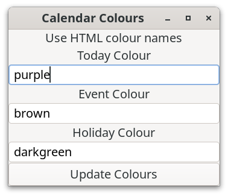
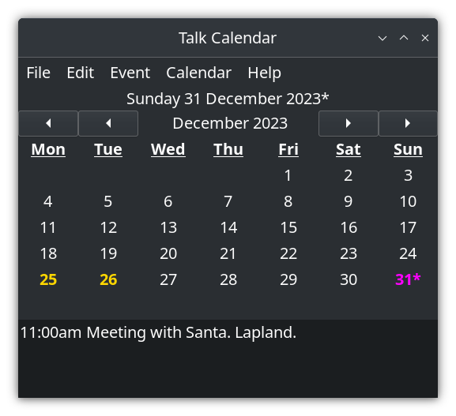

# Talk Calendar Diphone

Talk Calendar Diphone is a talking desktop calendar for Linux. It uses a built-in diphone speech synthesizer. It has been developed using C and [GTK4](https://docs.gtk.org/gtk4/). A screenshot is shown below.


## Core Features

* built with C and GTK 4.8.3 (Debian 12)
* bespoke custom calendar which allows dates with events to be marked up
* calendar visual colour marks for days with events and holidays
* event summary, location, start and end time can be entered and edited
* priority, is-yearly and notifications can be used
* Sqlite3 database used to store events
* built-in diphone speech synthesizer

A release version is available with an installer and can downloaded [here](https://github.com/crispinprojects/talkcalendar/releases/tag/v0.6.2).

## Prebuilt binary

A 64-bit prebuilt binary for the latest version of Talk Calendar is available and can be downloaed from the binary directory and can be used with Linux distributions that have GTK4 in their repositories such as Debian 12 Bookworm, Ubuntu 22.04, Fedora 35 onwards.

Extract the downloaded file which contains the Talk Calendar executable and diphones directory which should be located in the working directory.

Assuming that the GTK4 base libraries are installed the Talk Calendar binary can be run from the terminal using:

```
./talkcalendar
```
or double click on the "talkcalendar" file. 

Talk Calendar must have executable permissions to execute. Right click it and choose Properties->Permissions and tick allow "Executable as Program".

Audio output requires that the alsa-utils package is installed (this is usually installed by default).

Talk Calendar uses an Sqlite3 database for storing events. Sqlite is normally installed by default. With Debian (Ubuntu) based distributions you can check the version of Sqlite installed on your system using the terminal command below.

```
apt policy sqlite3
```

Talking Calendar can also display this information. Use menu->Information. 

To add Talk Calendar to the system menu modify the "talkcalendar.desktop" file provided in the download using your user name and application location and copy it to the ***.local/share/applications/*** directory.

Alternatively use a menu editor such as [MenuLibre](https://github.com/bluesabre/menulibre) to create a launcher for Talk Calendar which allows the working directory to be chosen. The calendar database called "calendar.db" is located in the working directory. 

Release versions include an installer. For more information please see below.


## Calendar Usage

### Adding New Event

* Select event date using the calendar
* Select "Event->New Event" from the menu or press Ctrl+n to invoke the "New Event" window
* Enter the event summary (e.g. meeting, birthday, anniversary, doctor, dentist etc.)
* Enter the description (optional)
* Enter the location (optional)
* Enter start and end times (or all day)
* Events are sorted by start time when displayed
* Navigate through the year using the calendar to add events


When a creating a new event you can check "Send Notification" which will send a system notification when Talk Calendar is started on the day in which the event occurs.

### Editing Existing Event

* Select the event in the list view and either select "Event->Edit Selected Event" from the menu or press Ctrl+e
* Change details as appropriate

### Changing Calendar Colours

* Select the calendar colour window using Calendar->Colours from the menu
* Enter the HTML colour name for changing the today, event and holiday calendar colour marks



A list of HTML colour names can be found [here](https://www.w3schools.com/tags/ref_colornames.asp). Most of the major colour names have been implemented (not all tested) as shown below which should be sufficient if using either a light or dark legacy desktop colour theme.

Red HTML colour names:
```
indianred 	
lightcoral 	
salmon 	
darksalmon 	
lightsalmon 	
crimson 	
red 	
firebrick 	
darkred 
```
Pink HTML colour names:
```
pink 	
lightpink 	
hotpink 	
deeppink 	
mediumvioletred 	
palevioletred
```
Orange HTML colour names:
```
lightsalmon 	
coral 	
tomato 	
orangered 
darkorange 
orange
```
Yellow HTML colour names:
```
gold 	
yellow 	
lightyellow 	
lemonchiffon 	
lightgoldenrodyellow 	
papayawhip 	
moccasin 	
peachpuff 	
palegoldenrod 	
khaki 	
darkkhaki 
```
Purple HTML colour names:
```
lavender 	
thistle 	
plum 	
violet 	
orchid 	
fuchsia 	
magenta 	
mediumorchid 	
mediumpurple 	
rebeccapurple 	
blueviolet 	
darkviolet 	
darkorchid 	
darkmagenta 	
purple 	
indigo 
slateblue 	
darkslateblue 
mediumslateblue
```
Green HTML colour names:
```
greenyellow 	
chartreuse 	
lawngreen 	
lime 	
limegreen 	
palegreen 	
lightgreen 	
mediumspringgreen 	
springgreen 	
mediumseagreen 
seagreen 	
forestgreen 
green 
darkgreen 
yellowgreen 
olivedrab 
olive 
darkolivegreen 	
mediumaquamarine 
darkseagreen 
lightseagreen
darkcyan 
teal 
```
Blue HTML colour names:
```
aqua 	
cyan 	
lightcyan 	
paleturquoise 	
aquamarine 	
turquoise 	
mediumturquoise 
darkturquoise 	
cadetblue 	
steelblue 	
lightsteelblue 	
powderblue 	
lightblue 	
skyblue 	
lightskyblue 	
deepskyblue 	
dodgerblue 	
cornflowerblue 	
mediumslateblue 
royalblue 	
blue 	
mediumblue 	
darkblue 
navy 	
midnightblue 
```
Brown HTML colour names:
```
cornsilk 	
blanchedalmond 	
bisque 
navajowhite 
wheat 	
burlywood 
tan 
rosybrown 
sandybrown 
goldenrod 
darkgoldenrod 
peru 
chocolate 
saddlebrown 
sienna 	
brown 	
maroon 
```
White HTML colour names:
```
white 	
snow 	
honeydew 	
mintcream 	
azure 	
aliceblue 	
ghostwhite 	
whitesmoke 
seashell 	
beige 	
oldlace 
floralwhite 	
ivory 	
antiquewhite 	
linen 
lavenderblush 	
mistyrose 
```
Grey HTML colour names:
```
gainsboro 	
lightgray 	
silver 	
darkgray 	
gray 	
dimgray 	
lightslategray 	
slategray 	
darkslategray 	
black 	
```
Note the American spelling of grey (gray).

### Preferences

* Select Calendar->Preferences from the menu or use Ctrl+Alt+p to invoke the preferences window (see screenshot below)
* Change options as required


You can use 12 hour format. Event end-times can also be shown in the list view. If public holidays is selected then the date label shows the public holiday (UK only) which is also spoken.

Talk options can be changed.

### Dark Theme

You can use a legacy dark theme with Talk Calendar. The screenshot below which shows how Talk Calendar looks when the Breeze dark theme is being used. Change calendar visual mark colours to match the theme.




## Talking

* Press spacebar to speak event details.

### Information

* Select "Help->Information from the menu or press F1
* the information window shows the keyboard shoutcuts, how many records are in the database, the Sqlite version being used on the system, the desktop font and scale factor.


* Use the About dialog to display current version.

### Keyboard Shortcuts

```
Ctrl+n			New Event
Ctrl+e			Edit Selected Event
Delete			Delete Selected Event
Ctrl_Alt+p		Preferences window
Spacebar		Speak
t			Speak Time
F1			Information
```

## Startup Applications

Add Talk Calendar to your start-up programs to read out the date and any event details when the computer is switched on.

With GNOME based desktops use the GNOME "Tweak Tool" to add Talk Calendar to your startup applications if required.

## How is Speech Generated?

Words are formed as sequences of elementary speech units. A phoneme is the smallest unit of sound that distinguishes one word from another word and there are 44 phonemes in the English language. A diphone is a sound unit composed of two adjacent partial phonemes i.e. the second half of the first phoneme and the first half of the second phoneme. The synthesizer uses a set of pre-recorded diphone sound samples and concatenates diphone wav files to produce speech output for a given text input.

The folder containing the diphone wav files should be placed into the application binary (executable) working directory. The diphone collection was created by Alan W Black and Kevin Lenzo and more information can be found using the links in the Acknowledgements. The diphone license can be found [here](https://github.com/hypnaceae/DiphoneSynth/blob/master/diphones_license.txt).

The diphone speech synthesizer uses a small dictionary of approximately 56,600 English words. If a word is not recognised by the dictionary it is skipped over. More words will be added in future updates.

### Events Database

Events are stored in an [Sqlite](https://www.sqlite.org/index.html) database. SQLite is a small, fast and full-featured SQL database engine written in C. 

### Backup Restore Events Database

A first attempt of a backup and restore system has been implemented in case the Sqlite events database becomes corrupted (e.g. by using another external program to open it or by attempting to vacuum it). You should backup your events by using the export to CSV file menu item which will create an "events.csv" file in the working directory (keep this safe and make another copy if necessary). If you then corrupt your database, you can clear all events from the Sqlite database and then use the import from  CSV restore option which assumes that the "events.csv" file is in the current working directory. If you completely corrupt your Sqlite database called calendar.db then rename it and restart Talk Calendar which will create a new empty database and restore into this. 

I have not tested what will happen if you attempt to vacuum your database externally and then restart Talk Calendar with this.

## Release Versions

Release versions contain a 64 bit prebuilt binary and a bash script installer and instructions on how to use it with trouble shooting information. Typically these are older versions representing a milestone in the development cycle. Download and extract the release file and then run the bash script installer from the terminal as shown below and follow the install instructions.

```
./install-talkcalendar.sh
```
Use the version in the binary directory for the latest version of Talk Calendar.

## Build From Source

The C source code for the Talk Calendar application is provided in the src directory.

[Geany](https://www.geany.org/) can be used as a source code editor for opening, viewing and then compiling the Talk Calendar C code. Geany is lightweight and has an integrated terminal for building the application.

You need the GTK4 development libraries and the gcc compiler. The code has been compiled using GTK 4.8.3 amd64 (Debian 12). To determine which version of GTK4 is running on a Linux system use the following terminal command.

```
dpkg -l | grep libgtk*
```

To build Talk Calendar you also need the Sqlite3 development libraries. With Debian and Ubuntu you install these using the commands below.

```
sudo apt install sqlite3
sudo apt install libsqlite3-dev
```

To check the installed version use the command below.

```
sqlite3 --version
```

### Building on Ubuntu and Debian Bookworm

With both  Debian Bookworm and Ubuntu and you need to install the following packages to compile Talk Calendar.

```
apt install build-essential
apt install libgtk-4-dev
apt install libasound2-dev
```

The packages:

```
apt install libglib2.0-dev
apt install alsa-utils
```

are needed but should be installed by default.

With Ubuntu 22.04 the base GTK4 libraries are installed by default. With other Ubuntu based distributions (spins) you may have to install these using the command below.

```
sudo apt install libgtk-4-1
```

Use the MAKEFILE to compile.

```
make
./talkcalendar
```

Audio requires that the diphone directory containing the diphone wav files be located in the working directory. Example diphones are included  but you can create you own.

### Building on Fedora

With Fedora you need to install the following packages to compile Talk Calendar.

```
sudo dnf install gtk4-devel
sudo dnf install gtk4-devel-docs
sudo dnf install glib-devel
sudo dnf install alsa-lib-devel
```
## Roadmap

* ~~backend sqlite database~~ (done)
* ~~backup and restore database (export/import csv file)~~ (done)
* ~~public holiday calendar colour marks~~ (done)
* ~~startup notifications~~ (done but see note below)
* ~~check and read out upcoming events~~ (basic code structure completed)
* ~~test building talkcalendar with GTK 4.12~~ (see note below)
* ~~deployment release with Git tag~~ 
* ~~bash script installer~~ 
* ~~replace GNOME HIG hamburger menu style UI with a traditional based desktop using a top menu bar~~ (done)
* ~~calendar styling using Pango and markup~~ (done see note below)
*  ~~colour dialog to allow a user to change today, event and holiday colours~~ (done)
* ~~speak time~~ (done)
* expand speech dictionary (ongoing)
* refactor preferences dialog code
* refactor startup code (checking)
* multi-day events 
* GTK desktop testing (ongoing see below)
* ~~remove GTK4 classes being depreciated (ongoing - see below)~~
* bug testing (ongoing)
* more releases
* libawaita (see Calendar Style section below)
* explore packaging options (produce a reference example)

I will add more features as the project rolls along.

## Notes & Testing 

### GTK4 Deprecating Classes

GTK have announced that they are [deprecating a number of GTK4 classes](https://blog.gtk.org/2022/10/30/on-deprecations/) as an early outlook at changes that will appear in the next major release that will break API compatibility. The full list of depreciated classes can be found in the list of [GTK4 api classes](https://docs.gtk.org/gtk4/#classes) and generally listed as GTK4.10 or GTK4.12 depreciations. Debian based Linux distributions are currently using GTK4.8. Talk Calendar had been using a number of classes which will be depreciated and so recent work has involved going through the source code line-by-line removing class functions on the depreciation hit list. 

I have tested building Talk Calendar with ***GTK4.12*** (Ubuntu 23.10). It builds. However, if you take a binary built with GTK4.12 and try to run it on Debian 12 which uses GTK4.8 it fails to run. You need to use a binary built on Debian 12 on Debian 12 and a binary built on Ubuntu 23.10 on Ubuntu 23.10. However, a binary built on Debian 12 with GTK4.8 runs on Ubuntu 23.10. It appears from my testing that a GTK4 app built on a lower version will run on a higher version but the reverse is not true. 

The main reason why I am not currently using a file dialog for saving a backup file is because the functions [gtk_file_chooser_dialog_new](https://docs.gtk.org/gtk4/ctor.FileChooserDialog.new.html) and [gtk_dialog_new_with_buttons](https://docs.gtk.org/gtk4/ctor.Dialog.new_with_buttons.html) are being depreciated in GTK4.10. I believe that you will have to use [GtkFileDialog](https://docs.gtk.org/gtk4/class.FileDialog.html) instead.

GTK developers are planning the [GTK5](https://www.phoronix.com/news/GTK5-Likely-After-GTK-4.12) toolkit discussing making it a Wayland only [release](https://www.phoronix.com/news/GTK5-Might-Drop-X11).

### Calendar Style

Currently, Talk Calendar uses Pango attributes and markup for adding some style and colour to the calendar. Pango is the text layout system used by GDK and GTK.

The platform library [libadwaita](https://gnome.pages.gitlab.gnome.org/libadwaita/doc/main/style-classes.html) used by GNOME desktops uses style classes such as “title-1”, "title-2", and “dim-label” etc. which can be used by GTK4 applications with the gtk_widget_add_css_class() function. An example is shown below.

```
gtk_widget_add_css_class (GTK_WIDGET(label), "title-2");
```

As I understand it, GTK4 does not define style classes and this is left to the platform library (libadwaita). GTK4 gives you "labels", "buttons" and other GUI components while libadwaita is used to style these following GNOME's Human Interface Guidelines known as [HIG](https://developer.gnome.org/hig/). 

However, if you create a GTK4 calendar and use for example

```
gtk_widget_add_css_class (GTK_WIDGET(calendar), "title-2");
```
the whole calendar is changed to use "title-2" in this case. I could not find a way to add and remove visual marks to the GTK4 Calendar using "gtk_calendar_mark_day" and "gtk_calendar_unmark_day" and so I ended up writing my own custom calendar class so that I could add visual colour marks for event days and holidays. See my [GTK4 Simple Calendar](https://github.com/crispinprojects/gtk4-simple-calendar) application for more details.

I need to do more research into GTK4 styling with a platform library. Consequently, I have placed the use of libadwaita lower down in the road map list as I need to learn how to use it and decide if it is a good idea to lock in the application to a platform library or not. There is a Github discussion on this topic entitled ["Please don't use LibAdwaita library"](https://github.com/xournalpp/xournalpp/discussions/5301).

The [gtk_css_provider_load_from_data()](https://docs.gtk.org/gtk4/method.CssProvider.load_from_data.html) function which I used previously in the GTK3 version of the application is being depreciated and so all code using it has been [removed](https://gitlab.gnome.org/GNOME/gtk/-/commit/f2a297f56d7b0f749ae8b5ef5b853951ff30a89d). I believe gtk_css_provider_load_from_string() could be used instead in GTK 4.12. However, I am using GTK 4.8.3 for developing this application which is found in the Debian 12 package repositories. It appears that you can still load and parse an application-specific styling css file (e.g. styles.css) but although I developed some test code I have not gone down this route in case this approach is depreciated further down the line.

Hopefully this all makes some sense to anyone reading this. In summary libadwaita styling is stalled until I get a better understanding on how best to move forward but my custom calendar does allow visual colour marks to be used.

I am also monitoring how the Xfce and Budgie desktops move to Wayland and how they will use GNOME HIG as this may help. Talk Calendar version 0.6 (and onwards) has replaced the GNOME hamburger style HIG UI with a traditional based desktop using a top menu bar. Gtk4 still allows you to do this. I know GNOME have said that the “traditional desktop” is dead, and it’s not coming back, [Community Power Part 4: The GNOME Way](https://blogs.gnome.org/tbernard/2021/07/13/community-power-4/) but I feel that this application is best suited to a traditional desktop experience especially if using desktops such as Xfce and Budgie. 

### Wayland and X11 Distros (GNOME, Xfce, Budgie)

GTK4 supports [Wayland](https://wayland.freedesktop.org/) which is a replacement for the X11 window system protocol. The XDG_SESSION_TYPE variable stores the type of display server the system is using. To check if you are running Wayland or X11 echo the XDG (Cross Desktop Group) session type as shown below.

```
echo $XDG_SESSION_TYPE
```
It will output either "wayland" or "x11".

The GNOME desktop (i.e. GNOME Shell written in C and GTK) uses the Mutter compositor which supports both Xorg and Wayland and defaults to Wayland when the environment variable is set as shown below.

```
export GDK_BACKEND=wayland
```

To use the X11 back-end you would use.

```
export GDK_BACKEND=x11
```

Talk Calendar runs on both Debian GNOME and Ubuntu GNOME. Both use Mutter and Wayland by default. In these specific use cases Intel® HD Graphics 530 and Intel® HD Graphics 630 integrated graphics units have been used.

I have also tested Talk Calendar on the Debian Xfce and Debian Budgie desktops which currently use X11 by default.

Regarding Xfce, I believe they plan to move to using a Wayland compositor and progress can be found in their [roadmap](https://wiki.xfce.org/releng/wayland_roadmap). They are working on a library called [libxfce4windowing](https://gitlab.xfce.org/xfce/libxfce4windowing) which they describe as a windowing concept abstraction library for X11 and Wayland. 

Regarding the [Budgie Desktop](https://github.com/BuddiesOfBudgie/budgie-desktop), running the apt policy command below 
```
apt policy budgie-desktop
```
shows that Debian Bookworm is using the Budgie desktop version 10.7.1-1. Using
```
inxi -Gxx | grep compositor
```
reveals that the compositor is "budgie-wm". The XDG (Cross Desktop Group) session type is X11. 

There is information on the Buddies of Budgie [Wayland blog](https://buddiesofbudgie.org/blog/wayland) about moving to a Wayland only version of Budgie using a Wayland compositor called Magpie V1.0 which was originally forked from Mutter.

In summary testing shows that the GTK 4.8 version of Talk Calendar runs on both X11 and Wayland desktops without any known issues. With this Talk Calendar version there is no css styling. It is just a raw GTK4 application styled using Pango and markup.

### Notifications

Startup day event notifications have now been implemented using [libnotify](https://gitlab.gnome.org/GNOME/libnotify). This library is an implementation of the [Desktop Notifications Specification](https://specifications.freedesktop.org/notification-spec/notification-spec-latest.html) which provides support for GTK and Qt applications and is ***desktop independent***. 

I have developed a small GTK4 notification tester app which can be found [here](https://github.com/crispinprojects/notification-tester) with screenshots and notes for Debian GNOME (Wayland) and Debian Budgie (X11) testing. I found that GNotification code works on Debian Budgie (X11) but not on Debian GNOME (Wayland). Consequently, I am currently using libnotify for implementing notifications in Talk Calendar.

## Versioning

[SemVer](http://semver.org/) is used for versioning. The version number has the form 0.0.0 representing major, minor and bug fix changes.

## Author

* **Alan Crispin** [Github](https://github.com/crispinprojects)

## License

Talk Calendar Diphone is licensed under LGPL v2.1. GTK is released under the terms of the LGPL v2.1 license.

## Project Status

Active.

## Acknowledgements

* [GTK](https://www.gtk.org/)

* GTK is a free and open-source project maintained by GNOME and an active community of contributors. GTK is released under the terms of the [GNU Lesser General Public License version 2.1](https://www.gnu.org/licenses/old-licenses/lgpl-2.1.html).

* [GTK4 API](https://docs.gtk.org/gtk4/index.html)

* [GObject API](https://docs.gtk.org/gobject/index.html)

* [Glib API](https://docs.gtk.org/glib/index.html)

* [Gio API](https://docs.gtk.org/gio/index.html)

* [Geany](https://www.geany.org/) is a lightweight source-code editor (version 2 now uses GTK3). [GPL v2 license](https://www.gnu.org/licenses/old-licenses/gpl-2.0.txt)

* [Diphone Source and License](https://github.com/hypnaceae/DiphoneSynth/blob/master/diphones_license.txt)

* Diphone collection and synthesis Alan W. Black and Kevin Lenzo [2000](https://www.cs.cmu.edu/~awb/papers/ICSLP2000_diphone.pdf)

* [Sqlite](https://www.sqlite.org/index.html) is open source and in the [public domain](https://www.sqlite.org/copyright.html).

* [Embedding a file in an executable](https://www.linuxjournal.com/content/embedding-file-executable-aka-hello-world-version-5967) and [here](https://stackoverflow.com/questions/6785214/how-to-embed-a-file-into-an-executable-file).
