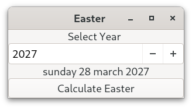
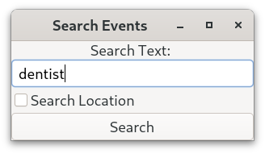
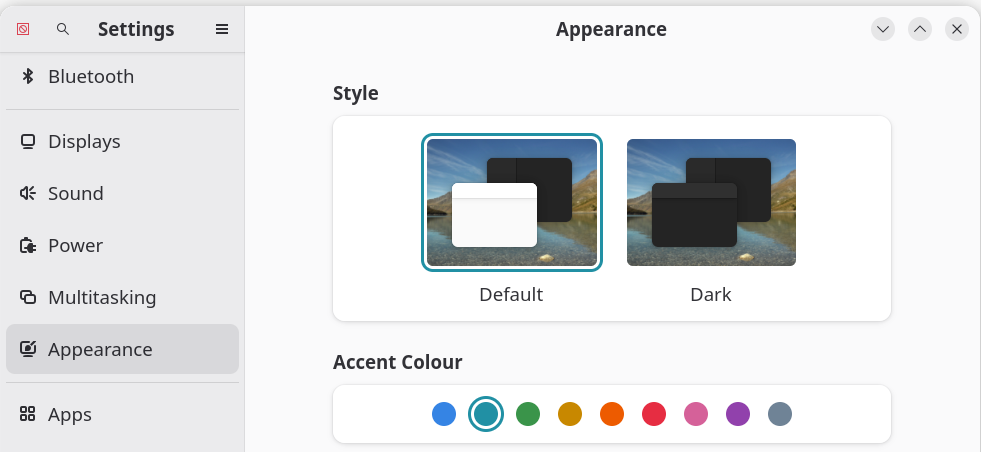

# Talk Calendar

Talk Calendar is a personal desktop calendar for Linux which can read out calendar events.

The Calendar GUI has been developed using C, [GTK4](https://docs.gtk.org/gtk4/) and Adwaita for the GNOME and Ubuntu desktops. Adwaita is the  official default design language, user interface style, and widget library (libadwaita) for the GNOME Desktop Environment. 

A screenshot of Talk Calendar is shown below. 


## Core Features

* built with C and GTK4, Adwaita for GNOME and Ubuntu desktops
* month-view calendar
* export and import iCalendar files (backup and restore)
* calendar tools such as calculate Easter and search for events
* built-in speech synthesizer
* Sqlite3 database used to store events

## Install

A pre-built executable binary of the latest version of Talk Calendar for x86 Debian Trixie GNOME  and Ubuntu desktops is available and can be downloaded from the binary directory. This have been built and tested using Debian Trixie with the [GNOME](https://www.gnome.org/) desktop. Once downloaded and unzipped make sure that Talk Calendar has executable permissions before running. To change permissions and run Talk Calendar from the terminal use the commands below.
```
chmod +x talkcalendar
./talkcalendar
```

## BASH Script Installer

The easiest way to install Talk Calendar locally on  Debian GNOME or Ubuntu Adwaita distros is to use the BASH script installer from the terminal. This is found in the binary directory in the download. 

To install Talk Calendar simply run the installer script as shown below and follow the on-screen instructions.

```
./install-talkcalendar.sh
```

To uninstall Talk Calendar run the script below

```
./uninstall-talkcalendar
```

You can open the BASH script installer using a Text Editor to view the code. One advantage of using a BASH script installer is that the code can be inspected to show exactly what is occurring. 

## Manually Install Using Desktop File

To install Talk Calendar locally create a  "org.gtk.talkcalendar.desktop" desktop file as shown below and copy it into in the ***~/.local/share/applications/***  directory. If the applications directory does not exist create it. 

A desktop file has a .desktop extension and provides metadata about an application such as its name, icon, command to execute and other properties. The "org.gtk.talkcalendar.desktop" file is shown below. You need to modify the "org.gtk.talkcalendar.desktop" file  shown below by using your own user name and directory locations. The Exec variable defines the command to execute when launching an application, in this case, the "talkcalendar" binary executable. The Icon variable specifies the path to the icon file associated with the application. The Path variable specifies that Talk Calendar should use this directory as its working directory and so is where the calendar database is stored. In a .desktop file, you need to use absolute and full paths.

```
[Desktop Entry]
Version=0.7.2
Type=Application
Name=Talk Calendar
Comment=Talking calendar
Icon=/home/your_user_name/Software/talkcalendar/calendar.png
Exec=/home/your_user_name/Software/talkcalendar/talkcalendar
Path=/home/your_user_name/Software/talkcalendar
X-GNOME-UsesNotifications=true
Categories=Office;
MimeType=text/calendar;
StartupNotify=true
Name[en_GB]=TalkCalendar
```

Modify the desktop file so that it uses your user name and the directory where you install local programs (in this case it is assumed to be /home/your_user_name/Software).

Copy your modified  "org.gtk.talkcalendar.desktop" file to ***~/.local/share/applications/***. To do this you can use your graphical file manager or the terminal command below.

```
cp org.gtk.talkcalendar.desktop /home/your_user_name/.local/share/applications
```

Again change "your_user_name" to your user name. Note that ***.local*** is a hidden directory and you need to tick the "Show Hidden Files" option in the file explorer to display it.

You can now run Talk Calendar Calendar from the system menu. It is located in the "Office Category". 

You can also copy your modified  "org.gtk.talkcalendar.desktop" file to ***~/.config/autostart/*** hidden directory to make Talk Calendar run when you start a new desktop session.

## Calendar Interface

Talk Calendar uses a month view calendar with a bottom panel to display day events when a day is selected. To create a new event select a day on the calendar and select the "new event" menu item or press Ctrl+N. To edit an event, select it in day view panel and then select the "edit event" menu item or press Ctrl+E. Likewise to delete an event select it in the day view panel and use the "delete event" menu item or the DELETE key. 

Use the File->Export menu item to export a calendar as an iCalendar file for backup purposes. These typically use the file extension ".ical" or ".ics". The [iCalendar standard](https://icalendar.org/) is an open standard for exchanging calendar and scheduling information between users and computers.  An icalendar file is a plain text file and so can be viewed and modified using a standard text editor. 

Pressing F1 invokes the information window which can also be selected from the menu using the Help->Information menu item. The information window shows the keyboard shortcuts, how many records are in the calendar database and the Sqlite version being used on the system. The About dialog displays the Talk Calendar version number.

Press the spacebar to speak events for the selected day. Press the T-key to speak the current time. Some Talk Calendar screenshot are shown below.

### New Event


### Preferences


### Calculate Easter


### Search


### Information (F1)


### Accent Colour

The Talk Calendar Adwaita version makes use of accent colour which is set using GNOME settings.




### Events Database

Events are stored in an [Sqlite](https://www.sqlite.org/index.html) database. SQLite is a small, fast and full-featured SQL database engine written in C. 

### Export and Import iCalendar Files

Talk Calendar allows a personal calendar to be exported as an iCalendar file. These typically use the file extension ".ical" or ".ics". The [iCalendar standard](https://icalendar.org/) is an open standard for exchanging calendar and scheduling information between users and computers.  An icalendar file is a plain text file and so can be modified using a standard text editor. 

You should backup your events by using the File->Export menu item which by default will create an "talkcalendar.ical" file but the name can be changed. A file chooser dialog is used to allow the file to be located in a chosen directory

### Recurring Events

The only recurring event type that is currently supported by Talk Calendar is yearly. This is required for events such as birthdays and anniversaries. The parser uses icalendar [RRULE](https://icalendar.org/iCalendar-RFC-5545/3-8-5-3-recurrence-rule.html) to determine if an event is yearly (e.g. birthday).

## Updating

To update from a previous version of Talk Calendar export the current calendar to an ical file and then import it into the new version of Talk Calendar. Always keep a backup copy of the Talk Calendar database called talkcalendar.db.

## Speech Synthesis

Talk Calendar uses it own internal speech synthesizer engine. It is a lightweight G2P speech engine coded from scratch. You can find out more about how I developed this speech engine [here](https://github.com/crispinprojects/speak).

### Building on Debian 13 and Ubuntu 24.04 (x86 Hardware)

To build Talk Calendar from source you need the gcc compiler, GTK4, GLIB, and SQLITE development libraries. You need to install the following packages.

Talk Calendar has been developed using Debian Trixie and tested with the GNOME (Wayland backend).

```
sudo apt update
sudo apt install build-essential
sudo apt install libgtk-4-dev
sudo apt install libasound2-dev
sudo apt install sqlite3
sudo apt install libsqlite3-dev
sudo apt install libadwaita-1-dev
```
To check the libadwaita version use the command line below.

```
pkg-config --modversion libadwaita-1 
```

To check the installed Sqlite 3 version use the command below.

```
sqlite3 --version
```

To determine which version of GTK4 is running on a Ubuntu/Debian system use the following terminal command.

```
gtk4-launch --version
```
or
```
dpkg -l | grep libgtk*
```
Use the MAKEFILE to compile Talk Calendar. Just run "make" inside the source code folder.

```
make
```

To run Talk Calendar from the terminal use

```
./talkcalendar
```

Note that the Talk Calendar Makefile now uses the libadwaita library.


### GTK4 version of Talk Calendar

I have retained the source code for the GTK 4 only version of Talk Calendar which can be found in the directory called src-gtk. This is compiled in the same way using the Makefile provided and and can be used with desktops such as XFCE which do not use libadwaita. The main.c file for the Adwaita version of Talk Calendar uses 
```
#include <adwaita.h> 
```
while the raw GTK 4 version does not.

### Building on Fedora

With Fedora you need to install the following packages to compile Talk Calendar.

```
sudo dnf install gcc make
sudo dnf install gtk4-devel
sudo dnf install gtk4-devel-docs
sudo dnf install glib-devel
sudo dnf install alsa-lib-devel
sudo dnf install sqlite-devel
sudo dnf install libadwaita-devel
```

To check the installed Sqlite 3 version use the command below.

```
sqlite3 --version
```

To determine which version of GTK4 is running on a Ubuntu/Debian system use the following terminal command.

```
gtk4-launch --version
```
or

```
dnf list gtk4-devel
```


## Versioning

[SemVer](http://semver.org/) is used for versioning. The version number has the form 0.0.0 representing major, minor and bug fix changes.

## Author

* **Alan Crispin** [Github](https://github.com/crispinprojects)

## Project Status

Active and under development.

## Acknowledgements

* [GTK](https://www.gtk.org/)

* GTK is a free and open-source project maintained by GNOME and an active community of contributors. GTK is released under the terms of the [GNU Lesser General Public License version 2.1](https://www.gnu.org/licenses/old-licenses/lgpl-2.1.html).

* [GTK4 API](https://docs.gtk.org/gtk4/index.html)

* [GObject API](https://docs.gtk.org/gobject/index.html)

* [Glib API](https://docs.gtk.org/glib/index.html)

* [Gio API](https://docs.gtk.org/gio/index.html)

* [Adwaita](https://gnome.pages.gitlab.gnome.org/libadwaita/)

* [Geany](https://www.geany.org/) is a lightweight source-code editor (version 2 now uses GTK3). [GPL v2 license](https://www.gnu.org/licenses/old-licenses/gpl-2.0.txt)

* [Sqlite](https://www.sqlite.org/index.html) is open source and in the [public domain](https://www.sqlite.org/copyright.html).

* [My Speech Engine](https://github.com/crispinprojects/speak)

* [GNOME](https://www.gnome.org/)

* [XFCE](https://xfce.org/)

* [Debian](https://www.debian.org/)

* [Ubuntu](https://ubuntu.com/download/desktop)

* [Fedora](https://fedoraproject.org/)
