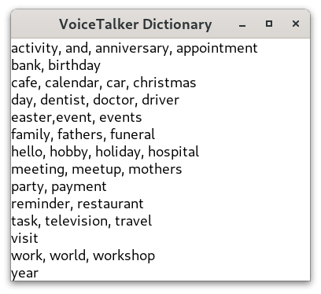
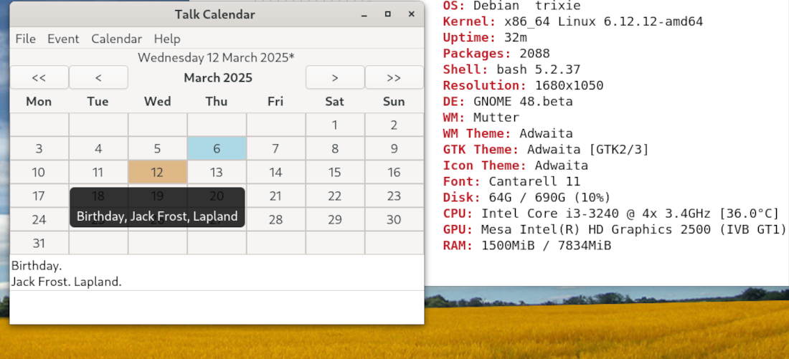
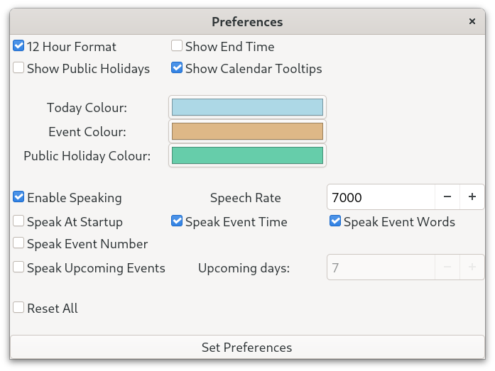
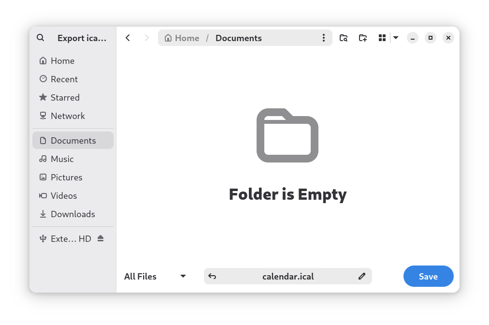

# Talk Calendar

Talk Calendar is a personal desktop calendar for Linux which has some speech capability for reading out dates, times and event text.

Talk Calendar developed using C and [GTK4](https://docs.gtk.org/gtk4/) for GTK desktops (GNOME, XFCE etc.). A screenshot of Talk Calendar is shown below.


## Core Features

* built with C and GTK4 for GTK based desktops
* month view calendar 
* event details, location, start and end time can be entered and edited
* calendar tooltips and multiday event display
* export and import iCalendar files (backup and restore)
* Sqlite3 database used to store events
* speech sythesizer and dispatcher
* binary for GTK 4.8.4 (Debian Bookworm)

### Local Install Using Pre-built Binary

A 64-bit pre-built binary of Talk Calendar is available and can be downloaded from the binary directory. This has been built using GTK 4.8 and compiled using Debian Bookworm.

Extract the downloaded file which contains the Talk Calendar executable. Talk Calendar must have executable permissions to execute.  Change Talk Calendar file permissions so that it can run as an executable as shown below.

```
sudo chmod +x talkcalendar
```

Use the command shown below to run Talk Calendar.

```
./talkcalendar
```

To add Talk Calendar to the system menu modify the Talk Calendar desktop file provided in the download. A desktop file has a .desktop extension and provides metadata about an application such as its name, icon, command to execute and other properties. For user-specific applications desktop files can be located locally in the ***~/.local/share/applications/*** directory. Local user entries take precedence over system entries. For the GNOME desktop, the desktop file should be named using the [application ID](https://developer.gnome.org/documentation/tutorials/application-id.html), that is <application_id>.desktop, which in this case is "org.gtk.talkcalendar.desktop" 

You need to modify the "org.gtk.talkcalendar.desktop" file using your own user name and directory locations. For example, if your user name is "sam" and you install local applications in a folder called "Software" and you create a folder called "talkcalendar " to store the Talk Calendar binary executable then the executable path would be "Exec=/home/sam/Software/talkcalendar/talkcalendar". The Exec variable defines the command to execute when launching an application, in this case, the talkcalendar binary executable. The Path variable tells the system where to look for the calendar database. The Icon variable specifies the path to the icon file associated with the application. In a .desktop file, you need to use absolute and full paths. 

Copy the "org.gtk.talkcalendar.desktop" file to the ***~/.local/share/applications/*** directory. Create the ~/.local/share/applications/ directory if it does not already exist. This way of locally installing Talk Calendar should be universal across different Linux distributions.

## Autostart Talk Calendar

Copy the "org.gtk.talkcalendar.desktop" file to ***~/.config/autostart*** to start Talk Calendar when the computer is switched on. Talk Calendar can then read out the current date and day events and any future upcoming events (see preferences settings) when the computer is switched on.

## Calendar Usage

If you have used a calendar application before then using Talk Calendar will be straight forward. 

### Adding New Event

* Click on the "New Event" button in the header bar or press Ctrl+n to invoke the "New Event" window
* Enter the event summary (e.g. birthday, anniversary, dentist etc.) 
* Enter the description of the event and location
* Enter the start date by setting the day, month and year values 
* Enter start and end times (or tick the all day check box)
* Times are entered as hour and minute values using the 24-hour time notation
* Events are sorted by start time when displayed
* Check the "Is Yearly" check box if the event repeats every year (e.g. birthdays and anniversaries)

Talk Calendar uses a small dictionary to read out the event summary.

A screenshot of the new event dialog is shown below.


* If using the built-in VoiceTalker then pressing F2 shows the current list of words which can be used for reading out the event summary.



### Editing Existing Event

* Select the event in the list view and either select "Event->Edit Selected Event" from the menu or press Ctrl+e
* Change details as appropriate

### Searching For Events

* Select the Event->Search menu item
* Enter a search term or location.

### Preferences

* Select Calendar->Preferences from the menu or use Ctrl+Alt+p to invoke the preferences window (see screenshot below)
* Change options as required


You can use 12 hour format. Event end-times can also be shown in the list view. Public holidays can be displayed on the calendar which are also spoken.

Colours have to be entered manually using RGB values.You can use the w3Schools [RGB calcuator](https://www.w3schools.com/colors/colors_rgb.asp) for selecting a RGB colour. 

Talk options can be changed. The option "Speak At Startup" allows Talk Calendar to read out the current date and day events when the calendar is started. The number of upcoming events and titles can be read out if required. 

You can select between either the built-in VoiceTalker speech synthesizer or the eSpeak speech dispatcher. Options such as talking speed can be changed for both.

## Talking

* Press the *t key* to read out the current time.

* Press *spacebar* to read out event details for the date selected.


### Keyboard Shortcuts

```
Ctrl+n			New Event
Ctrl+e			Edit Selected Event
Ctrl_Alt+p		Preferences window
Spacebar		Speak
t			Speak Time
F1			Information
```

### Information

* Select "Information"  from the help menu or press F1

* The information window shows the keyboard shoutcuts, how many records are in the database, the Sqlite version being used on the system, the desktop font and scale factor.

* It also shows if eSpeak is available for the speech dispatcher as shown below.


* Use the About dialog to display current version.

### Events Database

Events are stored in an [Sqlite](https://www.sqlite.org/index.html) database. SQLite is a small, fast and full-featured SQL database engine written in C. 

### Export and Import iCalendar Files

Talk Calendar allows a personal calendar to be exported as an iCalendar file. These typically use the file extension ".ical" or ".ics". The [iCalendar standard](https://icalendar.org/) is an open standard for exchanging calendar and scheduling information between users and computers.  An icalendar file is a plain text file and so can be modified using a standard text editor. 

The export to icalendar file does not currently support time zones and so the DTSTART and DTEND properties contain dates with local time and have no reference to a time zone. For example, the following represents an event starting on January, 1st, 2024 at 11.30am and ending at 2pm.

```
DTSTART:20240101T113000
DTEND:20240101T140000
```

You should backup your events by using the File->Export menu item which will create an "events.ical" file in the working directory (keep this safe and make another copy if necessary). If you then corrupt your database, you can clear all events and then use the File->Import to restore exported events. This assumes that the "events.ical" file is in the current working directory. If you completely corrupt your Sqlite database called calendar.db then rename it and restart Talk Calendar which will create a new empty database and restore into this.

The icalendar import parser allows the date and local time to be imported and checks if a time zone has been specified using the [TZID](https://icalendar.org/iCalendar-RFC-5545/3-2-19-time-zone-identifier.html) property. A file chooser dialog is used to allow the file to be chosen by the user as shown below. File filters can be used.

The parser will be updated with new features in future releases.

### Recurring Events

The only recurring event type that is currently supported by Talk Calendar is yearly. This is required for events such as birthdays and anniversaries. The parser uses icalendar [RRULE](https://icalendar.org/iCalendar-RFC-5545/3-8-5-3-recurrence-rule.html) to determine if an event is yearly (e.g. birthday).

## Speech Synthesis

Talk Calendar has a built-in word concatenation speech synthesizer which I have called VoiceTalker. It is used to play-back pre-recorded English words for reading out dates, times and some common generic words used to summarise a personal calendar event such as *anniversary, appointment, birthday, cafe, calendar, car, day, dentist, doctor, driver, event, family, fathers, funeral, holiday, hospital, meeting, meetup, mothers, party, payment, reminder, restaurant, task, television, travel, visit, work, workshop*. You can use two or more words for the event summary such as "Birthday party", "Mothers day", "Fathers day", "Travel and visit" or just "Calendar event". If an event summary word is not recognised then it is skipped over. More words for personal calendar events and notable dates will be added in future updates. 

Talk Calendar also incorporates a speech dispatcher which allows text-to-speech output to be sent to the espeak speech synthesizer which has to be installed separately on the user system.

With Debian use the command below to install eSpeak.

```
sudo apt install espeak
```

Use the Preferences dialog to select between VoiceTalker and the eSpeak dispatcher and what you want to be spoken.

The [eSpeak](https://espeak.sourceforge.net/) speech synthesizer is an open source speech synthesizer which uses a formant synthesis method and is widely available in Linux distributions. It produces good quality speech with clear articulation. It is more versatile than than the built-in VoiceTalker allowing the event summary, description and location to be spoken if required. 

The eSpeak [license](https://github.com/espeak-ng/espeak-ng) is GPL-3.0 with other licenses found. eSpeak is an official Debian package and labelled [DFGS free](https://blends.debian.org/accessibility/tasks/speechsynthesis). If eSpeak is not available on your Linux system then use VoiceTalker.

For more information on the formant speech synthesis method see my [formant speech synthesizer](https://github.com/crispinprojects/formant-synthesizer) project. 

The experimental version of Talk Calendar which used a built-in diphone speech synthesizer has been dropped as I could not achieve good quality speech articulation. It has been replaced with the speech dispatcher. For anyone interested the development code for my diphone speech synthesizer can be found [here](https://github.com/crispinprojects/diphone-talker).

### Audio Thread

Talk Calendar now uses GTask (async/wait pattern) to play audio in a thread rather than GThread and GMutex which were used previously. With GTK4 it appears that the preferred way to perform work in a thread is to use GTask. The code now uses [g_task_run_in_thread()](https://docs.gtk.org/gio/method.Task.run_in_thread.html) so that a play audio blocking operation is executed in a separate background thread. The function g_task_run_in_thread() turns a synchronous operation into an asynchronous one, by running it in a thread. Apparently, GTask maintains a thread pool that is based on the number of CPUs available (i.e. supports multiple CPU-cores). 

## Build From Source

The C source code for the Talk Calendar application is provided in the src directory. Debian Bookworm which uses GTK 4.8  has been used to compile the project. 

[Geany](https://www.geany.org/) can be used as a source code editor for opening, viewing and then compiling the Talk Calendar C code. Geany is lightweight and has an integrated terminal for building the application. To install the Geany IDE use the command below.

```
sudo apt install geany
```
Alternatively, the latest version of Geany can be built from source using autotools.

### Building on Debian Bookworm

To build Talk Calendar from source you need the gcc compiler, GTK4, GLIB, and SQLITE development libraries. You need to install the following packages.

```
sudo apt install build-essential
sudo apt install libgtk-4-dev
sudo apt install libasound2-dev
sudo apt install sqlite3
sudo apt install libsqlite3-dev
```

The packages:

```
sudo apt install libglib2.0-dev
sudo apt install alsa-utils
```

are needed but should be installed by default. 

To check the installed Sqlite 3 version use the command below.

```
sqlite3 --version
```

To determine which version of GTK4 is running on a Debian system use the following terminal command.

```
dpkg -l | grep libgtk*
```

Use the MAKEFILE to compile Talk Calendar. Just run "make" inside the source code folder.

```
make
```

To run Talk Calendar from the terminal use

```
./talkcalendar
```

### Raspberry Pi OS

Raspberry Pi OS (64-bit) is a port of Debian Bookworm and by default it uses the Wayland compositor called [labwc](https://github.com/labwc/labwc). Consequently, you can build Talk Calendar on a Raspberry Pi 4 and 5 running Raspberry Pi OS in the same way described above for Debian 12 Bookworm. 

Talk Calendar has been tested on a Raspberry Pi 500 with the Raspberry Pi monitor which has two front-facing speakers for producing audio output.

### Debian Trixie 

The current code base has been compiled using Debian 12 Bookworm which uses [GTK4.8](https://packages.debian.org/source/bookworm/gtk4). This is an older version of the GTK4 toolkit. 

Debian Trixie will be the next stable release of Debian. At the time of writing the [Debian GTK4 tracker](https://tracker.debian.org/pkg/gtk4) shows that Debian Trixie is currently using GTK4.18.2. Some changes to the GTK4 toolkit since GTK4.8 which are relevant to the Talk Calendar project are outlined below.

#### GTK 4.10: 
In GTK 4.10 the GTK [ColorDialogButton](https://docs.gtk.org/gtk4/class.ColorDialogButton.html) was introduced. The GTK ColorDialogButton is not available with GTK 4.8. This means that in the Debian Bookworm version of Talk Calendar the RGB values for the today, calendar event, public holiday colours have to be entered manually. The GTK ColorDialogButton is used in the Trixie development code.

#### GTK 4.12: 
The function gtk_css_provider_load_from_data was depreciated in GTK 4.12 and replaced with  "gtk_css_provider_load_from_string". The Trixie Talk Calendar source code has been updated to use "gtk_css_provider_load_from_string".

With GTK4.12 the GtkFileDialog API is no longer signal based but callback based which should match a GAsyncReadyCallback function (async/await) and this will be used in future updates. In computer programming, the async/await pattern is a syntactic feature that allows an asynchronous, non-blocking function to be structured in a way similar to an ordinary synchronous function. The function "gtk_file_chooser_dialog_new" used with a response callback has been depreciated and so has been removed from Debian Bookworm Talk Calendar source code and ical backup files are saved to the current working directory. The GAsyncReadyCallback function is used in the Trixie development code.

A screenshot showing the Trixie version of Talk Calendar under development is shown below.



The GTK ColorDialogButton is used to set calendar colour preferences as shown in the screenshot below.



A file dialog to export an ical backup file is implemented using a GAsyncReadyCallback function.



When Trixie is released I will move the Talk Calendar code based to the updated GTK version and put the Bookworm version into maintenance mode. At the moment the Bookworm version has the latest speech synthesis code base. Use the Bookworm version of Talk Calendar until Trixie is released. The screenshots above just show what is possible with later versions of the GTK toolkit.

### Building on Fedora

With Fedora you need to install the following packages to compile Talk Calendar.

```
sudo dnf install gcc make
sudo dnf install gtk4-devel
sudo dnf install gtk4-devel-docs
sudo dnf install glib-devel
sudo dnf install alsa-lib-devel
sudo dnf install sqlite-devel
```

To check the installed Sqlite 3 version use the command below.

```
sqlite3 --version
```

To check the installed version of the GTK4 development libraries use the command below.

```
dnf list gtk4-devel
```

## Versioning

[SemVer](http://semver.org/) is used for versioning. The version number has the form 0.0.0 representing major, minor and bug fix changes.

## Author

* **Alan Crispin** [Github](https://github.com/crispinprojects)

## Project Status

Active and under development.

## License

GTK is released under the terms of the [GNU Lesser General Public License version 2.1](https://www.gnu.org/licenses/old-licenses/lgpl-2.1.html). Consequently, Talk Calendar is licensed under the same LGPL v2.1 license.

## Acknowledgements

* [GTK](https://www.gtk.org/)

* GTK is a free and open-source project maintained by GNOME and an active community of contributors. GTK is released under the terms of the [GNU Lesser General Public License version 2.1](https://www.gnu.org/licenses/old-licenses/lgpl-2.1.html).

* [GTK4 API](https://docs.gtk.org/gtk4/index.html)

* [GObject API](https://docs.gtk.org/gobject/index.html)

* [Glib API](https://docs.gtk.org/glib/index.html)

* [Gio API](https://docs.gtk.org/gio/index.html)

* [Geany](https://www.geany.org/) is a lightweight source-code editor (version 2 now uses GTK3). [GPL v2 license](https://www.gnu.org/licenses/old-licenses/gpl-2.0.txt)

* [Sqlite](https://www.sqlite.org/index.html) is open source and in the [public domain](https://www.sqlite.org/copyright.html).

* [eSpeak](https://espeak.sourceforge.net/) is an open source speech synthesizer which uses a formant synthesis method and is widely available in Linux distributions. It produces good quality speech with clear articulation. The eSpeak [license](https://github.com/espeak-ng/espeak-ng) is GPL-3.0 with other licenses found. eSpeak is an official Debian package and labelled [DFGS free](https://blends.debian.org/accessibility/tasks/speechsynthesis). 

* For more information on the diphone speech synthesis method see my [Diphone speech synthesizer](https://github.com/crispinprojects/diphone-talker) project.

* For more information on the formant speech synthesis method see my [formant speech synthesizer](https://github.com/crispinprojects/formant-synthesizer) project. 

* [Debian](https://www.debian.org/)

* [Fedora](https://fedoraproject.org/)

* [Ubuntu](https://ubuntu.com/download/desktop)
