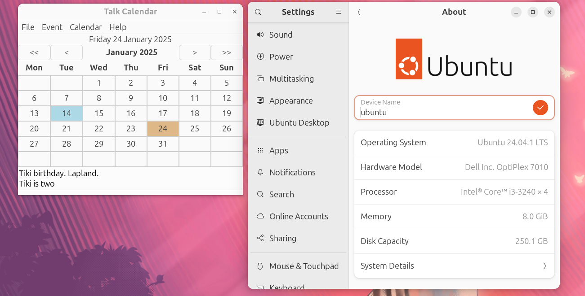
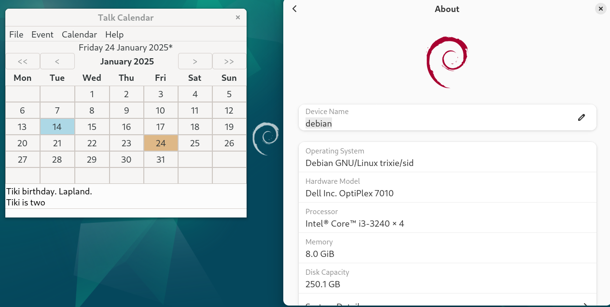
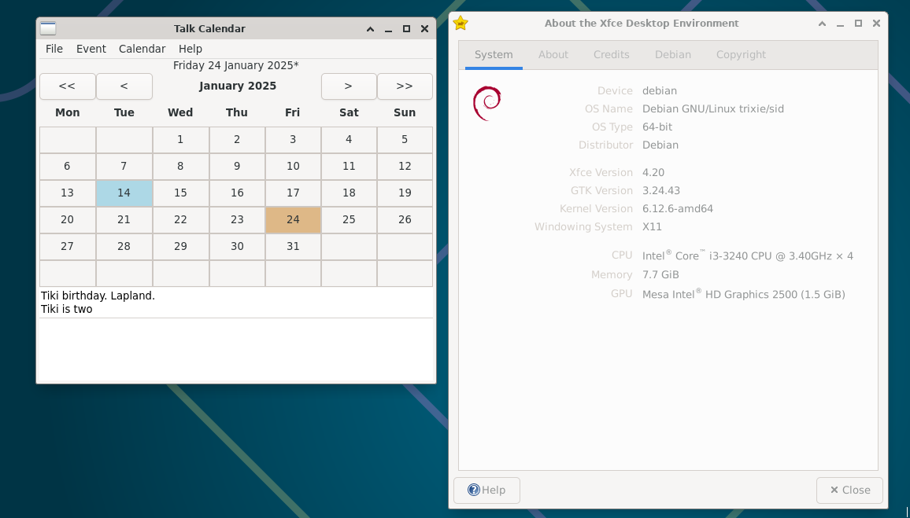

# Talk Calendar

Talk Calendar is a personal desktop calendar for use with Raspberry Pi OS (64 bit) which has some speech capability using its own built-in speech engine for speaking dates, times and event words. 

Talk Calendar developed using C and [GTK4](https://docs.gtk.org/gtk4/) for GTK desktops (GNOME, XFCE etc.). The speech synthesizer which is based on concatenating and playing back pre-recorded English words. A screenshot of Talk Calendar is shown below.


## Core Features

* built with C and GTK4 for GTK based desktops
* month view calendar 
* event details, location, start and end time can be entered and edited
* export and import iCalendar files (backup and restore)
* Sqlite3 database used to store events
* built-in word concatenation speech synthesizer (date, time and event word speaker)
* binary for GTK 4.16.5 (Fedora 41)

### Local Install Using Prebuilt Binary

A 64-bit prebuilt binary for the latest version of Talk Calendar is available and can be downloaded from the binary directory. This has been built using GTK 4.16 and compiled using Fedora 41 and tested with Ubuntu 24.04 LTS and Debian Trixie (alpha).

Extract the downloaded file which contains the Talk Calendar executable. Assuming that the GTK4 base libraries are installed the Talk Calendar binary can be run from the terminal using:

```
./talkcalendar
```

or double click on the "talkcalendar" file. Talk Calendar must have executable permissions to execute. Right click it and choose Properties->Permissions and tick allow "Executable as Program".

To add Talk Calendar to the system menu modify the Talk Calendar desktop file provided in the download. A desktop file has a .desktop extension and provides metadata about an application such as its name, icon, command to execute and other properties. For user-specific applications desktop files can be located locally in the ***~/.local/share/applications/*** directory. Local user entries take precedence over system entries. For the GNOME desktop, the desktop file should be named using the [application ID](https://developer.gnome.org/documentation/tutorials/application-id.html), that is <application_id>.desktop, which in this case is "org.gtk.talkcalendar.desktop" 

You need to modify the "org.gtk.talkcalendar.desktop" file using your own user name and directory locations. For example, if your user name is "tiki" and you install local applications in a folder called "Software" and you create a folder called "talkcalendar " to store the Talk Calendar binary executable then the executable path would be "Exec=/home/tiki/Software/talkcalendar/talkcalendar". The Exec variable defines the command to execute when launching an application, in this case, the talkcalendar binary executable. The Path variable tells the system where to look for the executable and the calendar database. The Icon variable specifies the path to the icon file associated with the application. In a .desktop file, you need to use absolute and full paths.

Copy the "org.gtk.talkcalendar.desktop" file to the ***~/.local/share/applications/*** directory. Create the ~/.local/share/applications/ directory if it does not already exist. This way of locally installing Talk Calendar should be universal across different Linux distributions.

## Calendar Usage

If you have used a calendar application before then using Talk Calendar will be straight forward. 

### Adding New Event

* Click on the "New Event" button in the header bar or press Ctrl+n to invoke the "New Event" window
* Select the event speech word (summary) using the dropdown
* Enter the event description 
* Enter the location
* Enter the start date by setting the day, month and year values 
* Enter start and end times (or tick the all day check box)
* Times are entered as hour and minute values using the 24-hour time notation
* Events are sorted by start time when displayed
* Check the "Is Yearly" check box if the event repeats every year (e.g. birthdays and anniversaries)

A screenshot of the new event dialog is shown below.


### Editing Existing Event

* Select the event in the list view and either select "Event->Edit Selected Event" from the menu or press Ctrl+e
* Change details as appropriate

### Searching For Events

* Select the Event->Search menu item
* Enter a search term or location.

### Preferences

* Select Calendar->Preferences from the menu or use Ctrl+Alt+p to invoke the preferences window (see screenshot below)
* Change options as required


You can use 12 hour format. Event end-times can also be shown in the list view. If notable dates is selected then the date label shows special calendar dates such as some UK public holidays. These are also spoken.

Talk options can be changed.

## Talking

* Press spacebar to speak event details.

### Information

* Select "Help->Information from the menu or press F1

* the information window shows the keyboard shoutcuts, how many records are in the database, the Sqlite version being used on the system, checks if espeak installed, the desktop font and scale factor.

* Use the About dialog to display current version.

### Keyboard Shortcuts

```
Ctrl+n            New Event
Ctrl+e            Edit Selected Event
Delete            Delete Selected Event
Ctrl_Alt+p        Preferences window
Spacebar        Speak
t            Speak Time
F1            Information
```

## Startup Applications

Add Talk Calendar to your start-up programs to read out the date and any event details when the computer is switched on.

Use the "Tweak Tool" to add Talk Calendar to your startup applications if required.

### Information

* Select "Information"  from the help menu or press F1

* the information window shows the keyboard shoutcuts, how many records are in the database, the Sqlite version being used on the system, the desktop font and scale factor.

* Use the About dialog to display current version.

## Startup Applications

With GNOME based desktops you can use the GNOME "Tweak Tool" to add Talk Calendar to your startup applications. Talk Calendar will then read out the current date and days events and any future upcoming events (see preferences settings) when the computer is switched on.

### Events Database

Events are stored in an [Sqlite](https://www.sqlite.org/index.html) database. SQLite is a small, fast and full-featured SQL database engine written in C. 

### Export and Import iCalendar Files

Talk Calendar allows a personal calendar to be exported as an iCalendar file. These typically use the file extension ".ical" or ".ics". The [iCalendar standard](https://icalendar.org/) is an open standard for exchanging calendar and scheduling information between users and computers.  An icalendar file is a plain text file and so can be modified using a standard text editor. 

The export to icalendar file does not currently support time zones and so the DTSTART and DTEND properties contain dates with local time and have no reference to a time zone. For example, the following represents an event starting on January, 1st, 2024 at 11.30am and ending at 2pm.

```
DTSTART:20240101T113000
DTEND:20240101T140000
```

A file chooser dialog is used to allow the save directory location to be chosen by the user as shown below.

The icalendar import parser allows the date and local time to be imported and checks if a time zone has been specified using the [TZID](https://icalendar.org/iCalendar-RFC-5545/3-2-19-time-zone-identifier.html) property. A file chooser dialog is used to allow the file to be chosen by the user as shown below. File filters can be used.

The parser will be updated with new features in future releases.

### Recurring Events

The only recurring event type that is currently supported by Talk Calendar is yearly. This is required for events such as birthdays and anniversaries. The parser uses icalendar [RRULE](https://icalendar.org/iCalendar-RFC-5545/3-8-5-3-recurrence-rule.html) to determine if an event is yearly (e.g. birthday).

## Build From Source

The C source code for the Talk Calendar application is provided in the src directory. Fedora 41 has been used to compile the project. Fedora 41 uses GTK 4.16 but I have successfully compiled the project with GTK 4.14.

[Geany](https://www.geany.org/) can be used as a source code editor for opening, viewing and then compiling the Talk Calendar C code. Geany is lightweight and has an integrated terminal for building the application.

To build Talk Calendar from source you need the gcc compiler, GTK4, GLIB, SQLITE and libnotify development libraries. 

### Building on Fedora 40

With Fedora you need to install the following packages to compile Talk Calendar.

```
sudo dnf install gcc make
sudo dnf install gtk4-devel
sudo dnf install gtk4-devel-docs
sudo dnf install glib-devel
sudo dnf install alsa-lib-devel
sudo dnf install sqlite-devel
```

To check the installed Sqlite 3 version use the command below.

```
sqlite3 --version
```

To check the installed version of the GTK4 development libraries use the command below.

```
dnf list gtk4-devel
```

Use the MAKEFILE to compile. 

```
make
```

To run Talk Calendar from the terminal use

```
./talkcalendar
```

### Ubuntu 24.04 LTS

The screenshot below shows Talk Calendar running on Ubuntu 24.04 LTS.



To compile Talk Calendar with Ubuntu and you need to install the following packages.

```
sudo apt install build-essential
sudo apt install libgtk-4-dev
sudo apt install libasound2-dev
sudo apt install sqlite3
sudo apt install libsqlite3-dev
```

The packages:

```
apt install libglib2.0-dev
apt install alsa-utils
```

are needed but should be installed by default. 

You may need to use the [Ubuntu snap store](https://snapcraft.io/) to install things like Geany.

### Debian Trixie (GNOME Wayland)

The screenshot below shows Talk Calendar running on Debian Trixie (Alpha) with the default Wayland GNOME desktop. Trixie will be the next stable release of Debian.



The [Debian GTK4 tracker](https://tracker.debian.org/pkg/gtk4) show that Trixie is currently using GTK4.16. 

To compile Talk Calendar with Debian Trixie and you need to install the following packages.

```
sudo apt install build-essential
sudo apt install libgtk-4-dev
sudo apt install libasound2-dev
sudo apt install sqlite3
sudo apt install libsqlite3-dev
```

The packages:

```
apt install libglib2.0-dev
apt install alsa-utils
```

are needed but should be installed by default.

To check the installed Sqlite 3 version use the command below.

```
sqlite3 --version
```

To install the Geany IDE use the command below.

```
sudo apt install geany
```

### Debian Trixie XFCE

I have also tested Talk Calendar with Debian Trixie XFCE 4.20 with X11 as shown in the screenshot below.



### Debian 12 Bookworm

Debian 12 Bookworm uses [GTK4.8](https://packages.debian.org/source/bookworm/gtk4). The Talk Calendar source code was originally developed using GKT4.14 (Fedora 40) and recently with GTK4.16 (Fedora 41) and so will not compile with GTK 4.8 without making a number of code changes. These include downgrading "gtk_css_provider_load_from_string" with "gtk_css_provider_load_from_data" as the function gtk_css_provider_load_from_data was depreciated in GTK 4.12. A bigger change is that the GtkFileDialog API is no longer signal based. With GTK4.12 and above it is callback based which should match a GAsyncReadyCallback function (async/await). In computer programming, the async/await pattern is a syntactic feature that allows an asynchronous, non-blocking function to be structured in a way similar to an ordinary synchronous function. With my Debian 12 (GTK4.8) projects I used the older function "gtk_file_chooser_dialog_new" with a response callback but this approach has been depreciated. Also GTK [ColorDialogButton](https://docs.gtk.org/gtk4/class.ColorDialogButton.html) was introduced with GTK 4.10 and so is not availible with GTK 4.8.

However you can compile my [Pi Calendar](https://github.com/crispinprojects/picalendar) project on Debian Bookworm as Raspberry Pi OS is a port of Debian Bookworm.

To determine which version of GTK4 is running on a Debian system use the following terminal command.

```
dpkg -l | grep libgtk*
```

## Speech Synthesis

Talk Calendar incorporates a small word-based speech synthesizer used to concatenate and play-back pre-recorded English words using the computer speaker. The voice used by this version of Talk Calendar is based on my own recordings and so is subject to same license as the project. Words are recorded in a headless RAW audio format so that they can be converted to hexadecimal values and stored in an array and added to a voice header file. The voice will be improved and updated in future versions of the project.

For speech synthesis I explored the possibility of installing and using [eSpeak](https://espeak.sourceforge.net/) so that commands could be send to it for speech output.  However, I discovered a potential eSpeak license compatibility issue in that some of its components may not be compatible with the GTK LGPL v2.1 license. For example, the IEEE80.c file [license](https://github.com/espeak-ng/espeak-ng/blob/c1d9341f86eee4b7a0da50712b627d8a76e92fea/src/libespeak-ng/ieee80.c) says "Copyright (C) 1989-1991 Apple Computer, Inc." which is very strange given that espeak has a GPL v3 [license](https://espeak.sourceforge.net/license.html). This is discussed further in the forum post [here](https://opensource.stackexchange.com/questions/11545/possibilities-to-use-a-gpl-v3-licensed-library-in-a-closed-source-game). Consequently, I decided not to use eSpeak.

## Code Notes

With this version of Talk Calendar playing audio using GThread and GMutex has been replaced with GTask (async/wait pattern). With GTK4 it appears that the preferred way to perform work in a thread is to use GTask. The code now uses [g_task_run_in_thread()](https://docs.gtk.org/gio/method.Task.run_in_thread.html) so that a play audio blocking operation is executed in a separate background thread. The function g_task_run_in_thread() turns a synchronous operation into an asynchronous one, by running it in a thread. Apparently, GTask maintains a thread pool that is based on the number of CPUs available (i.e. supports multiple CPU-cores). The basic GTask code structure is working but will be updated as I learn more.

## Versioning

[SemVer](http://semver.org/) is used for versioning. The version number has the form 0.0.0 representing major, minor and bug fix changes.

## Author

* **Alan Crispin** [Github](https://github.com/crispinprojects)

## Project Status

Active and under development.

## License

GTK is released under the terms of the [GNU Lesser General Public License version 2.1](https://www.gnu.org/licenses/old-licenses/lgpl-2.1.html). Consequenty, Talk Calendar is licensed under the same LGPL v2.1 license.

## Acknowledgements

* [GTK](https://www.gtk.org/)

* GTK is a free and open-source project maintained by GNOME and an active community of contributors. GTK is released under the terms of the [GNU Lesser General Public License version 2.1](https://www.gnu.org/licenses/old-licenses/lgpl-2.1.html).

* [GTK4 API](https://docs.gtk.org/gtk4/index.html)

* [GObject API](https://docs.gtk.org/gobject/index.html)

* [Glib API](https://docs.gtk.org/glib/index.html)

* [Gio API](https://docs.gtk.org/gio/index.html)

* [Geany](https://www.geany.org/) is a lightweight source-code editor (version 2 now uses GTK3). [GPL v2 license](https://www.gnu.org/licenses/old-licenses/gpl-2.0.txt)

* [Sqlite](https://www.sqlite.org/index.html) is open source and in the [public domain](https://www.sqlite.org/copyright.html).

* [Fedora](https://fedoraproject.org/)

* [Ubuntu](https://ubuntu.com/download/desktop)

* [Debian](https://www.debian.org/)
