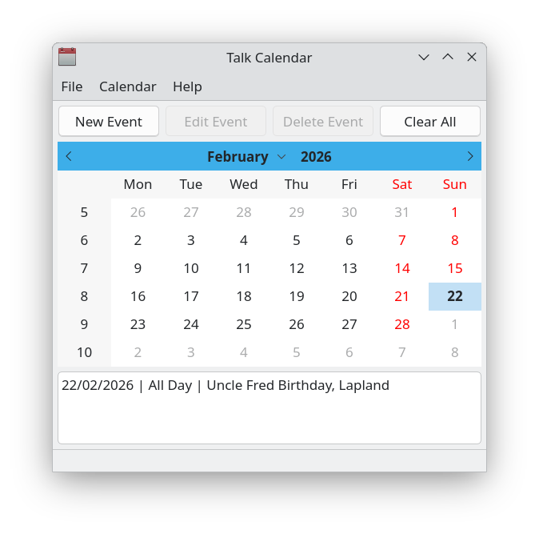

# Talk Calendar

Talk Calendar is a personal desktop calendar for Linux which has some speech capability for reading out dates, event summary words and event times.

Talk Calendar has been developed using C++ and Qt 6.

A screenshot of Talk Calendar is shown below. 


## Core Features

* built with Qt 6
* month-view calendar
* export and import iCalendar files (backup and restore)
* calendar tools such as calculate Easter and search for events
* built-in speech synthesizer
* Sqlite3 database used to store events

## Pre-built binary

A pre-built binary of the latest version of Talk Calendar for x86 Linux computers and ARM64 Raspberry Pi 5 computers are available and can be downloaded from the binary directory.  Once downloaded and unzipped make sure that Talk Calendar has executable permissions before running. To change permissions and run Talk Calendar from the terminal use the commands below.
```
chmod +x talkcalendar
./talkcalendar
```
The x86 binary has been tested with Debian Trixie KDE. With Raspberry Pi OS you need to install the Qt6 base libraries to run the Talk Calendar ARM64 binary. This is done suing the terminal command below. 

```
sudo apt install  qt6-base-dev
```

The Qt 6 base libraries are installed on Debian GNOME and Fedora but you may have to install them on some other GTK based distributions.

***Note:*** The Raspberry Pi does not have a coin-battery-powered ‘Real Time Clock’ (RTC) module by default as used by laptop and desktop computers. The Raspberry Pi updates the time automatically from the global ntp (network time protocol) servers. This can be a problem when there is no network connection as a Real-Time Clock (RTC) keeps track of the current time and date when the device is powered off. This functionality is needed by calendar and other scheduling applications. The Raspberry Pi 5 has a Real-Time Clock (RTC) connector which can be used to fit a RTC battery case compatible with Raspberry Pi 5 to maintain accurate time without needing an internet connection.

## Desktop File

To install Talk Calendar locally copy the  "talkcalendar.desktop" file into in the ***~/.local/share/applications/***  directory. If the applications directory does not exist create it. You will need to modify the desktop file so that it uses your user name and the directory where you install local programs. 

A desktop file has a .desktop extension and provides metadata about an application such as its name, icon, command to execute and other properties. The "talkcalendar.desktop" file is shown below. You need to modify this by using your own user name and directory locations. In this example it is assumed that local applications are installed in a folder called Software (/home/your_user_name/Software). Some people use a folder called "Programs". The Exec variable defines the command to execute when launching an application, in this case, the "talkcalendar" binary executable. The Icon variable specifies the path to the icon file associated with the application. The Path variable specifies that Talk Calendar should use this directory as its working directory and so it is where the calendar database is stored. In a .desktop file, you need to use absolute and full paths.

```
[Desktop Entry]
Version=0.6.6
Type=Application
Name=Talk Calendar
Comment=Talking calendar
Icon=/home/your_user_name/Software/talkcalendar/calendar.png
Exec=/home/your_user_name/Software/talkcalendar/talkcalendar
Path=/home/your_user_name/Software/talkcalendar
X-GNOME-UsesNotifications=true
Categories=Office;
MimeType=text/calendar;
StartupNotify=true
Name[en_GB]=TalkCalendar
```

Copy your modified  "talkcalendar.desktop" file to ***~/.local/share/applications/***. To do this you can use your graphical file manager or the terminal command below.

```
cp talkcalendar.desktop /home/your_user_name/.local/share/applications
```

Again change "your_user_name" to your user name. Note that ***.local*** is a hidden directory and you need to tick the "Show Hidden Files" option in the file explorer to display it.

You can now run Talk Calendar Calendar from the system menu. It should be located in the "Office Category". 

You can also copy your modified  "talkcalendar.desktop" to ~/.config/autostart so that Talk Calendar starts up when the computer is switched on.

## Calendar Interface

Talk Calendar uses a month view calendar with a bottom list view to display day events when a day is selected. To create a new event select a day on the calendar and then the "new event"button. To edit an event, select it in day list view and then select the "edit event" button. Likewise to delete an event select it in the day list view panel and use the "delete event" button. 

Use the File->Export menu item to export a calendar as an iCalendar file for backup purposes. These typically use the file extension ".ical" or ".ics". The [iCalendar standard](https://icalendar.org/) is an open standard for exchanging calendar and scheduling information between users and computers.  An icalendar file is a plain text file and so can be viewed and modified using a standard text editor. 

If talk is enabled select as day on the calendar to read out the day events. Press the spacebar to speak events again for the selected day. Press the T-key to speak the current time.

### New Event



### Preferences


### Search


Executing a search populates the main list view with the results. Just click on another calendar date to clear.

### Easter Calculator


### Information


### Events Database

Events are stored in an [Sqlite](https://www.sqlite.org/index.html) database. SQLite is a small, fast and full-featured SQL database engine written in C. 

### Export and Import iCalendar Files

Talk Calendar allows a personal calendar to be exported as an iCalendar file. These typically use the file extension ".ical" or ".ics". The [iCalendar standard](https://icalendar.org/) is an open standard for exchanging calendar and scheduling information between users and computers.  An icalendar file is a plain text file and so can be modified using a standard text editor. 

You should backup your events by using the File->Export iCal menu item. If you then corrupt your database, you can clear all events and then use the File->Import iCal to restore exported events. 

### Recurring Events

The only recurring event type that is currently supported by Talk Calendar is yearly. This is required for events such as birthdays and anniversaries. The parser uses icalendar [RRULE](https://icalendar.org/iCalendar-RFC-5545/3-8-5-3-recurrence-rule.html) to determine if an event is yearly (e.g. birthday).

## Bluetooth Speakers

To use Bluetooth speakers with Debian and Raspberry Pi OS you need to install the “bluez-alsa-utils” package as shown below.

```
sudo apt install bluez-alsa-utils
```
To check if it is already installed use.

```
dpkg -l | grep bluez-alsa-utils > /dev/null 2>&1 && echo "Installed" || echo "Not installed"

```
You can also check if the "bluez-alsa-utils" package is installed using using the Help->Information menu item.

There is an option to enable Bluetooth speakers in the preferences window if these are paired to your system.

Bluetooth functionality is experimental but I have tested it with my Raspberry Pi 5 with a set of Bluetooth speakers paired to it and this works.


## Updating

To update from the Talk Calendar 0.5 series to the 0.6 series export the current calendar to an ical file and then import it into the new version of Talk Calendar. The Talk Calendar 0.6 series uses Qt 6.


## Speech Synthesizer 

Talk calendar has a built-in concatenative diphone speech synthesizer. This has been coded from scratch to read out the date, time and event summary words. 

The Talk Calendar speech engine uses a multi-stage Grapheme-to-Phoneme (G2P) pipeline to transform raw calendar text into audible speech.

### The Processing Pipeline

1. Pre-processing is used to convert dates and times into spoken words (e.g. "Tuesday twenty-fourth February").
2. Lexicon Lookup: The first stage checks pre-defined diphone sequences for common calendar words, months and numbers.
3. Custom Decision Tree Grapheme-to-Phoneme (G2P) engine: For other words the second stage converts strings of characters (graphemes) into phonetic sounds (phonemes). 
4. Diphone Concatenation: Phonemes are split into diphones (transitions) and stitched together from the audio database.
     
### Learned Phonetic Patterns

At the heart of the Talk Calendar speech engine is a custom decision tree based  **Grapheme-to-Phoneme (G2P)** engine written in C++ and Qt. The job of the G2P engine is to transcribe a word into a phoneme sequence. For example, it would transcribe the word "hello" into the phonemes  HH AH L OW. This is The [ARPAbet](https://en.wikipedia.org/wiki/ARPABET) phonetic transcription for the word "hello".  ARPABET symbols are used by **The CMU Pronouncing Dictionary** and you can look up the pronunciation for a word or phrase in the [CMUdict here](http://www.speech.cs.cmu.edu/cgi-bin/cmudict).

I trained the decision tree using statistical inference which is a form of machine learning using the [CMU Pronouncing Dictionary](http://www.speech.cs.cmu.edu/cgi-bin/cmudict#about) as the pronunciation corpus. This contains 134,000 words and their phoneme transcriptions. The decision tree was trained on all 134,000 words and I ended up with what I believe is called a a trained CART (Classification and Regression Tree) model. The idea is to predict the pronunciation of words based on statistical probability. By analysing the whole CMUdict dataset, the decision tree model discovered patterns such as:

* Context-Sensitive Vowels: Automatically identifying "Magic E" patterns to switch between short and long vowel sounds.
* Digraph Detection: Recognizing multi-letter clusters like th, sh, and ph as single phonetic units.

However, this was not perfect and I had to modify a number of the decision tree functions using hand written rules to improve English word pronunciations. I also had to add word exceptions with hand-crafted word to phoneme transcriptions. The Talk Calendar speech engine should never "break" when it sees a word it does not know as the decision tree will always make the best statistical guess. That is the G2P engine always make an effort of pronouncing an unknown word based on the decision tree rules.

I have also experimented with using a neural network to learn how to "pronounce" English words by developing a G2P neural network. You can find more details on the progress of this work [here](https://github.com/crispinprojects/g2p-neural-network).

The Talk Calendar speech engine will be updated as I develop new features and functionality. New vocabulary and unique pronunciations will be added to the lexicon (i.e. the word to phoneme mapping) as I come across them. You can find out more about diphone concatenation and the diphones used for this project [here](https://github.com/crispinprojects/diphone-talker). Currently, a diphone Overlap-Add (OLA) vocoder is used. The vocoder is the component responsible for taking "information" (the diphones) and generating the final audio samples. 

## Speech Synthesis Technology Comparison

The Talk Calendar speech engine is extremely lightweight able to run on low-power hardware without a GPU. Below is a table which shows how it compares with other speech engines.

| Engine / System | Synthesis Type | Text Processing (G2P) | Architecture | Target |
| :--- | :--- | :--- | :--- | :--- |
| **Talk Calendar** | Concatenative (Diphone) | Trained Decision Trees (ML) | C++ / Qt | Embedded / Lightweight |
| **eSpeak-NG** | Formant (Klatt) | Rule-based | C | Ultra-low footprint |
| **Festival** | Unit Selection | Scheme / Lexicon | C++ / Lisp | Research / Unix |
| **Flite** | Diphone | Compiled G2P Trees | C | Mobile / IoT |
| **Piper** | Neural (VITS) | Phonemizer (ML) | C++ / Python | Modern High-Quality |

***Definitions:***

***Concatenative (Diphone):*** Splicing together transitions between sounds. 

***Formant (Klatt):*** Generating sound mathematically using a sound source and filters to mimic a human voice. 

***Unit Selection:*** Like diphone concatenation, but uses other types of speech units in addition to diphones such as whole words or phrases and so requires a much larger searchable database.

***Neural (VITS):*** Advanced neural network models, specifically trained with VITS (Variational Inference Text-to-Speech) for producing natural-sounding voices 

***Phonemizer:*** modern name for a Grapheme-to-Phoneme (G2P) engine that turns "hello" into /HH AH L OW/.


### Source Code 

The source code is found in the src directory. It is being developed and tested using Debian 13 Trixie KDE but you can compile the project using Raspberry Pi OS.

## Dependencies

Talk Calendar requires the following system dependencies to run and speak:

* **Qt 6.5+** (Core, Gui, Widgets, Sql)
* **SQLite 3** (Database storage)

### Build on Debian 13 / Ubuntu 24.04 / Raspberry Pi OS

To build Talk Calendar from source you need install C++ (build essential), Qt 6 development library/tools and the CMake/Ninja packages as shown below. 

```
sudo apt update
sudo apt install build-essential cmake ninja-build
sudo apt install qt6-base-dev qt6-base-dev-tools
sudo apt install qtcreator
```

## Compile the Project

1. Launch Qt Creator.
2. Open Talk Calendar Project ( File > Open Project).
3. Make sure the build system is CMake (this is the modern standard).
4. Kits: make sure "Desktop Qt 6.x.x" kit is selected
5. Build and run
    
    
### Building on Fedora

With Fedora you need to install the following packages to compile Talk Calendar.

```
sudo dnf groupinstall "Development Tools" "C Development Tools and Libraries"
sudo dnf install cmake gcc-cpp
sudo dnf install qt6-qtbase-devel qt6-qt5compat-devel qt6-qtbase-sqlite
```


## Versioning

[SemVer](http://semver.org/) is used for versioning. The version number has the form 0.0.0 representing major, minor and bug fix changes.

## Author

* **Alan Crispin** [Github](https://github.com/crispinprojects)

## Project Status

Active and under development.

## Web Links

* [Debian](https://www.debian.org/)

