# Talk Calendar

Talk Calendar is a personal desktop calendar for Linux which has some speech capability for reading out dates and event times and summary words.

Talk Calendar has been developed using C and [GTK4](https://docs.gtk.org/gtk4/) for GTK desktops (Ubuntu Desktop, GNOME, XFCE, Cinnamon etc.). 

A screenshot of Talk Calendar is shown below. 

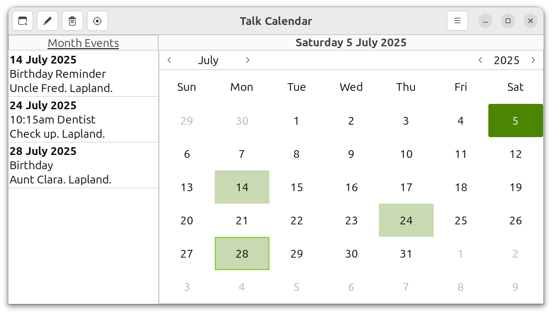

## Core Features

* built with C and GTK4 for GTK based desktops
* Graphical user interface with month-view calendar with event tooltips
* traditional menu and keybindings 
* event day and today colour preferences 
* dark colour scheme mode
* export and import iCalendar files (backup and restore)
* calendar tools such as calculate Easter and search for events
* built-in speech synthesizer
* Sqlite3 database used to store events

## BASH Script Installer

The easiest way to install Talk Calendar on a traditional Intel X86 PC with either Debian 13 or Ubuntu 24.04 (or above) is to use the BASH script installer from the terminal. The Talk Calendar installer is found in the installers directory in the download. 

To install Talk Calendar run the installer script as shown below and follow the on-screen instructions.

```
./install-talkcalendar.sh
```

To uninstall Talk Calendar run the script below

```
./uninstall-talkcalendar
```

One advantage of using a BASH script installer is that you can open and view (inspect) the code with a standard Text Editor to see exactly what is occurring. The Talk Calendar binary is installed locally into the directory "./local/bin". The installer has been tested with Debian 13 (Trixie) and Ubuntu 24.04.

## Calendar Interface

Talk Calendar uses a month view calendar with a bottom panel to display day events when a day is selected. To create a new event select a day on the calendar and either select the "new event" menu item or press Ctrl+N. To edit an event, select it in day view panel and then either select the "edit event" menu item or press Ctrl+E. Likewise to delete an event select it in the day view panel and use the "delete event" menu item or press the delete key. 

Use the File->Export menu item to export a calendar as an iCalendar file for backup purposes. These typically use the file extension ".ical" or ".ics". The [iCalendar standard](https://icalendar.org/) is an open standard for exchanging calendar and scheduling information between users and computers.  An icalendar file is a plain text file and so can be viewed and modified using a standard text editor. 

Pressing F1 invokes the information window which can also be selected from the menu using the Help->Information menu item. The information window shows the keyboard shortcuts, how many records are in the calendar database, the Sqlite version being used on the system, the desktop font and scale factor and the status of the speech synthesizer. The About dialog displays the Talk Calendar version number.

### New Event
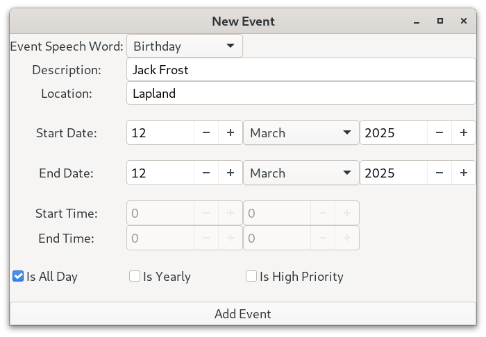

### Calendar Tooltips
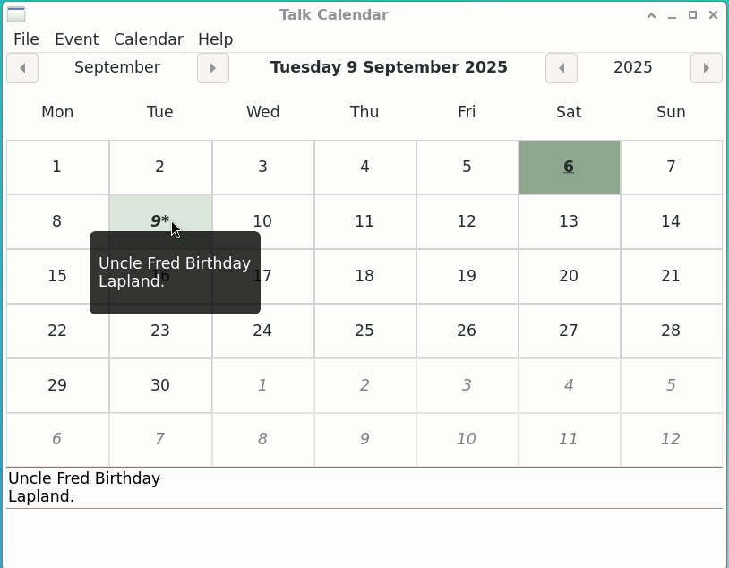

### Preferences
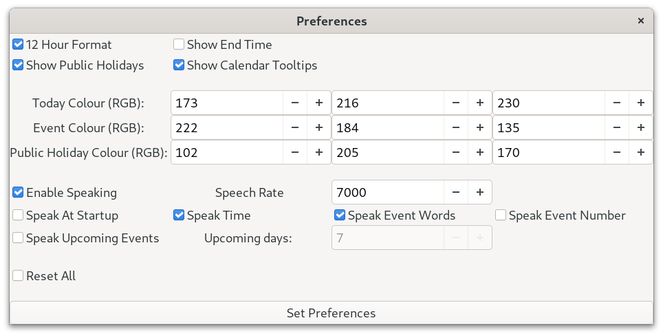

You can change the today and event colours by clicking on the colour buttons and using the colour picker.

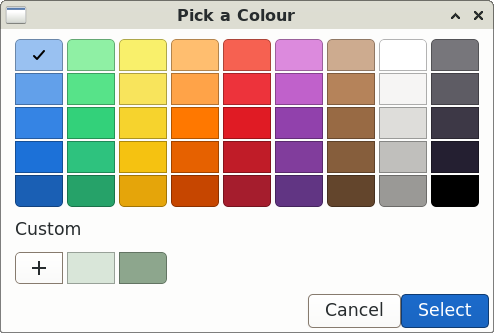

### Information (F1)
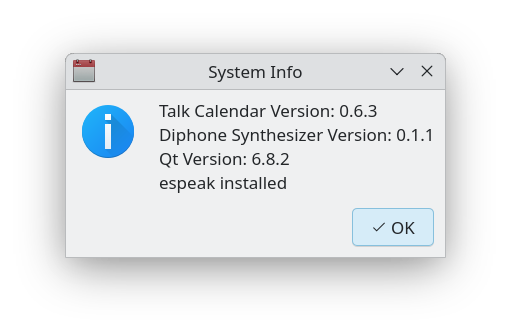

The keyboard shortcuts for creating, editing and deleting events are shown below.

```
CONTROL+N = new event
CONTROL+E = edit selected event
DELETE = delete selected event
```

### Set Alarm
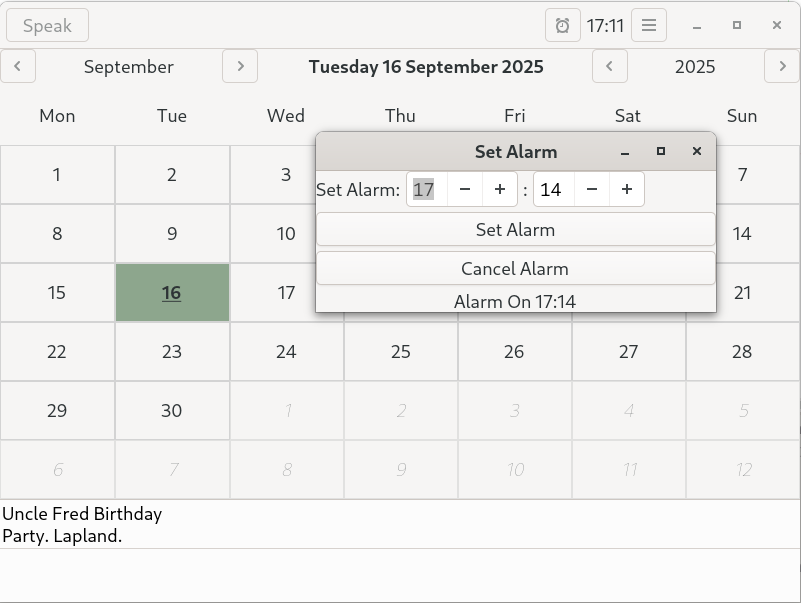

The audio beep alarm is activated at the selected time provided Talk Calendar is running.


## Dark Theme

You can select a dark colour scheme from the preferences dialog. This uses a dark background with white text on the user interface elements. You can change the today and event colours to suit the dark theme.

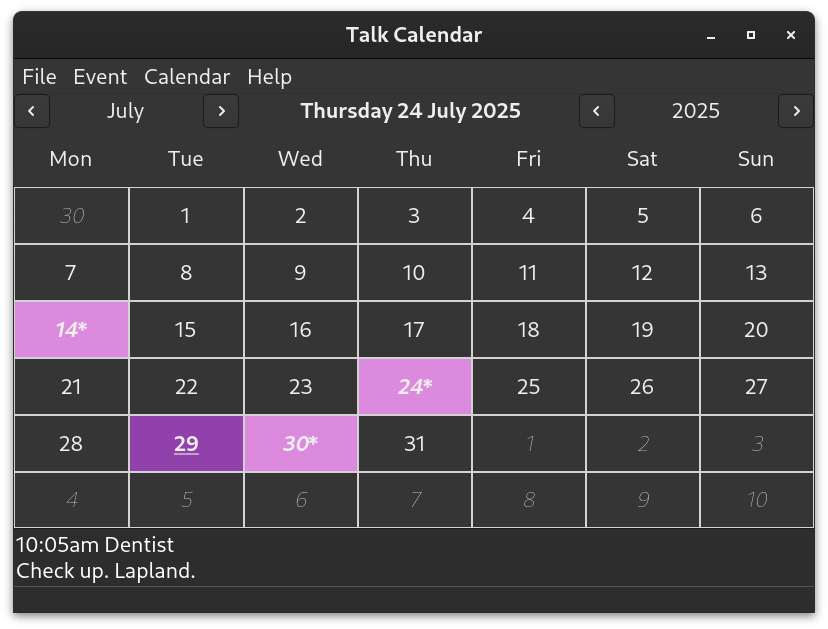


## Font, Colour, Icons

### Font

Apparently you should now use ***system settings*** rather that in-app settings with GNOME based desktops and GTK4 applications.

Consequently, font, font size and text scaling are no longer changed from within Talk Calendar but done at the ***system level***. One way to do this with the GNOME desktop and the Ubuntu Desktop is to use the GNOME Tweaks tool which is installed as shown below.
 
```
sudo apt install gnome-tweaks
```

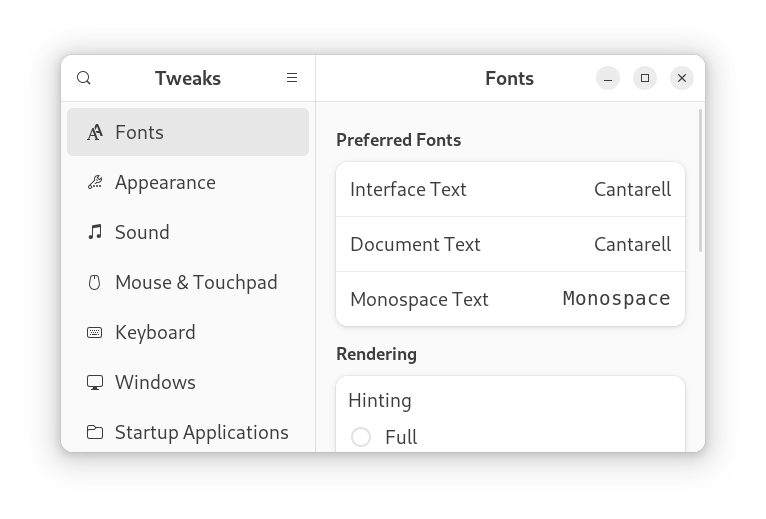

GNOME Tweaks can also be used to add Talk Calendar to the startup applications. Talk Calendar can then read out the date and any day events when the computer is switched on.

Xfce uses its own "Appearance" settings window which allows the default font to be changed and so you don't need to install Tweaks.

### Colour

The today and event calendar colours are set using the colour buttons in the preferences dialog. 

### Events Database

Events are stored in an [Sqlite](https://www.sqlite.org/index.html) database. SQLite is a small, fast and full-featured SQL database engine written in C. 

### Export and Import iCalendar Files

Talk Calendar allows a personal calendar to be exported as an iCalendar file. These typically use the file extension ".ical" or ".ics". The [iCalendar standard](https://icalendar.org/) is an open standard for exchanging calendar and scheduling information between users and computers.  An icalendar file is a plain text file and so can be modified using a standard text editor. 

The export to icalendar file does not currently support time zones and so the DTSTART and DTEND properties contain dates with local time and have no reference to a time zone. For example, the following represents an event starting on January, 1st, 2024 at 11.30am and ending at 2pm.

```
DTSTART:20240101T113000
DTEND:20240101T140000
```

You should backup your events by using the File->Export menu item which will create an "events.ical" file in the working directory (keep this safe and make another copy if necessary). If you then corrupt your database, you can clear all events and then use the File->Import to restore exported events. This assumes that the "events.ical" file is in the current working directory. If you completely corrupt your Sqlite database called calendar.db then rename it and restart Talk Calendar which will create a new empty database and restore into this.

The icalendar import parser allows the date and local time to be imported and checks if a time zone has been specified using the [TZID](https://icalendar.org/iCalendar-RFC-5545/3-2-19-time-zone-identifier.html) property. A file chooser dialog is used to allow the file to be chosen by the user as shown below. File filters can be used.

The parser will be updated with new features in future releases.

### Recurring Events

The only recurring event type that is currently supported by Talk Calendar is yearly. This is required for events such as birthdays and anniversaries. The parser uses icalendar [RRULE](https://icalendar.org/iCalendar-RFC-5545/3-8-5-3-recurrence-rule.html) to determine if an event is yearly (e.g. birthday).

## Updating

To update from the Talk Calendar 0.4 series to the 0.5 series export the current calendar to an ical file and then import it into the new version of Talk Calendar.

## Speech Synthesis

Talk Calendar uses it own built-in speech synthesizer coded from scratch to read out the date, time and event summary words. The number of event words recognised is constrained to common generic words used to describe a personal calendar event such as *anniversary, appointment, birthday, cafe, car, dentist, doctor, driver, family, funeral, holiday, hospital, meeting, party, payment, reminder, restaurant, service, task, television, travel, visit, wedding, work*. You can use two or more words for the event summary such as "birthday party", "dentist appointment", "car service", "radio reminder", "television reminder", etc. I have been adding some common English first names to the dictionary so that it is possible to readout a first name and birthday e.g. "Fred birthday". However, many first names have not yet been implemented and so this feature is far from complete. If an event word is not recognised then it is skipped over. 

Talk Calendar uses the diphone speech synthesizer method. Speech is synthesised by concatenating pre-recorded segments of speech called [diphones](https://en.wikipedia.org/wiki/Diphone). A small pronouncing dictionary is used to convert a word into it a diphone pronunciation. I have been using the [CMU Pronouncing Dictionary](http://www.speech.cs.cmu.edu/cgi-bin/cmudict?in=C+M+U+Dictionary) to look up the phoneme pronunciation  of a word and then work out the diphone construction.

The voice used by Talk Calendar is derivative work based on the diphone collection created by Alan W Black and Kevin Lenzo which is free for use for any purpose (commercial or otherwise) and subject to the light restrictions [detailed here](https://github.com/hypnaceae/DiphoneSynth/blob/master/diphones_license.txt). I have used the same licence for the voice hex arrays that I have created. There is information about recording your own diphones [here](http://festvox.org/bsv/x2401.html) and in the speech synthesis lecture by Professor Alan W Black [here](https://www.youtube.com/watch?v=eDjtEsOvouM&t=1459s). 

### Building on Debian 13 and Ubuntu 24.04 (x86 Hardware)

To build Talk Calendar from source you need the gcc compiler, GTK4, GLIB, and SQLITE development libraries. You need to install the following packages.

```
sudo apt install build-essential
sudo apt install libgtk-4-dev
sudo apt install libasound2-dev
sudo apt install sqlite3
sudo apt install libsqlite3-dev
```

To check the installed Sqlite 3 version use the command below.

```
sqlite3 --version
```

To determine which version of GTK4 is running on a Ubuntu/Debian system use the following terminal command.

```
gtk4-launch --version
```
or
```
dpkg -l | grep libgtk*
```
Use the MAKEFILE to compile Talk Calendar. Just run "make" inside the source code folder.

```
make
```

To run Talk Calendar from the terminal use

```
./talkcalendar
```


## Compile Notes

The Talk Calendar 0.5 series is being developed using both Debian 13 Trixie and Ubuntu 24.04. Debian 13 uses GTK 4.18 while Ubuntu 24.04 uses GTK 4.14. The Talk Calendar 0.5 series uses its own internal speech synthesizer.The Talk Calendar 0.3 series was developed using Debian 12 which uses GTK 4.8 while Talk Calendar 0.4 series used GTK 4.14.

A model view design has been used based around a CalendarEvent type which is subclass of GObject. This allows the use of GListStore which is an array-like list implementation. A GListStore is a concrete implementation of the GListModel interface. GListView is used to display data from the model.

With GTK 4.12 onwards the GtkFileDialog API is no longer signal based but callback based using an asynchronous pattern. This allows an asynchronous, non-blocking function to be structured in a way similar to an ordinary synchronous function. File dialog windows to export and import ical files (for backup purposes) have been implemented using this approach and this code is not compatible with GTK 4.8 (Debian 12). 

GTask allows a task to be called inside a thread and is now used to play audio rather than the previous approach which used GThread and GMutex. With GTK4 it appears that the preferred way to perform work in a thread is to use GTask. The code now uses [g_task_run_in_thread()](https://docs.gtk.org/gio/method.Task.run_in_thread.html) so that audio is played in a separate background thread. The function g_task_run_in_thread() turns a synchronous operation into an asynchronous one, by running it in a thread. Apparently, GTask maintains a thread pool that is based on the number of CPUs available (i.e. supports multiple CPU-cores). 

Talk Calendar uses a GTK4 custom calendar which allows both visual markers and tooltips to be applied. A dark theme can be used with the today and event colours changed using the colour buttons in the preferences dialog.

The latest version  of Talk Calendar (0.5 series) can be used with Ubuntu 24.04, Debian 13 (but not Debian 12 for the reasons discussed above) and Fedora 41 and above.

## GTK4 vs libadwaita

With the latest GNOME changes it appears that only applications built with libadwaita (the default Adwaita theme for GNOME based desktops) respect system-wide accent colours. The libadwaita library is built on top of GTK4 and provides widgets that adhere to the [GNOME Human Interface Guidelines HIG](https://developer.gnome.org/hig/). It is used by GNOME developers to ensure that applications look and behave consistently within the GNOME desktop environment. The separation between GTK (the core toolkit) and libadwaita (the GNOME design language implementation) appears to be a deliberate strategy to allow other desktop environments (Xfce, Cinnamon, MATE) to develop and use GTK4 applications.

Talk Calendar is a GTK4 application and is not a libadwaita application. The means that it is not GNOME HIG compliant and so accent colours are not supported when using Debian 13 Trixie GNOME. I have developed a small libadwaita Calendar demo as shown in the screenshot below to demonstrate the use of accent colours on Debian 13 GNOME. 

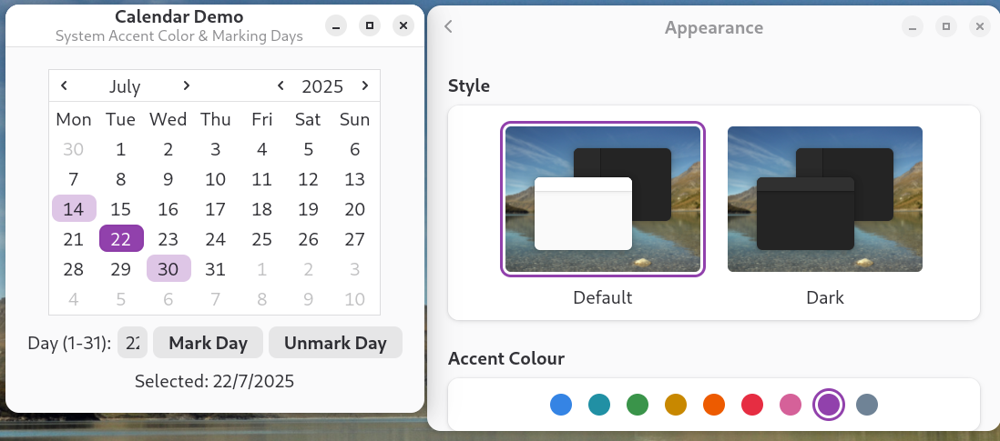

However, the application would not run on a default [Xfce4 Wayland](https://github.com/crispinprojects/xfce4-wayland) desktop without installing libadwaita and supporting libraries. Depending on your system setup this can be done using the commands below but other libraries may be needed. 

```
sudo apt update
sudo apt install libadwaita-1-0
```

Even when I got the libadwaita calendar demo to run on Debian 13 Xfce only the Debian default system colours (dark blue/light blue) were displayed as there is no accent colours dialog. 

Debian 13 Trixie (and Ubuntu) based distros have the GTK4 runtime installed by default. This means that Talk Calendar just runs without installing libadwaita.

Talk Calendar has not been rewritten as a libadwaita application using the GNOME HIG philosophy. Although a Talk Calendar libadwaita application would run on the GNOME desktop it would not run on other GTK desktops such as Xfce with out installing supporting libraries. Xfce and other GTK desktops have not officially adopted the GNOME HIG philosophy as they maintain their own system dialogs (e.g. Appearance dialog) and ecosystem. 

The GNOME HIG discourages the [use of preferences](https://wiki.gnome.org/Design(2f)HIG(2f)Planning(2f)Configuration.html) saying "using preferences as a band-aid is the root of much UI evil" and then "As far as possible, applications should be designed in order to not require manual configuration". Talk Calendar does allow users to change colour and theme preferences and choose other display options and so it is not GNOME HIG compliant in this respect. Sorry about that.

Talk Calendar supports a dark theme which can be selected using the preferences dialog. The today and event day colours to be changed to suit the dark colour scheme using the colour picker so that the user can select their own [accent colours](https://www.bbc.co.uk/homes/design/colour_wheel.shtml). The dark theme worked on an [Xfce Wayland desktop](https://github.com/crispinprojects/xfce4-wayland).

It appears that GTK5 will continue to be a general-purpose toolkit but likely to be Wayland only with web technologies used for styling. Assuming GTK5 remains a general toolkit other desktop environments such as Xfce, Cinnamon, MATE etc. will be able to use it to develop Wayland applications and apply their own themes and design. However, as GNOME drives changes in GTK that align with its GNOME HIG philosophy, the more difficult it may become for other desktop environments to use GTK applications without adopting libadwaita. 

### Building on Raspberry Pi

At the time of writing [Raspberry Pi](https://www.raspberrypi.com/software/) does not have an official release of RPi OS (Trixie). However, Ubuntu Desktop 25.04 (ARM 64-bit) can be installed using the official Raspberry Pi Imager on RPi 4/400 and RPi5/550 boards with 4GB or above. I have successfully compiled Talk Calendar on a RPi 500 with the Ubuntu 25.04 OS. See screenshot below.

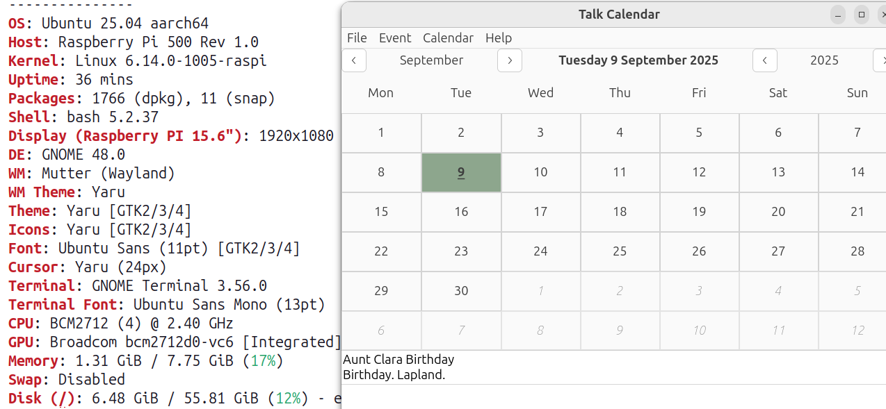

Canonical also provide Ubuntu [images](https://canonical.com/blog/ubuntu-developer-images-now-available-for-orangepi-rv2-a-low-cost-risc-v-sbc) for RISC-V single board computers (SBCs) such as the OrangePi RV2. Although I have not been able to test one of these boards I expect that it should be possible to compile Talk Calendar on a RISC-V board using Ubuntu RISC-V OS provided GTK 4.14 or above is supported. 

### Building on Fedora

With Fedora you need to install the following packages to compile Talk Calendar.

```
sudo dnf install gcc make
sudo dnf install gtk4-devel
sudo dnf install gtk4-devel-docs
sudo dnf install glib-devel
sudo dnf install alsa-lib-devel
sudo dnf install sqlite-devel
```

To check the installed Sqlite 3 version use the command below.

```
sqlite3 --version
```

To determine which version of GTK4 is running on a Ubuntu/Debian system use the following terminal command.

```
gtk4-launch --version
```
or

```
dnf list gtk4-devel
```

## Versioning

[SemVer](http://semver.org/) is used for versioning. The version number has the form 0.0.0 representing major, minor and bug fix changes.

## Author

* **Alan Crispin** [Github](https://github.com/crispinprojects)

## Project Status

Active and under development.

## Acknowledgements

* [GTK](https://www.gtk.org/)

* GTK is a free and open-source project maintained by GNOME and an active community of contributors. GTK is released under the terms of the [GNU Lesser General Public License version 2.1](https://www.gnu.org/licenses/old-licenses/lgpl-2.1.html).

* [GTK4 API](https://docs.gtk.org/gtk4/index.html)

* [GObject API](https://docs.gtk.org/gobject/index.html)

* [Glib API](https://docs.gtk.org/glib/index.html)

* [Gio API](https://docs.gtk.org/gio/index.html)

* [Geany](https://www.geany.org/) is a lightweight source-code editor (version 2 now uses GTK3). [GPL v2 license](https://www.gnu.org/licenses/old-licenses/gpl-2.0.txt)

* [Sqlite](https://www.sqlite.org/index.html) is open source and in the [public domain](https://www.sqlite.org/copyright.html).

* [Diphone License](https://github.com/hypnaceae/DiphoneSynth/blob/master/diphones_license.txt)

* [Debian](https://www.debian.org/)

* [Fedora](https://fedoraproject.org/)

* [Ubuntu](https://ubuntu.com/download/desktop)
