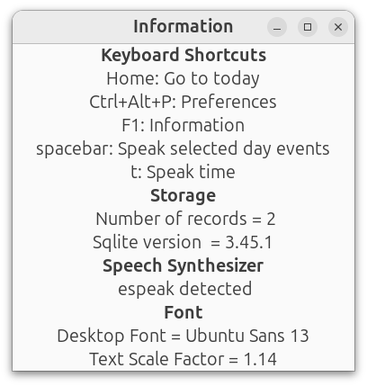

# Talk Calendar

Talk Calendar is a personal desktop calendar for Linux which has some speech capability for reading out dates, times and event details.

Talk Calendar has been developed using C and [GTK4](https://docs.gtk.org/gtk4/) for GTK desktops (GNOME, Ubuntu Desktop, Cinnamon, XFCE  etc.). 

A screenshot of Talk Calendar (Ubuntu Desktop) is shown below. 


## Core Features

* built with C and GTK4 for GTK based desktops
* Graphical user interface with month view calendar allowing events to be entered and edited
* display of truncated event titles on calendar
* use of tooltips (hovering over an event day displays a tooltip with day event details)
* export and import iCalendar files (backup and restore)
* click and talk (click on calendar day to read out events)
* talking clock (t-key)
* calendar tools such as calculate Easter and search for events
* Sqlite3 database used to store events


## Local Install Using Pre-built Binary (x86 Intel PCs)

A pre-built 64-bit x86 Talk Calendar executable is available and can be downloaded from the binary directory. This has been built using GTK 4.14 and compiled using Ubuntu 24.04 on Intel hardware.

Extract the downloaded file which contains the Talk Calendar executable. Talk Calendar must have executable permissions to execute.  If necessary change Talk Calendar file permissions so that it can run as an executable as shown below.

```
sudo chmod +x talkcalendar
```

Assuming that the GTK4 base libraries are installed the Talk Calendar binary can be run from the terminal using:

```
./talkcalendar
```


## Desktop System Menu Entry

To add Talk Calendar to the system menu modify the Talk Calendar desktop file provided in the download. A desktop file has a .desktop extension and provides metadata about an application such as its name, icon, command to execute and other properties. For user-specific applications desktop files can be located locally in the ***~/.local/share/applications/*** directory. Local user entries take precedence over system entries. For desktops based on GNOME such as the Ubuntu Desktop, the desktop file should be named using the [application ID](https://developer.gnome.org/documentation/tutorials/application-id.html), that is application_id.desktop, which in this case is "org.gtk.talkcalendar.desktop" 

You need to modify the "org.gtk.talkcalendar.desktop" file using your own user name and directory locations. For example, if your user name is "sam" and you install local applications in a folder called "Software" and you create a folder called "talkcalendar " to store the Talk Calendar binary executable then the executable path would be "Exec=/home/sam/Software/talkcalendar/talkcalendar". The Exec variable defines the command to execute when launching an application, in this case, the talkcalendar binary executable. The Path variable tells the system where to look for the executable and the calendar database. The Icon variable specifies the path to the icon file associated with the application. In a .desktop file, you need to use absolute and full paths.

Copy your modified "org.gtk.talkcalendar.desktop" file to the ***~/.local/share/applications/*** directory. Create the ~/.local/share/applications/ directory if it does not already exist. This way of locally installing Talk Calendar should be universal across different Linux distributions.

Talk Calendar now uses espeak which needs to be installed separately rather. With Ubuntu you install espeak using the terminal command below.

```
sudo apt install espeak
```

## Autostart Talk Calendar

Copy the "org.gtk.talkcalendar.desktop" file to ***~/.config/autostart*** to start Talk Calendar when the computer is switched on. Talk Calendar can then read out the current date and day events and any future upcoming events (see preferences settings) when the computer is switched on.


## Calendar Interface


Talk Calendar now uses a month view calendar which displays truncated event titles on selected days so that all events for a month to be viewed at a single glance. Hovering over an event day displays a tooltip with further event details. Clicking on a day reads out the events for that day if any. Talking is switched on by default but can be switched off in the preferences dialog. The calendar colours for today and event days can also be changed.

If you have ever used a desktop calendar application before then using Talk Calendar will be straight forward. You select a date, then click on the event dialog button in the top left corner which enables you to create a new event. You can then edit an existing event or delete an event by selecting it in the list view. 

The hamburger menu can be used to select the preferences dialog and other features such as exporting a personal calendar as an iCalendar file for backup purposes. These typically use the file extension ".ical" or ".ics". The [iCalendar standard](https://icalendar.org/) is an open standard for exchanging calendar and scheduling information between users and computers.  An icalendar file is a plain text file and so can be views and modified using a standard text editor. 

Pressing F1 invokes the information window which can also be selected from the hamburger menu. The information window shows the keyboard shortcuts, how many records are in the calendar database, the Sqlite version being used on the system, the desktop font and scale factor. The About dialog displays the Talk Calendar version number.

## Screenshots

Talk Calendar series 0.4 uses a new interface and current downloads are snapshots of work in progress. Some current screenshots are shown below.




## Talking

Speech requires that [espeak](https://espeak.sourceforge.net/) is installed. With Ubuntu and Debian use the command below to install eSpeak.

```
sudo apt install espeak
```

* Press the *t key* to readout the current time (talking clock).

* Click calendar day to readout event details 

* spacebar can also be used to read out events on a selected day

## Text Scaling

Font text scaling is no longer changed from within Talk Calendar using Pango but done at the system level. You can install and use the GNOME Tweaks Tool to change fonts and the text scaling factor.

```
sudo apt install gnome-tweaks
```

### Building on Ubuntu 24.04 x86 Hardware

To build Talk Calendar from source you need the gcc compiler, GTK4, GLIB, and SQLITE development libraries. You need to install the following packages.

```
sudo apt install build-essential
sudo apt install libgtk-4-dev
sudo apt install libasound2-dev
sudo apt install sqlite3
sudo apt install libsqlite3-dev
sudo apt install espeak
```

The packages:

```
sudo apt install libglib2.0-dev
sudo apt install alsa-utils
```

are needed but should be installed by default. 

To check the installed Sqlite 3 version use the command below.

```
sqlite3 --version
```

To determine which version of GTK4 is running on a Ubuntu/Debain system use the following terminal command.

```
dpkg -l | grep libgtk*
```

Use the MAKEFILE to compile Talk Calendar. Just run "make" inside the source code folder.

```
make
```

To run Talk Calendar from the terminal use

```
./talkcalendar
```

## IDE

I am now using GNOME Builder for developing Talk Calendar. This is a a free and open-source Integrated Development Environment (IDE) which can be used for developing GTK4 and GNOME applications. Talk Calendar is a GTK4 application and not a libadwaita GNOME program and uses the [GNU Make](https://www.gnu.org/software/make/) build system (not Meson). 

To get the latest version of Builder with Ubuntu 22.04 you need to install Flatpak and use the Flathub repository which can be installed using using the terminal commands below.

```
sudo apt update
sudo apt upgrade
sudo apt install flatpak
flatpak remote-add --if-not-exists flathub https://flathub.org/repo/flathub.flatpakrepo

```
After a restart install Warehouse which can be used to manage the installation of Flatpaks and is particularly useful with Ubuntu as unfortunately the app centre does not support Flatpaks.

```
flatpak install flathub io.github.flattool.Warehouse
```

Open Warehouse and search for GNOME Builder and install.

With Builder you can use the the "Empty Makefile Project" template for starting a GTK4 Makefile project. Builder has some great features and there is a tutorial [here](https://builder.readthedocs.io/installation.html). Some feature highlights include browser pages so that [GTK4 API](https://docs.gtk.org/gtk4/index.html) information can be displayed within the IDE, global search, integral terminal, debugger, and  build, rebuild, clean and create run command menu items.

If you just want a simple code editor to compile the lastest version of Talk Calendar then [Geany](https://www.geany.org/) can be used and installed using the Ubuntu app centre. Geany has a sidebar that has a symbols tab. This is very useful as it shows a list of symbols (functions, classes, variables, etc.) found within the current open file and you can filter these. With Builder you have to do a global search for a callback.


## Compile Notes

The latest version of Talk Calendar (0.4 series) has been developed using Ubuntu 24.04 which uses GTK 4.14. This is a much newer version of the GTK toolkit compared to that used with Debian 12 which is version GTK 4.8.

With GTK 4.14 the GtkFileDialog API is no longer signal based but callback based which should match a GAsyncReadyCallback function (async/await) and this has been used. In computer programming, the async/await pattern is a syntactic feature that allows an asynchronous, non-blocking function to be structured in a way similar to an ordinary synchronous function.  A file dialog to export an ical backup file has been implemented using a GAsyncReadyCallback function and this code is not compatible with GTK 4.8 (Debian 12). 

The GTK4.14 [GTKCalendar](https://docs.gtk.org/gtk4/class.Calendar.html) has a function  called [gtk_calendar_mark_day](https://docs.gtk.org/gtk4/method.Calendar.mark_day.html) which places a visual marker on a particular day of the current calendar month. This did not work with GTK 4.8 (Debian 12) and the reason I developed a custom calendar to allow visual markers to be used. I tried using the lastest version of GtkCalendar but it does not support features such as displaying event titles and tooltips. With the latest version of Talk Calendar I have upgraded custom calendar to support the display of truncated event titles on the calendar view and tooltips. Hovering over an event day displays a tooltip with further event details.

I have also dropped the built-in diphone speech synthesizer in favour of using eSpeak. Talk Calendar is in essence a speech-dispatcher as it sends text-to-speech output to the eSpeak speech synthesizer which has to be installed separately on the user system. With Ubuntu and Debian use the command below to install eSpeak.

```
sudo apt install espeak
```

The last of the previous versions (0.3 series) of Talk Calendar which compiles with Debian 12 can still be download from the "talkcalendar-debian 12" folder.

The latest version  of Talk Calendar (0.4 series) can be used with Ubuntu 22.04, Debian 13 (but not Debian 12 for the reasons discussed above) and Fedora 41 and above.

### Raspberry Pi OS

Raspberry Pi OS (64-bit) is a port of Debian Bookworm and by default it uses the Wayland compositor called [labwc](https://github.com/labwc/labwc). You need to use the Debian 12 code base to build Talk Calendar on a Raspberry Pi 4 and 5 running Raspberry Pi OS. 

### Building on Fedora

With Fedora you need to install the following packages to compile Talk Calendar.

```
sudo dnf install gcc make
sudo dnf install gtk4-devel
sudo dnf install gtk4-devel-docs
sudo dnf install glib-devel
sudo dnf install alsa-lib-devel
sudo dnf install sqlite-devel
```

To check the installed Sqlite 3 version use the command below.

```
sqlite3 --version
```

To check the installed version of the GTK4 development libraries use the command below.

```
dnf list gtk4-devel
```

## Versioning

[SemVer](http://semver.org/) is used for versioning. The version number has the form 0.0.0 representing major, minor and bug fix changes.

## Author

* **Alan Crispin** [Github](https://github.com/crispinprojects)

## Project Status

Active and under development.

## License

GTK is released under the terms of the [GNU Lesser General Public License version 2.1](https://www.gnu.org/licenses/old-licenses/lgpl-2.1.html). Talk Calendar is licensed under the same LGPL v2.1 license.

## Acknowledgements

* [GTK](https://www.gtk.org/)

* GTK is a free and open-source project maintained by GNOME and an active community of contributors. GTK is released under the terms of the [GNU Lesser General Public License version 2.1](https://www.gnu.org/licenses/old-licenses/lgpl-2.1.html).

* [GTK4 API](https://docs.gtk.org/gtk4/index.html)

* [GObject API](https://docs.gtk.org/gobject/index.html)

* [Glib API](https://docs.gtk.org/glib/index.html)

* [Gio API](https://docs.gtk.org/gio/index.html)

* [GNOME Builder](https://builder.readthedocs.io/index.html)

* [Geany](https://www.geany.org/) is a lightweight source-code editor (version 2 now uses GTK3). [GPL v2 license](https://www.gnu.org/licenses/old-licenses/gpl-2.0.txt)

* [Sqlite](https://www.sqlite.org/index.html) is open source and in the [public domain](https://www.sqlite.org/copyright.html).

* [espeak](https://espeak.sourceforge.net/)

* [Debian](https://www.debian.org/)

* [Fedora](https://fedoraproject.org/)

* [Ubuntu](https://ubuntu.com/download/desktop)
