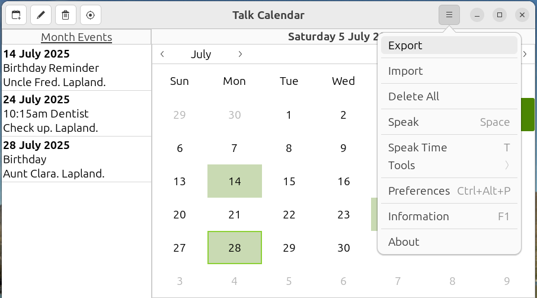

# Talk Calendar

Talk Calendar is a personal desktop calendar for Linux which has some speech capability for reading out dates, times and event titles.

Talk Calendar has been developed using C and [GTK4](https://docs.gtk.org/gtk4/) for GTK desktops (GNOME, Ubuntu Desktop, Cinnamon, XFCE  etc.). It uses it own built-in speech synthesizer which means it can be can compiled without any external speech library dependencies and so should be universal across different distributions. I have been developing it using [Debian 12 Bookworm](https://www.debian.org/) which uses GTK4.8.

A screenshot of Talk Calendar is shown below. 


## Core Features

* built with C and GTK4 for GTK based desktops
* month view calendar 
* event details, location, start and end time can be entered and edited
* export and import iCalendar files (backup and restore)
* speech synthesizer for reading out date, times and event titles
* talking clock (t-key)
* Sqlite3 database used to store events


## Local Install Using Pre-built Binary (x86 Intel PCs)

A pre-built 64-bit x86 Talk Calendar executable is available and can be downloaded from the binary directory. This has been built using GTK 4.8 and compiled using Debian 12 on Intel hardware.

Extract the downloaded file which contains the Talk Calendar executable. Talk Calendar must have executable permissions to execute.  If necessary change Talk Calendar file permissions so that it can run as an executable as shown below.

```
sudo chmod +x talkcalendar
```

Assuming that the GTK4 base libraries are installed the Talk Calendar binary can be run from the terminal using:

```
./talkcalendar
```

## Desktop System Menu Entry

To add Talk Calendar to the system menu modify the Talk Calendar desktop file provided in the download. A desktop file has a .desktop extension and provides metadata about an application such as its name, icon, command to execute and other properties. For user-specific applications desktop files can be located locally in the ***~/.local/share/applications/*** directory. Local user entries take precedence over system entries. For the GNOME desktop, the desktop file should be named using the [application ID](https://developer.gnome.org/documentation/tutorials/application-id.html), that is <application_id>.desktop, which in this case is "org.gtk.talkcalendar.desktop" 

You need to modify the "org.gtk.talkcalendar.desktop" file using your own user name and directory locations. For example, if your user name is "sam" and you install local applications in a folder called "Software" and you create a folder called "talkcalendar " to store the Talk Calendar binary executable then the executable path would be "Exec=/home/sam/Software/talkcalendar/talkcalendar". The Exec variable defines the command to execute when launching an application, in this case, the talkcalendar binary executable. The Path variable tells the system where to look for the executable and the calendar database. The Icon variable specifies the path to the icon file associated with the application. In a .desktop file, you need to use absolute and full paths.

Copy your modified "org.gtk.talkcalendar.desktop" file to the ***~/.local/share/applications/*** directory. Create the ~/.local/share/applications/ directory if it does not already exist. This way of locally installing Talk Calendar should be universal across different Linux distributions.

## Autostart Talk Calendar

Copy the "org.gtk.talkcalendar.desktop" file to ***~/.config/autostart*** to start Talk Calendar when the computer is switched on. Talk Calendar can then read out the current date and day events and any future upcoming events (see preferences settings) when the computer is switched on.

## Calendar Usage

If you have used a calendar application before then using Talk Calendar will be straight forward. 

### Adding New Event

* Click on the "New Event" button in the header bar or press Ctrl+n to invoke the "New Event" window
* Enter the event summary
* Enter the event description 
* Enter the location
* Enter the start date by setting the day, month and year values 
* Enter start and end times (or tick the all day check box)
* Times are entered as hour and minute values using the 24-hour time notation
* Events are sorted by start time when displayed
* Check the "Is Yearly" check box if the event repeats every year (e.g. birthdays and anniversaries)

A screenshot of the new event dialog is shown below.


### Editing Existing Event

* Select the event in the list view and either select "Edit Event" button in the header bar or press Ctrl+e
* Change details as appropriate

### Hamburger Menu



### Searching For Events

* Select the "Search" menu item in the hamburger menu (see screenshot)
* Enter a search term or location.

### Preferences

* Select "Preferences" in the hamburger menu or use Ctrl+Alt+p to invoke the preferences window (see screenshot below)
* Change options as required


You can use 12 hour format. Event end-times can also be shown in the list view. Notable dates (Christmas, Easter, Saint Days etc.) can be displayed on the calendar which are also spoken.

Talk options can be changed. The option "Speak At Startup" allows Talk Calendar to read out the current date and day events when the calendar is started.

## Talking

* Press the *t key* to readout the current time (talking clock).

* Press *spacebar* to readout event details for the date selected (see option preferences).

### Information

* Select "Information"  from the help menu or press F1


* the information window shows the keyboard shoutcuts, how many records are in the database, the Sqlite version being used on the system, the desktop font and scale factor.

* Use the About dialog to display the Talk Calendar current version.

### Keyboard Shortcuts

```
Ctrl+n			New Event
Ctrl+e			Edit Selected Event
Delete			Delete Selected Event
Ctrl_Alt+p		Preferences window
Spacebar		Speak
t			Speak Time
F1			Information
```

### Events Database

Events are stored in an [Sqlite](https://www.sqlite.org/index.html) database. SQLite is a small, fast and full-featured SQL database engine written in C. 

### Export and Import iCalendar Files

Talk Calendar allows a personal calendar to be exported as an iCalendar file. These typically use the file extension ".ical" or ".ics". The [iCalendar standard](https://icalendar.org/) is an open standard for exchanging calendar and scheduling information between users and computers.  An icalendar file is a plain text file and so can be modified using a standard text editor. 

The export to icalendar file does not currently support time zones and so the DTSTART and DTEND properties contain dates with local time and have no reference to a time zone. For example, the following represents an event starting on January, 1st, 2024 at 11.30am and ending at 2pm.

```
DTSTART:20240101T113000
DTEND:20240101T140000
```

You should backup your events by using the File->Export menu item which will create an "events.ical" file in the working directory (keep this safe and make another copy if necessary). If you then corrupt your database, you can clear all events and then use the File->Import to restore exported events. This assumes that the "events.ical" file is in the current working directory. If you completely corrupt your Sqlite database called calendar.db then rename it and restart Talk Calendar which will create a new empty database and restore into this.

The icalendar import parser allows the date and local time to be imported and checks if a time zone has been specified using the [TZID](https://icalendar.org/iCalendar-RFC-5545/3-2-19-time-zone-identifier.html) property. A file chooser dialog is used to allow the file to be chosen by the user as shown below. File filters can be used.

The parser will be updated with new features in future releases.

### Recurring Events

The only recurring event type that is currently supported by Talk Calendar is yearly. This is required for events such as birthdays and anniversaries. The parser uses icalendar [RRULE](https://icalendar.org/iCalendar-RFC-5545/3-8-5-3-recurrence-rule.html) to determine if an event is yearly (e.g. birthday).

## Speech Synthesis

Synthesised speech can be created by concatenating pieces of recorded speech. The size of the stored speech units can range from  [phonemes](https://en.wikipedia.org/wiki/Phoneme), [diphones](https://en.wikipedia.org/wiki/Diphone), [words](https://en.wikipedia.org/wiki/Speech_synthesis) or even whole sentences. The use of whole words and sentences are used in restricted domain applications such as public transport announcement systems. I found that the main issue with using word concatenation for this talking calendar application was that the voice file increases in size as more audio word recordings are added to the dictionary.  I had to use Signed 16-bit PCM encoding for the audio files rather than 8000Hz 8-bit Unsigned PCM encoding to eliminate the audio hiss that could heard on playback in early versions of Talk Calendar. However, this makes the audio word files larger and so adds to the voice file size problem. Also recording words to get a uniform set of pronunciations is challenging as is deciding how many and what generic words should be recorded for describing event titles. I found that the word concatenation speech synthesizer approach produced clear fluent speech although the word splicing nature of the concatenation approach meant that the natural flow of words (prosody) has a stepping rhythm when mimicking the process of speech formation. 

Of course, from a file size perspective, the better approach is to use recorded diphones and construct words from these.  With this approach the audio voice file size remains fixed but words have to be constructed by stitching together diphones in the correct order. A pronunciation dictionary is used to map words to diphone sequences and new words can be easily added once the diphone sequence has been established.

A parametric speech synthesizer uses a set of parameters like formant frequencies (resonances) and bandwidths to generate synthetic speech rather than using human speech samples (words, diphones etc.) and concatenating these together. The parameters are manipulated to create different speech sounds. A formant speech synthesizer is a type of parametric speech synthesizer. I developed a small formant speech synthesizer the details of which can be found [here](https://github.com/crispinprojects/formant-synthesizer) to see if this approach could be used. The voice output is very robotic with many acoustic artefacts and so I have not used it for the Talk Calendar project. There is more information on parametric speech synthesis [here](https://ptolemy.berkeley.edu/eecs20/speech/voder.html) and  [here](https://en.wikipedia.org/wiki/Speech_synthesis). 

Talk Calendar currently uses the diphone speech synthesizer method. Some early development code can be found [here](https://github.com/crispinprojects/diphone-talker). Speech is synthesised by concatenating pre-recorded [diphones](https://en.wikipedia.org/wiki/Diphone). A small pronouncing dictionary is used to convert a word into it a diphone pronunciation. I have been using the [CMU Pronouncing Dictionary](http://www.speech.cs.cmu.edu/cgi-bin/cmudict?in=C+M+U+Dictionary) to look up the phoneme pronunciation  of a word and then work out the diphone construction. 

So what are diphones? The English language has 44 distinct minimal units of sound called phonemes. Graphemes are the written symbols that represent a sound and some phonemes may be represented by more than one grapheme. When a phoneme is spoken and recorded it is called "phone". A diphone is the last part of one phone followed by the first part of another. Either phone could be silence and they can be the same phone. Because diphone boundaries are in the centres of phones they are the units of co-articulation and so are a useful building block for synthesising speech. More information can be found on the [Speech Zone](https://speech.zone/courses/speech-processing/module-6-speech-synthesis-waveform-generation-and-connected-speech/videos/diphone/) site.

The voice used by Talk Calendar is derivative work based on the diphone collection created by Alan W Black and Kevin Lenzo which is free for use for any purpose (commercial or otherwise) and subject to the light restrictions [detailed here](https://github.com/hypnaceae/DiphoneSynth/blob/master/diphones_license.txt). I have used the same licence for the voice that I have created. There is information about recording your own diphones [here](http://festvox.org/bsv/x2401.html) and in the speech synthesis lecture by Professor Alan W Black [here](https://www.youtube.com/watch?v=eDjtEsOvouM&t=1459s). Further details of how to code a diphone speech synthesizer can be found [here](https://github.com/crispinprojects/talkdp).
 
I have recently been adding some common English first names to the dictionary so that it is possible to readout a first name and birthday e.g. "Fred birthday" in an effort to personalise a calendar entry. Of course a generic title such as "Uncle birthday" or "Birthday reminder" can be used instead. Many first names have not yet been implemented and so this feature is far from complete. 

Talk Calendar uses a very basic time scale modification algorithm to speed up playback without changing the pitch. This is based on a cross fade overlap and add (OLA) algorithm which is explained [here](https://ftp.esat.kuleuven.be/pub/sista/jszurley/peno/timescaling.pdf).
  
The speech synthesizer and pronunciation dictionary are work in progress. The advantage of using my own built-in speech synthesizer is that Talk Calendar can be compiled without any external speech synthesizer dependencies.

### Audio Thread

Talk Calendar now uses GTask (async/wait pattern) to play audio in a thread rather than GThread and GMutex which were used previously. With GTK4 it appears that the preferred way to perform work in a thread is to use GTask. The code now uses [g_task_run_in_thread()](https://docs.gtk.org/gio/method.Task.run_in_thread.html) so that a play audio blocking operation is executed in a separate background thread. The function g_task_run_in_thread() turns a synchronous operation into an asynchronous one, by running it in a thread. Apparently, GTask maintains a thread pool that is based on the number of CPUs available (i.e. supports multiple CPU-cores). 

### Accessibility

The main aim of the project has been to produce a calendar with an interface designed for accessibility which allows the dates and times of personal calendar events to be readout with the integration of a talking clock (t-key).

Accessibility refers to the design of systems to be usable by people with disabilities and elders. Programs are more accessible for people with visual impairments if they can use large text, high contrast and have a simple design. I have tried make the Talk Calendar interface simple using header buttons for creating a new event, editing a selected event and deleting a selected event.  The interface can be scaled to create large text. High contrast is achieved by using black text on a plain white background. The keyboard arrow keys can be used in conjunction with the enter key to move between months and years minimising the use of the mouse if required.

If you are using Debian 12 (Bookworm) GNOME desktop then switching on the screen reader provides audio navigation of the calendar interface using [Orca](https://help.gnome.org/users/orca/stable/introduction.html.en) and the [espeak](https://espeak.sourceforge.net/) text-to-speech engine. The GNOME accessibility settings are available using Settings->Accessibility. You can also use the screen reader to read out a calendar event by selecting it in the list view. There is more on Debian accessibility [here](https://www.debian.org/devel/debian-accessibility/).

## Build From Source

The C source code for the Talk Calendar application is provided in the src directory. 

[Geany](https://www.geany.org/) can be used as a source code editor for opening, viewing and then compiling the Talk Calendar C code. Geany is lightweight and has an integrated terminal for building the application. To install the Geany IDE use the command below.

```
sudo apt install geany
```
Alternatively, the latest version of Geany can be built from source using autotools.

### Building on Ubuntu 24.04 and Debian 12 Bookworm x86 Hardware

To build Talk Calendar from source you need the gcc compiler, GTK4, GLIB, SQLITE and Flite development libraries. You need to install the following packages.

```
sudo apt install build-essential
sudo apt install libgtk-4-dev
sudo apt install libasound2-dev
sudo apt install sqlite3
sudo apt install libsqlite3-dev
```

The packages:

```
sudo apt install libglib2.0-dev
sudo apt install alsa-utils
```

are needed but should be installed by default. 

To check the installed Sqlite 3 version use the command below.

```
sqlite3 --version
```

To determine which version of GTK4 is running on a Debian/Ubuntu system use the following terminal command.

```
dpkg -l | grep libgtk*
```

Use the MAKEFILE to compile Talk Calendar. Just run "make" inside the source code folder.

```
make
```

To run Talk Calendar from the terminal use

```
./talkcalendar
```

## Debian Compile Notes

I have tried to keep the current code base compatible with Debian 12 (Bookworm) which uses GTK 4.8. This is an older version of the GTK4 toolkit compared to the latest stable version which is currently [GTK4.18](https://www.gtk.org/). Debian Trixie will be the next stable release of Debian. At the time of writing the [Debian GTK4 tracker](https://tracker.debian.org/pkg/gtk4) shows that Debian Trixie is currently using GTK4.18.2. 

The function gtk_css_provider_load_from_data was depreciated in GTK 4.12 and replaced with "gtk_css_provider_load_from_string". However, I have still used this to be compatible with Debian 12. If compiling with Ubuntu 24.04 you get a series of depreciation warning messages as GTK 4.14 is used. See comments in the calendar source code file to eliminate these.

With GTK4.12 the GtkFileDialog API is no longer signal based but callback based which should match a GAsyncReadyCallback function (async/await) and this will be used in future updates. In computer programming, the async/await pattern is a syntactic feature that allows an asynchronous, non-blocking function to be structured in a way similar to an ordinary synchronous function. The function "gtk_file_chooser_dialog_new" used with a response callback has been depreciated and so has been removed from source code and ical backup files are saved to the current working directory. A file dialog to export an ical backup file will be implemented using a GAsyncReadyCallback function in future updates (when Debian 13 is released) and this will not be compatible with GTK4.8.

With GTK4.14 [GTKCalendar](https://docs.gtk.org/gtk4/class.Calendar.html) has a function  called [gtk_calendar_mark_day](https://docs.gtk.org/gtk4/method.Calendar.mark_day.html) which places a visual marker on a particular day of the current calendar month. This is not available in GTK4.8 (Debian 12) and the main reason why I ended up writing my own calendar. Also system colours will be used for the visual markers. When Debian 13 is released I will see if my custom calendar can be swapped out with GTKCalendar. 

### Raspberry Pi OS

Raspberry Pi OS (64-bit) is a port of Debian Bookworm and by default it uses the Wayland compositor called [labwc](https://github.com/labwc/labwc). Consequently, you can build Talk Calendar on a Raspberry Pi 4 and 5 running Raspberry Pi OS in the same way described above.

### Building on Fedora

With Fedora you need to install the following packages to compile Talk Calendar.

```
sudo dnf install gcc make
sudo dnf install gtk4-devel
sudo dnf install gtk4-devel-docs
sudo dnf install glib-devel
sudo dnf install alsa-lib-devel
sudo dnf install sqlite-devel
```

To check the installed Sqlite 3 version use the command below.

```
sqlite3 --version
```

To check the installed version of the GTK4 development libraries use the command below.

```
dnf list gtk4-devel
```

## Versioning

[SemVer](http://semver.org/) is used for versioning. The version number has the form 0.0.0 representing major, minor and bug fix changes.

## Author

* **Alan Crispin** [Github](https://github.com/crispinprojects)

## Project Status

Active and under development.

## License

GTK is released under the terms of the [GNU Lesser General Public License version 2.1](https://www.gnu.org/licenses/old-licenses/lgpl-2.1.html). Talk Calendar is licensed under the same LGPL v2.1 license.

## Acknowledgements

* [GTK](https://www.gtk.org/)

* GTK is a free and open-source project maintained by GNOME and an active community of contributors. GTK is released under the terms of the [GNU Lesser General Public License version 2.1](https://www.gnu.org/licenses/old-licenses/lgpl-2.1.html).

* [GTK4 API](https://docs.gtk.org/gtk4/index.html)

* [GObject API](https://docs.gtk.org/gobject/index.html)

* [Glib API](https://docs.gtk.org/glib/index.html)

* [Gio API](https://docs.gtk.org/gio/index.html)

* [Geany](https://www.geany.org/) is a lightweight source-code editor (version 2 now uses GTK3). [GPL v2 license](https://www.gnu.org/licenses/old-licenses/gpl-2.0.txt)

* [Sqlite](https://www.sqlite.org/index.html) is open source and in the [public domain](https://www.sqlite.org/copyright.html).

* [Debian](https://www.debian.org/)

* [Fedora](https://fedoraproject.org/)

* [Ubuntu](https://ubuntu.com/download/desktop)
