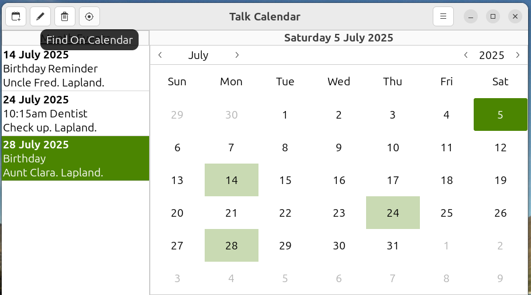
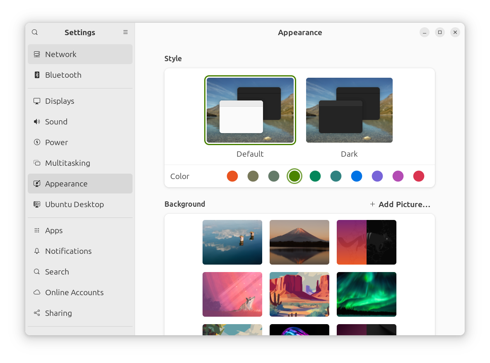

# Talk Calendar

Talk Calendar is a personal desktop calendar for Linux which has some speech capability for reading out dates, times and event summary words.

Talk Calendar has been developed using C and [GTK4](https://docs.gtk.org/gtk4/) for GTK desktops (Ubuntu Desktop, GNOME,  Cinnamon, XFCE  etc.). 

A screenshot of Talk Calendar (Ubuntu Desktop) is shown below. 


## Core Features

* built with C and GTK4 for GTK based desktops
* Graphical user interface with month view calendar 
* month events side panel
* export and import iCalendar files (backup and restore)
* built-in diphone speech synthesizer for speaking dates, time and event summary words
* calendar tools such as calculate Easter and search for events
* Sqlite3 database used to store events

## Local Install Using Pre-built Binary (x86 Intel PCs)

A pre-built 64-bit x86 Talk Calendar executable is available and can be downloaded from the binary directory. This has been built using GTK 4.14 and compiled and tested using Ubuntu 24.04 on Intel hardware.

A 64-bit prebuilt binary for the latest version of Talk Calendar is available and can be extracted from the binary directory. Talk Calendar must have executable permissions to execute.  If necessary change Talk Calendar file permissions so that it can run as an executable as shown below.

```
sudo chmod +x talkcalendar
```
Assuming that the GTK4 base libraries are installed the Talk Calendar binary can be run from the terminal using:

```
./talkcalendar
```

## BASH Script Installer

The easiest way to install Talk Calendar is to use the bash script installer from the terminal. This is found in the binary directory in the download. 

To install Talk Calendar run the installer script as shown below and follow the on-screen instructions.

```
./install-talkcalendar.sh
```

The installer assumes that you are a member of the sudo group and that the GTK4 libraries are installed. If not, go to the building section below and the following terminal command instructions to install the required packages.

To uninstall Talk Calendar run the script below

```
./uninstall-talkcalendar
```


## Calendar Interface

Talk Calendar uses a month view calendar with a pane side panel to display month events. To create a new event select a day on the calendar and press the new event button on the header bar. To edit an event, select it in month events side panel and then press the edit event button on the header bar. Likewise to delete an event select it in the month events side panel and press the delete button on the header bar. To locate an event on the calendar press the location button.

The hamburger menu can be used to select the preferences dialog and other features such as exporting a personal calendar as an iCalendar file for backup purposes. These typically use the file extension ".ical" or ".ics". The [iCalendar standard](https://icalendar.org/) is an open standard for exchanging calendar and scheduling information between users and computers.  An icalendar file is a plain text file and so can be viewed and modified using a standard text editor. 

Pressing F1 invokes the information window which can also be selected from the hamburger menu. The information window shows the keyboard shortcuts, how many records are in the calendar database, the Sqlite version being used on the system, the desktop font and scale factor. The About dialog displays the Talk Calendar version number.

### New Event


### Select An Event


### Hamburger Menu


### Preferences


### Information (F1)


## Talking

Talk Calendar can read out the date and time. The event summary can also be read out but the number of words recognised is constrained to common generic words used to describe a personal calendar event such as *anniversary, appointment, birthday, cafe, car, dentist, doctor, driver, family, funeral, holiday, hospital, meeting, party, payment, reminder, restaurant, service, task, television, travel, visit, wedding, work*. You can use two or more words for the event summary such as "birthday party", "dentist appointment", "car service" etc. I have been adding some common English first names to the dictionary so that it is possible to readout a first name and birthday e.g. "Fred birthday". However, many first names have not yet been implemented and so this feature is far from complete. If an event word is not recognised then it is skipped over. 

* Make sure the "Enable Talking" check button in the preferences window is ticked 

* Press the *t key* to readout the current time (talking clock)

* Click on a calendar day to read out the date and any event details

* The space bar can also be used to read out events on a selected day

## Font Size, Text Scaling, Colour

Apparently you should now use ***system settings*** rather that in-app settings with GNOME based desktops.

Consequently, font, font size and text scaling are no longer changed from within Talk Calendar but done at the ***system level***. The easiest way to do this is to install and use the GNOME Tweaks tool  as shown below.
 
```
sudo apt install gnome-tweaks
```


Gnome Teaks can also be used to add Talk Calendar to the startup applications. Talk Calendar can then read out the date and any day events when the computer is switched on.

The calendar style colour is again set at the system level. Open Ubuntu desktop "Settings" and use the "Appearance" tab
to change the colour style as required.



 
## Speech Synthesis

Talk Calendar uses the diphone speech synthesizer method. Speech is synthesised by concatenating pre-recorded segments of speech called [diphones](https://en.wikipedia.org/wiki/Diphone). A small pronouncing dictionary is used to convert a word into it a diphone pronunciation. I have been using the [CMU Pronouncing Dictionary](http://www.speech.cs.cmu.edu/cgi-bin/cmudict?in=C+M+U+Dictionary) to look up the phoneme pronunciation  of a word and then work out the diphone construction.

The voice used by Talk Calendar is derivative work based on the diphone collection created by Alan W Black and Kevin Lenzo which is free for use for any purpose (commercial or otherwise) and subject to the pretty light restrictions [detailed here](https://github.com/hypnaceae/DiphoneSynth/blob/master/diphones_license.txt). I have used the same licence for the voice that I have created. There is information about recording your own diphones [here](http://festvox.org/bsv/x2401.html) and in the speech synthesis lecture by Professor Alan W Black [here](https://www.youtube.com/watch?v=eDjtEsOvouM&t=1459s).

### Building on Ubuntu 24.04 x86 Hardware

To build Talk Calendar from source you need the gcc compiler, GTK4, GLIB, and SQLITE development libraries. You need to install the following packages.

```
sudo apt install build-essential
sudo apt install libgtk-4-dev
sudo apt install libasound2-dev
sudo apt install sqlite3
sudo apt install libsqlite3-dev
```

To check the installed Sqlite 3 version use the command below.

```
sqlite3 --version
```

To determine which version of GTK4 is running on a Ubuntu/Debain system use the following terminal command.

```
dpkg -l | grep libgtk*
```

Use the MAKEFILE to compile Talk Calendar. Just run "make" inside the source code folder.

```
make
```

To run Talk Calendar from the terminal use

```
./talkcalendar
```

## Compile Notes

The latest version of Talk Calendar (0.4 series) has been developed using Ubuntu 24.04 which uses GTK 4.14. This is a much newer version of the GTK toolkit compared to that used with Debian 12 which is version GTK 4.8 and used when developing the 0.3 series of Talk Calendar.

A model view design has been used based around a CalendarEvent type which is subclass of GObject. This allows the use of GListStore which is an array-like list implementation. A GListStore is a concrete implementation of the GListModel interface. GListView is used to display data from the model.

With GTK 4.14 the GtkFileDialog API is no longer signal based but callback based using an async/await pattern. This is a syntactic feature that allows an asynchronous, non-blocking function to be structured in a way similar to an ordinary synchronous function. File dialogs to export and import ical files (for backup purposes) has been implemented using this approach and this code is not compatible with GTK 4.8 (Debian 12). 

GTask allows a task to be called inside a thread and is now used to play audio rather than using GThread and GMutex. With GTK4 it appears that the preferred way to perform work in a thread is to use GTask. The code now uses [g_task_run_in_thread()](https://docs.gtk.org/gio/method.Task.run_in_thread.html) so that a play audio blocking operation is executed in a separate background thread. The function g_task_run_in_thread() turns a synchronous operation into an asynchronous one, by running it in a thread. Apparently, GTask maintains a thread pool that is based on the number of CPUs available (i.e. supports multiple CPU-cores). 

The GTK4.14 [GTKCalendar](https://docs.gtk.org/gtk4/class.Calendar.html) has a function  called [gtk_calendar_mark_day](https://docs.gtk.org/gtk4/method.Calendar.mark_day.html) which places a visual marker on a particular day of the current calendar month. This did not work with GTK 4.8 (Debian 12) and the reason I developed a custom calendar to allow visual markers to be used. GtkCalendar is now used in place of my previous custom calendar implementation.

The latest version  of Talk Calendar (0.4 series) can be used with Ubuntu 24.04, Debian 13 (but not Debian 12 for the reasons discussed above) and Fedora 41 and above.

### Building on Fedora

With Fedora you need to install the following packages to compile Talk Calendar.

```
sudo dnf install gcc make
sudo dnf install gtk4-devel
sudo dnf install gtk4-devel-docs
sudo dnf install glib-devel
sudo dnf install alsa-lib-devel
sudo dnf install sqlite-devel
```

To check the installed Sqlite 3 version use the command below.

```
sqlite3 --version
```

To check the installed version of the GTK4 development libraries use the command below.

```
dnf list gtk4-devel
```

## Versioning

[SemVer](http://semver.org/) is used for versioning. The version number has the form 0.0.0 representing major, minor and bug fix changes.

## Author

* **Alan Crispin** [Github](https://github.com/crispinprojects)

## Project Status

Active and under development.

## Acknowledgements

* [GTK](https://www.gtk.org/)

* GTK is a free and open-source project maintained by GNOME and an active community of contributors. GTK is released under the terms of the [GNU Lesser General Public License version 2.1](https://www.gnu.org/licenses/old-licenses/lgpl-2.1.html).

* [GTK4 API](https://docs.gtk.org/gtk4/index.html)

* [GObject API](https://docs.gtk.org/gobject/index.html)

* [Glib API](https://docs.gtk.org/glib/index.html)

* [Gio API](https://docs.gtk.org/gio/index.html)

* [Geany](https://www.geany.org/) is a lightweight source-code editor (version 2 now uses GTK3). [GPL v2 license](https://www.gnu.org/licenses/old-licenses/gpl-2.0.txt)

* [GNOME Builder](https://builder.readthedocs.io/index.html) is a free and open-source Integrated Development Environment (IDE) which can be used for developing GTK4 and GNOME applications.

* [Sqlite](https://www.sqlite.org/index.html) is open source and in the [public domain](https://www.sqlite.org/copyright.html).

* Diphone collection and synthesis Alan W. Black and Kevin Lenzo [2000](https://www.cs.cmu.edu/~awb/papers/ICSLP2000_diphone.pdf)

* [Debian](https://www.debian.org/)

* [Fedora](https://fedoraproject.org/)

* [Ubuntu](https://ubuntu.com/download/desktop)
