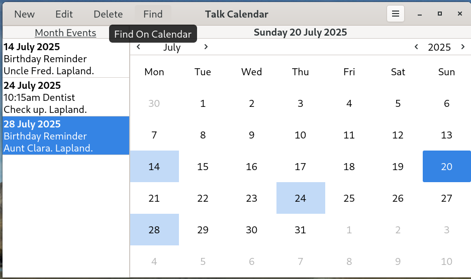

# Talk Calendar

Talk Calendar is a personal desktop calendar for Linux which has some speech capability for reading out dates, times and event summary words.

Talk Calendar has been developed using C and [GTK4](https://docs.gtk.org/gtk4/) for GTK desktops (Ubuntu Desktop, GNOME, XFCE, Cinnamon etc.). 

A screenshot of Talk Calendar is shown below. 


## Core Features

* built with C and GTK4 for GTK based desktops
* Graphical user interface with month view calendar 
* month events side panel
* export and import iCalendar files (backup and restore)
* built-in diphone speech synthesizer for speaking dates, time and event summary words
* calendar tools such as calculate Easter and search for events
* Sqlite3 database used to store events

## Pre-built Binary (x86 Intel PCs)

A pre-built 64-bit x86 Talk Calendar executable is available and can be downloaded from the installers directory. Unzip the installer archive file relevant to your distribution which contains the Talk Calendar executable.

Talk Calendar must have executable permissions to execute.  If necessary change Talk Calendar file permissions so that it can run as an executable as shown below.

```
sudo chmod +x talkcalendar
```
Assuming that the GTK4 base libraries are installed the Talk Calendar binary can be run from the terminal using:

```
./talkcalendar
```

## BASH Script Installer

The easiest way to install Talk Calendar is to use the BASH script installer from the terminal. This is found in the installers directory in the download. 

To install Talk Calendar run the installer script as shown below and follow the on-screen instructions.

```
./install-talkcalendar.sh
```

The installer assumes that you are a member of the sudo group and that the GTK4 libraries are installed. If not, go to the build Talk Calendar section below and use the terminal command instructions to install the required packages.

To uninstall Talk Calendar run the script below

```
./uninstall-talkcalendar
```

You can open the BASH script installer using a Text Editor to view the code. Talk Calendar is installed into the directory "/usr/bin/talkcalendar". One advantage of using a BASH script installer is that the code can be inspected to show exactly what is occurring. 

## Calendar Interface

Talk Calendar uses a month view calendar with a pane side panel to display month events. To create a new event select a day on the calendar and press the new event button on the header bar. To edit an event, select it in month events side panel and then press the edit event button on the header bar. Likewise to delete an event select it in the month events side panel and press the delete button on the header bar. To locate an event on the calendar press the "find on calendar"" button.

The hamburger menu can be used to select the preferences dialog and other features such as exporting a personal calendar as an iCalendar file for backup purposes. These typically use the file extension ".ical" or ".ics". The [iCalendar standard](https://icalendar.org/) is an open standard for exchanging calendar and scheduling information between users and computers.  An icalendar file is a plain text file and so can be viewed and modified using a standard text editor. 

Pressing F1 invokes the information window which can also be selected from the hamburger menu. The information window shows the keyboard shortcuts, how many records are in the calendar database, the Sqlite version being used on the system, the desktop font and scale factor. The About dialog displays the Talk Calendar version number.

### New Event


### Select Event and Find On Calendar


### Hamburger Menu


### Preferences


### Information (F1)


## Talking

Talk Calendar can read out the date and time. The event summary can also be read out but the number of words recognised is constrained to common generic words used to describe a personal calendar event such as *anniversary, appointment, birthday, cafe, car, dentist, doctor, driver, family, funeral, holiday, hospital, meeting, party, payment, reminder, restaurant, service, task, television, travel, visit, wedding, work*. You can use two or more words for the event summary such as "birthday party", "dentist appointment", "car service" etc. I have been adding some common English first names to the dictionary so that it is possible to readout a first name and birthday e.g. "Fred birthday". However, many first names have not yet been implemented and so this feature is far from complete. If an event word is not recognised then it is skipped over. 

* Make sure the "Enable Talking" check button in the preferences window is ticked 

* Press the *t key* to readout the current time (talking clock)

* Click on a calendar day to read out the date and any event details

* The space bar can also be used to read out events on a selected day

## Font, Colour, Icons

### Font

Apparently you should now use ***system settings*** rather that in-app settings with GNOME based desktops and GTK applications.

Consequently, font, font size and text scaling are no longer changed from within Talk Calendar but done at the ***system level***. One way to do this with GNOME and the Ubuntu Desktop is to use the GNOME Tweaks tool which is installed as shown below.
 
```
sudo apt install gnome-tweaks
```


GNOME Tweaks can also be used to add Talk Calendar to the startup applications. Talk Calendar can then read out the date and any day events when the computer is switched on.

Xfce uses its own "Appearance" settings window which allows the default font to be changed and so you don't need to install Tweaks.

### Accent Colour

Again with GNOME based desktops colour should now be set at the system level using the desktop environment "Settings" dialog. Unfortunately, testing Talk Calendar across different desktops and distributions has shown mixed results.

With Ubuntu 24.04 accent colour can be changed by opening Ubuntu desktop "Settings" and using the "Appearance" tab. It is possible to choose from a variety of colours to customise the way the desktop looks and accent colours are applied to Talk Calendar as you would expect.

With Debian 13 GNOME 48 (Wayland) the desktop "Settings" dialog can be used to change the accent colour. Unfortunately this has no effect on Talk Calendar. The calendar colours default to the standard system colours (blue/light blue). 

With Xfce there is no system wide settings dialog to change accent colours. Instead the "Appearance" dialog has three style options by default. These are the Adwaita (Gtk3,GTk2) light style, the Adwaita-Dark (Gtk3,Gtk2) dark style and the High Contrast (Gtk3,Gtk2) style. All of these styles work with Talk Calendar. Testing Talk Calendar with [Xfce4 and Wayland](https://github.com/crispinprojects/xfce4-wayland) using Debian 13 shows that the standard system colours (blue) are used again. The currently selected day colour is shown as dark blue. Event days are shown as light blue. See the screenshots by following the Xfce4 and Wayland link above.

## Update On Accent Colours (libadwaita)

With the latest changes it appears that only applications built with libadwaita (the default Adwaita theme for GNOME based desktops) respect system-wide accent colours. The libadwaita library is built on top of GTK4 and provides widgets that adhere to the [GNOME Human Interface Guidelines HIG](https://developer.gnome.org/hig/). It is used by GNOME developers to ensure that applications look and behave consistently with the GNOME desktop environment. The separation between GTK (the core toolkit) and libadwaita (the GNOME design language implementation) appears to be a deliberate strategy to allow other desktop environments (Xfce, Cinnamon, MATE, Pantheon) to use GTK and apply their own themes. 

Talk Calendar is a GTK4 only application and not a libadwaita application and so it is not GNOME HIG compliant. Because Talk Calendar is a GTK4 app accent colours are not supported with Debian 13 GNOME. I developed a small libadwaita Calendar test project and accent colours worked on Debian 13 but the application would not run on a default [Xfce4 Wayland](https://github.com/crispinprojects/xfce4-wayland) install.  Consequently, I am in a dilemma as to whether I should rewrite Talk Calendar as a libadwaita application. This would mean that it would only run on GNOME desktops. 

Currently Talk Calendar is a GTK4 application and runs on GTK desktop environments other than GNOME such as Xfce. This is because GTK4 can be used to write Xfce applications and run them. The issue is that Xfce and other GTK desktops have not officially adopted GNOME's libadwaita as they maintain their own themes and ecosystem. The other option is to resurrect my custom calendar widget which allows colours to be changed using CSS classes inside the application. 
 
It appears that GTK5 will continue to be a general-purpose toolkit but likely to be Wayland only with web technologies used for styling. Assuming GTK5 remains a general toolkit other desktop environments such as Xfce, Cinnamon, MATE, Pantheon will be able to use it to develop Wayland applications and apply their own themes and design. However, as GNOME drives changes in GTK that align with its GNOME HIG (libadwaita), the more difficult it may become for other desktop environments to use GTK applications without adopting libadwaita. Also it is likely that only GTK4 applications will support either X11 or Wayland which is another factor to consider.

### Icons

I had started to use button widgets created using icon names with code such as that shown below. 
```
button_edit_event= gtk_button_new_from_icon_name("document-edit-symbolic");
```	

I had assumed that there would be consistency across desktops and distributions now using libadwaita. Unfortunately, when testing Talk Calendar with the Ubuntu Desktop, the Debian 13 GNOME 48 (Wayland) desktop and Xfce different icons where used and some not found. Consequently, Talk Calendar 0.4.8 has reverted back to creating buttons with names.

```
button_edit_event = gtk_button_new_with_label("Edit");
```

## Speech Synthesis

Talk Calendar uses the diphone speech synthesizer method. Speech is synthesised by concatenating pre-recorded segments of speech called [diphones](https://en.wikipedia.org/wiki/Diphone). A small pronouncing dictionary is used to convert a word into it a diphone pronunciation. I have been using the [CMU Pronouncing Dictionary](http://www.speech.cs.cmu.edu/cgi-bin/cmudict?in=C+M+U+Dictionary) to look up the phoneme pronunciation  of a word and then work out the diphone construction.

The voice used by Talk Calendar is derivative work based on the diphone collection created by Alan W Black and Kevin Lenzo which is free for use for any purpose (commercial or otherwise) and subject to the pretty light restrictions [detailed here](https://github.com/hypnaceae/DiphoneSynth/blob/master/diphones_license.txt). I have used the same licence for the voice that I have created. There is information about recording your own diphones [here](http://festvox.org/bsv/x2401.html) and in the speech synthesis lecture by Professor Alan W Black [here](https://www.youtube.com/watch?v=eDjtEsOvouM&t=1459s).

### Building on Ubuntu 24.04 and Debian 13 (x86 Hardware)

To build Talk Calendar from source you need the gcc compiler, GTK4, GLIB, and SQLITE development libraries. You need to install the following packages.

```
sudo apt install build-essential
sudo apt install libgtk-4-dev
sudo apt install libasound2-dev
sudo apt install sqlite3
sudo apt install libsqlite3-dev
```

To check the installed Sqlite 3 version use the command below.

```
sqlite3 --version
```

To determine which version of GTK4 is running on a Ubuntu/Debian system use the following terminal command.

```
gtk4-launch --version
```
or
```
dpkg -l | grep libgtk*
```
Use the MAKEFILE to compile Talk Calendar. Just run "make" inside the source code folder.

```
make
```

To run Talk Calendar from the terminal use

```
./talkcalendar
```


## Compile Notes

The Talk Calendar 0.4 series is being developed using both Ubuntu 24.04 which uses GTK 4.14 and Debian 13 (testing) which uses GTK 4.18. The Talk Calendar 0.3 series was developed using Debian 12 which uses GTK 4.8.

A model view design is used based around a CalendarEvent type which is subclass of GObject. This allows the use of GListStore which is an array-like list implementation. A GListStore is a concrete implementation of the GListModel interface. GListView is used to display data from the model.

With GTK 4.12 onwards the GtkFileDialog API is no longer signal based but callback based using an asynchronous pattern. This allows an asynchronous, non-blocking function to be structured in a way similar to an ordinary synchronous function. File dialogs to export and import ical files (for backup purposes) have been implemented using this approach and this code is not compatible with GTK 4.8 (Debian 12). 

GTask allows a task to be called inside a thread and is now used to play audio rather than using GThread and GMutex. With GTK4 it appears that the preferred way to perform work in a thread is to use GTask. The code now uses [g_task_run_in_thread()](https://docs.gtk.org/gio/method.Task.run_in_thread.html) so that audio is played in a separate background thread. The function g_task_run_in_thread() turns a synchronous operation into an asynchronous one, by running it in a thread. Apparently, GTask maintains a thread pool that is based on the number of CPUs available (i.e. supports multiple CPU-cores). 

The GTK4.14 [GTKCalendar](https://docs.gtk.org/gtk4/class.Calendar.html) has a function  called [gtk_calendar_mark_day](https://docs.gtk.org/gtk4/method.Calendar.mark_day.html) which places a visual marker on a particular day of the current calendar month. This did not work with GTK 4.8 (Debian 12) and the reason I developed a custom calendar to allow visual markers to be used. GtkCalendar is now used in place of my previous custom calendar implementation although with GTK4.18  I have found an issue with system wide accent colours

The latest version  of Talk Calendar (0.4 series) can be used with Ubuntu 24.04, Debian 13 (but not Debian 12 for the reasons discussed above) and Fedora 41 and above.

### Building on Fedora

With Fedora you need to install the following packages to compile Talk Calendar.

```
sudo dnf install gcc make
sudo dnf install gtk4-devel
sudo dnf install gtk4-devel-docs
sudo dnf install glib-devel
sudo dnf install alsa-lib-devel
sudo dnf install sqlite-devel
```

To check the installed Sqlite 3 version use the command below.

```
sqlite3 --version
```

To check the installed version of the GTK4 development libraries use the command below.

```
dnf list gtk4-devel
```

## Versioning

[SemVer](http://semver.org/) is used for versioning. The version number has the form 0.0.0 representing major, minor and bug fix changes.

## Author

* **Alan Crispin** [Github](https://github.com/crispinprojects)

## Project Status

Active and under development.

## Acknowledgements

* [GTK](https://www.gtk.org/)

* GTK is a free and open-source project maintained by GNOME and an active community of contributors. GTK is released under the terms of the [GNU Lesser General Public License version 2.1](https://www.gnu.org/licenses/old-licenses/lgpl-2.1.html).

* [GTK4 API](https://docs.gtk.org/gtk4/index.html)

* [GObject API](https://docs.gtk.org/gobject/index.html)

* [Glib API](https://docs.gtk.org/glib/index.html)

* [Gio API](https://docs.gtk.org/gio/index.html)

* [Geany](https://www.geany.org/) is a lightweight source-code editor (version 2 now uses GTK3). [GPL v2 license](https://www.gnu.org/licenses/old-licenses/gpl-2.0.txt)

* [GNOME Builder](https://builder.readthedocs.io/index.html) is a free and open-source Integrated Development Environment (IDE) which can be used for developing GTK4 and GNOME applications.

* [Sqlite](https://www.sqlite.org/index.html) is open source and in the [public domain](https://www.sqlite.org/copyright.html).

* Diphone collection and synthesis Alan W. Black and Kevin Lenzo [2000](https://www.cs.cmu.edu/~awb/papers/ICSLP2000_diphone.pdf)

* [Debian](https://www.debian.org/)

* [Fedora](https://fedoraproject.org/)

* [Ubuntu](https://ubuntu.com/download/desktop)
