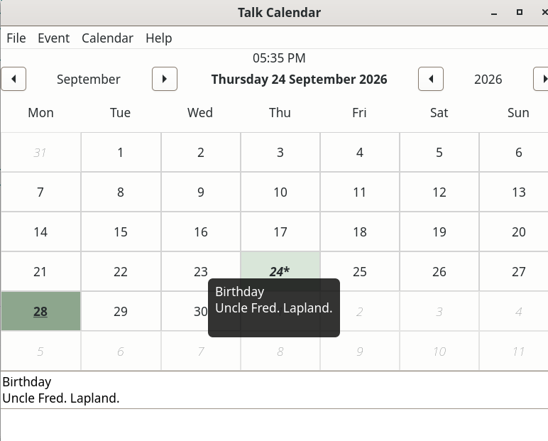
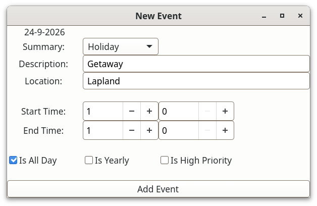
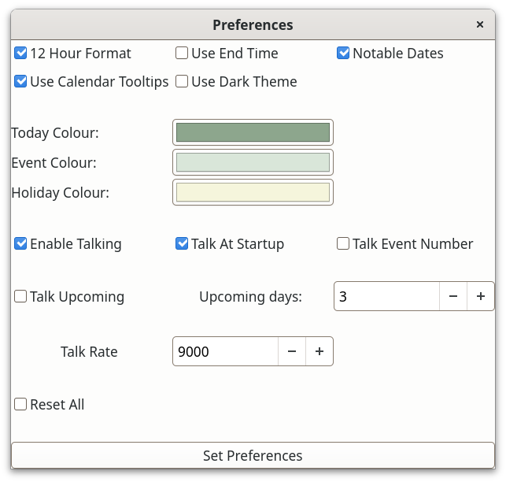
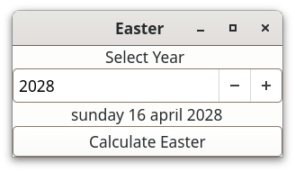
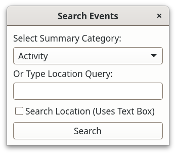
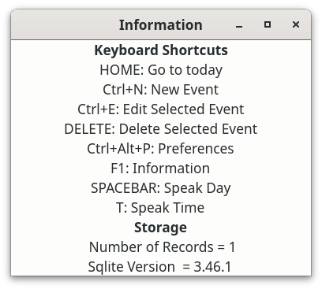
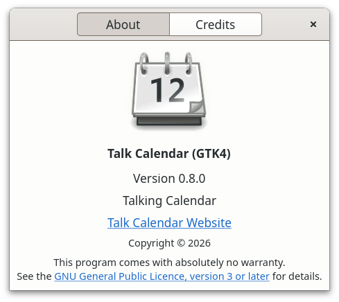

# Talk Calendar

Talk Calendar is a personal desktop calendar for Linux which has some speech capability for reading out dates, event summary words and event times.

Talk Calendar has been developed using C and [GTK4](https://docs.gtk.org/gtk4/) for GTK desktops (GNOME, Ubuntu Desktop, XFCE, Cinnamon etc.). 

A screenshot of Talk Calendar is shown below.  



## Core Features

* built with C and GTK4 for GNOME and Ubuntu desktops
* month-view calendar
* export and import iCalendar files (backup and restore)
* calendar tools such as calculate Easter and search for events
* built-in speech synthesizer
* Sqlite3 database used to store events

## Install

A pre-built executable binary of the latest version of Talk Calendar for x86 Debian Trixie GNOME  and Ubuntu desktops is available and can be downloaded from the binary directory. This have been built and tested using Debian Trixie with the [GNOME](https://www.gnome.org/) desktop. Once downloaded and unzipped make sure that Talk Calendar has executable permissions before running. To change permissions and run Talk Calendar from the terminal use the commands below.
```
chmod +x talkcalendar
./talkcalendar
```

## Manually Install Using Desktop File

To install Talk Calendar locally copy the  "org.gtk.talkcalendar.desktop" file into in the ***~/.local/share/applications/***  directory. If the applications directory does not exist create it. You will need to modify the desktop file so that it uses your user name and the directory where you install local programs (in this case it is assumed to be /home/your_user_name/Software).

A desktop file has a .desktop extension and provides metadata about an application such as its name, icon, command to execute and other properties. The "org.gtk.talkcalendar.desktop" file is shown below. You need to modify this by using your own user name and directory locations. The Exec variable defines the command to execute when launching an application, in this case, the "talkcalendar" binary executable. The Icon variable specifies the path to the icon file associated with the application. The Path variable specifies that Talk Calendar should use this directory as its working directory and so is where the calendar database is stored. In a .desktop file, you need to use absolute and full paths.


```
[Desktop Entry]
Version=0.8.1
Type=Application
Name=Talk Calendar
Comment=Talking calendar
Icon=/home/your_user_name/Software/talkcalendar/calendar.png
Exec=/home/your_user_name/Software/talkcalendar/talkcalendar
Path=/home/your_user_name/Software/talkcalendar
X-GNOME-UsesNotifications=true
Categories=Office;
MimeType=text/calendar;
StartupNotify=true
Name[en_GB]=TalkCalendar
```

Modify the desktop file so that it uses your user name and the directory where you install local programs (in this case it is assumed to be /home/your_user_name/Software).

Copy your modified  "org.gtk.talkcalendar.desktop" file to ***~/.local/share/applications/***. To do this you can use your graphical file manager or the terminal command below.

```
cp org.gtk.talkcalendar.desktop /home/your_user_name/.local/share/applications
```

Again change "your_user_name" to your user name. Note that ***.local*** is a hidden directory and you need to tick the "Show Hidden Files" option in the file explorer to display it.

You can now run Talk Calendar Calendar from the system menu. It is located in the "Office Category". 


## Calendar Interface

Talk Calendar uses a month view calendar with a bottom panel to display day events when a day is selected. To create a new event select a day on the calendar and select the "new event" menu item or press Ctrl+N. To edit an event, select it in day view panel and then select the "edit event" menu item or press Ctrl+E. Likewise to delete an event select it in the day view panel and use the "delete event" menu item or the DELETE key. 

Use the File->Export menu item to export a calendar as an iCalendar file for backup purposes. These typically use the file extension ".ical" or ".ics". The [iCalendar standard](https://icalendar.org/) is an open standard for exchanging calendar and scheduling information between users and computers.  An icalendar file is a plain text file and so can be viewed and modified using a standard text editor. 

Pressing F1 invokes the information window which can also be selected from the menu using the Help->Information menu item. The information window shows the keyboard shortcuts, how many records are in the calendar database and the Sqlite version being used on the system. The About dialog displays the Talk Calendar version number.

Press the spacebar to speak events for the selected day. Press the T-key to speak the current time. Some Talk Calendar screenshot are shown below.

### New Event


### Preferences


### Calculate Easter


### Search


### Information (F1)


### About


### Events Database

Events are stored in an [Sqlite](https://www.sqlite.org/index.html) database. SQLite is a small, fast and full-featured SQL database engine written in C. 

### Export and Import iCalendar Files

Talk Calendar allows a personal calendar to be exported as an iCalendar file. These typically use the file extension ".ical" or ".ics". The [iCalendar standard](https://icalendar.org/) is an open standard for exchanging calendar and scheduling information between users and computers.  An icalendar file is a plain text file and so can be modified using a standard text editor. 

You should backup your events by using the File->Export menu item which by default will create an "talkcalendar.ical" file but the name can be changed. A file chooser dialog is used to allow the file to be located in a chosen directory

### Recurring Events

The only recurring event type that is currently supported by Talk Calendar is yearly. This is required for events such as birthdays and anniversaries. The parser uses icalendar [RRULE](https://icalendar.org/iCalendar-RFC-5545/3-8-5-3-recurrence-rule.html) to determine if an event is yearly (e.g. birthday).

## Updating

To update from a previous version of Talk Calendar export the current calendar to an ical file and then import it into the new version of Talk Calendar. Always keep a backup copy of the Talk Calendar database called talkcalendar.db.

## Speech Synthesis

Talk Calendar uses it own internal speech synthesizer engine. The diphone speech synthesizer has been replaced with my original word concatenation speech engine coded using word voice recordings. However, my diphone speech engine  can still be found found [here](https://github.com/crispinprojects/speak).

### Building on Debian 13 and Ubuntu 24.04 (x86 Hardware)

To build Talk Calendar from source you need the gcc compiler, GTK4, GLIB, and SQLITE development libraries. You need to install the following packages.

Talk Calendar has been developed using Debian Trixie and tested with the GNOME (Wayland backend) and XFCE (X11 backend).

```
sudo apt update
sudo apt install build-essential
sudo apt install libgtk-4-dev
sudo apt install libasound2-dev
sudo apt install sqlite3
sudo apt install libsqlite3-dev
```

To check the installed Sqlite 3 version use the command below.

```
sqlite3 --version
```

To determine which version of GTK4 is running on a Ubuntu/Debian system use the following terminal command.

```
gtk4-launch --version
```
or
```
dpkg -l | grep libgtk*
```
Use the MAKEFILE to compile Talk Calendar. Just run "make" inside the source code folder.

```
make
```

To run Talk Calendar from the terminal use

```
./talkcalendar
```

### Building on Fedora

With Fedora you need to install the following packages to compile Talk Calendar.

```
sudo dnf install gcc make
sudo dnf install gtk4-devel
sudo dnf install gtk4-devel-docs
sudo dnf install glib-devel
sudo dnf install alsa-lib-devel
sudo dnf install sqlite-devel
```

To check the installed Sqlite 3 version use the command below.

```
sqlite3 --version
```

To determine which version of GTK4 is running on a Ubuntu/Debian system use the following terminal command.

```
gtk4-launch --version
```
or

```
dnf list gtk4-devel
```

## Autostart Talk Calendar

To make Talk Calendar run when you start a new desktop session create a "org.gtk.talkcalendar.desktop" file as shown below and copy it to the  ***~/.config/autostart/*** hidden directory. Where it says "your_user_name" replace this with you login name.

```
[Desktop Entry]
Version=0.8.1
Type=Application
Name=Talk Calendar
Comment=Talking calendar
Icon=/home/your_user_name/Software/talkcalendar/calendar.png
Exec=sh -c "sleep 1 && cd /home/your_user_name/Software/talkcalendar && ./talkcalendar"
X-GNOME-UsesNotifications=true
Categories=Office;
MimeType=text/calendar;
StartupNotify=true
Name[en_GB]=TalkCalendar
```

Notice that this script bypasses the Path= key at startup with the Exec= line explicitly forcing the  Talk Calendar application to change to its proper working directory before launching. I found this to be particularly important when using the XFCE desktop environment due to the  inconsistent handling of the PATH = key. The sleep command inside your Exec line is used to create a short delay at startup. This gives the desktop components, audio drivers, and notification services plenty of time to fully load. The  && in the Exec line ensures the next command only runs after the sleep timer successfully finishes.

### Valgrind Testing

Valgrind is a tool that monitors RAM bytes that a program such as Talk Calendar requests from the CPU. It is used to test for memory leaks. I use the following command to test Talk Calendar for memory leaks.

```
valgrind --leak-check=full --show-leak-kinds=definite,indirect --track-origins=yes ./talkcalendar
```
Most of the memory leaks that I have found relate to handling strings and I have been cleaning up the code using GString and g_string_free. Using GString and g_string_free is more convenient than using char* and g_free in GTK4 because GString automatically handles memory growth and length tracking, reducing manual buffer management errors. GString provides helper functions for appending, formatting, and manipulating strings safely.

The most important line in the Valgrind memory leak summary is the "Definitely Lost" line. This means a pointer was completely overwritten or dropped, leaving memory stranded. I have managed to get Talk Calendar below 50 blocks. Research indicates that an  application built on a massive framework like GTK4, below 50  blocks is very good. The 50 blocks or so represents the underlying operating system libraries (Fontconfig loading system fonts, Pango building text metrics, and Wayland setting up the display pipeline) allocating their initial startup parameters. These never grow and so do not  hurt performance and they are automatically cleared by Linux when Talk Calendar closes.

I have also performed some stress tests to check for dangerous cumulative leaks which are leaks which continue to grow endlessly without bounds. For example, clicking around on the Calendar and recording the Valgrind memory leak summary and then comparing this to the baseline captured by running Talk Calendar and closing immediately. Talk Calendar hits a flat limit (approximately 64 blocks) when performing a seven day calendar click stress test which suggests that the core program memory management is mostly leak-proof. The same happens when I perform search stress test. Typically with applications with memory leaks the stress test block count would climb into the hundreds or thousands or even more.

Valgrind reports some leaks from libraries associated with GTK4 (libfontconfig, libpangocairo-1.0, libpango-1.0, libgobject-2.0 etc.) which I do not fully understand at the moment.  When you see a Valgrind trace that terminates deep inside internal system libraries (like libfontconfig.so or libpango-1.0.so), it is showing internal, global font rendering and text caching tables allocated by the desktop framework layer. When GTK4 queries the Debian system font configurations or measures a text label widget layout (pango_layout_get_size), it builds a shared look-up layout table. These tables are kept alive on the heap intentionally for the entire lifetime of the running session so that the text updates remain lightning-fast. The system framework intentionally relies on the Linux OS kernel to clean up and free these static runtime blocks automatically when the Talk Calendar  program terminates. I believe they are a harmless framework overhead which can be disregarded.

## Aside: GNOME Desktop Extensions (Creating Traditional Desktop Interface)

GNOME extensions can be used to create a traditional desktop interface. Dash to Panel is an extension for the GNOME desktop environment that creates a taskbar similar to that found in other desktops. App Menu is an extension that displays a list of applications available for the user to launch. It organises applications into categorises.

You need to install the GNOME extension manager using the software centre and then search for and install the "Dash to Panel" and "App Menu" extensions.

The App Menu extension needs the gir1.2-gmenu package installed which is used for creating menus.

```
sudo apt install gir1.2-gmenu-3.0
suso apt install gnome-menus
```
The gir1.2-gmenu  package provides GObject introspection data for the GNOME menu library, which is part of the GNOME implementation of the freedesktop menu specification. It is used by applications to interact with the desktop menu system in GNOME environments.

## Versioning

[SemVer](http://semver.org/) is used for versioning. The version number has the form 0.0.0 representing major, minor and bug fix changes.

## Author

* **Alan Crispin** [Github](https://github.com/crispinprojects)

## Project Status

Active and under development.

## Acknowledgements

* [GTK](https://www.gtk.org/)

* GTK is a free and open-source project maintained by GNOME and an active community of contributors. GTK is released under the terms of the [GNU Lesser General Public License version 2.1](https://www.gnu.org/licenses/old-licenses/lgpl-2.1.html).

* [GTK4 API](https://docs.gtk.org/gtk4/index.html)

* [GObject API](https://docs.gtk.org/gobject/index.html)

* [Glib API](https://docs.gtk.org/glib/index.html)

* [Gio API](https://docs.gtk.org/gio/index.html)

* [Geany](https://www.geany.org/) is a lightweight source-code editor (version 2 now uses GTK3). [GPL v2 license](https://www.gnu.org/licenses/old-licenses/gpl-2.0.txt)

* [Sqlite](https://www.sqlite.org/index.html) is open source and in the [public domain](https://www.sqlite.org/copyright.html).

* [My Diphone Speech Engine](https://github.com/crispinprojects/speak)

* [GNOME](https://www.gnome.org/)

* [XFCE](https://xfce.org/)

* [Debian](https://www.debian.org/)

* [Ubuntu](https://ubuntu.com/download/desktop)

* [Fedora](https://fedoraproject.org/)
