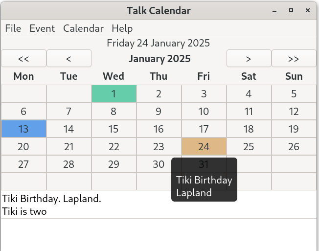
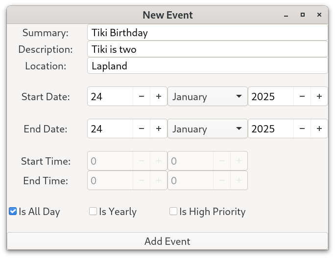

# Talk Calendar

Talk Calendar is a personal desktop calendar for Linux which has some speech capability using a built-in (text-to-speech) diphone speech synthesizer. It can read out current day events and upcoming events (if required) at start up.

It has been developed using C and [GTK4](https://docs.gtk.org/gtk4/). A screenshot is shown below.



## Core Features

* built with C and GTK4 for GTK based desktops
* month view calendar 
* event details, location, start and end time can be entered and edited
* multiday events supported
* export and import iCalendar files (backup and restore)
* Sqlite3 database used to store events
* built-in diphone speech synthesizer

### Local Install Using Prebuilt Binary

A 64-bit prebuilt binary for the latest version of Talk Calendar is available and can be downloaded from the binary directory. This has been built using GTK 4.16 and compiled using Fedora 41. 

Extract the downloaded file which contains the Talk Calendar executable. Assuming that the GTK4 base libraries are installed the Talk Calendar binary can be run from the terminal using:

```
./talkcalendar
```

or double click on the "talkcalendar" file. Talk Calendar must have executable permissions to execute. Right click it and choose Properties->Permissions and tick allow "Executable as Program".

To add Talk Calendar to the system menu modify the Talk Calendar desktop file provided in the download. A desktop file has a .desktop extension and provides metadata about an application such as its name, icon, command to execute and other properties. For user-specific applications desktop files can be located locally in the ***~/.local/share/applications/*** directory. Local user entries take precedence over system entries. For the GNOME desktop, the desktop file should be named using the [application ID](https://developer.gnome.org/documentation/tutorials/application-id.html), that is <application_id>.desktop, which in this case is "org.gtk.talkcalendar.desktop" 

You need to modify the "org.gtk.talkcalendar.desktop" file using your own user name and directory locations. For example, if your user name is "tiki" and you install local applications in a folder called "Software" and you create a folder called "talkcalendar " to store the Talk Calendar binary executable then the executable path would be "Exec=/home/tiki/Software/talkcalendar/talkcalendar". The Exec variable defines the command to execute when launching an application, in this case, the talkcalendar binary executable. The Path variable tells the system where to look for the executable and the calendar database. The Icon variable specifies the path to the icon file associated with the application. In a .desktop file, you need to use absolute and full paths.

Copy the "org.gtk.talkcalendar.desktop" file to the ***~/.local/share/applications/*** directory. Create the ~/.local/share/applications/ directory if it does not already exist. This way of locally installing Talk Calendar should be universal across different Linux distributions.

## Calendar Usage

If you have used a calendar app before then using Talk Calendar will be straight forward. 

### Adding New Event

* Click on the new event button in the header bar or press Ctrl+n to invoke the "New Event" window
* Enter the event summary (e.g. birthday)
* Enter description 
* Enter the location
* Set the start date day month year values 
* Enter start and end times (or tick the all day check box)
* Events are sorted by start time when displayed

A screenshot of the new event dialog is shown below.



### Display and Speak Events

* Select a date having events and press the spacebar to speak them (assuming talk preferences selected).

* The day events listview allows individual events to be selected so that they can be edited or deleted.

### Searching For Events

* Select "Event->Search from the menu.
* Enter a search term or location.

### Preferences

* Select Calendar->Preferences from the menu or use Ctrl+Alt+p to invoke the preferences window (see screenshot below).
* Change options as required.


### Information

* Select "Information"  from the help menu or press F1

* the information window shows the keyboard shoutcuts, how many records are in the database, the Sqlite version being used on the system, the desktop font and scale factor.

* Use the About dialog to display current version.

## Startup Applications

With GNOME based desktops you can use the GNOME "Tweak Tool" to add Talk Calendar to your startup applications. Talk Calendar will then read out the current date and days events and any future upcoming events (see preferences settings) when the computer is switched on.

### Events Database

Events are stored in an [Sqlite](https://www.sqlite.org/index.html) database. SQLite is a small, fast and full-featured SQL database engine written in C. 

### Export and Import iCalendar Files

Talk Calendar allows a personal calendar to be exported as an iCalendar file. These typically use the file extension ".ical" or ".ics". The [iCalendar standard](https://icalendar.org/) is an open standard for exchanging calendar and scheduling information between users and computers.  An icalendar file is a plain text file and so can be modified using a standard text editor. 

The export to icalendar file does not currently support time zones and so the DTSTART and DTEND properties contain dates with local time and have no reference to a time zone. For example, the following represents an event starting on January, 1st, 2024 at 11.30am and ending at 2pm.

```
DTSTART:20240101T113000
DTEND:20240101T140000
```

A file chooser dialog is used to allow the save directory location to be chosen by the user as shown below.

The icalendar import parser allows the date and local time to be imported and checks if a time zone has been specified using the [TZID](https://icalendar.org/iCalendar-RFC-5545/3-2-19-time-zone-identifier.html) property. A file chooser dialog is used to allow the file to be chosen by the user as shown below. File filters can be used.

The parser will be updated with new features in future releases.

### Recurring Events

The only recurring event type that is currently supported by Talk Calendar is yearly. This is required for events such as birthdays and anniversaries. The parser uses icalendar [RRULE](https://icalendar.org/iCalendar-RFC-5545/3-8-5-3-recurrence-rule.html) to determine if an event is yearly (e.g. birthday).

## Build From Source

The C source code for the Talk Calendar application is provided in the src directory. Fedora 41 has been used to compile the project. Fedora 41 uses GTK 4.16 but I have successfully compiled the project with GTK 4.14.

[Geany](https://www.geany.org/) can be used as a source code editor for opening, viewing and then compiling the Talk Calendar C code. Geany is lightweight and has an integrated terminal for building the application.

To build Talk Calendar from source you need the gcc compiler, GTK4, GLIB, SQLITE and libnotify development libraries. 

### Building on Fedora 40

With Fedora you need to install the following packages to compile Talk Calendar.

```
sudo dnf install gcc make
sudo dnf install gtk4-devel
sudo dnf install gtk4-devel-docs
sudo dnf install glib-devel
sudo dnf install alsa-lib-devel
sudo dnf install sqlite-devel
```

To check the installed Sqlite 3 version use the command below.

```
sqlite3 --version
```

To check the installed version of the GTK4 development libraries use the command below.

```
dnf list gtk4-devel
```

Use the MAKEFILE to compile. 

```
make
```

To run Talk Calendar from the terminal use

```
./talkcalendar
```

### Building on Ubuntu 24.04 LTS

With Ubuntu and you need to install the following packages to compile Talk Calendar.

```
sudo apt install build-essential
sudo apt install libgtk-4-dev
sudo apt install libasound2-dev
sudo apt install sqlite3
sudo apt install libsqlite3-dev
```

The packages:

```
apt install libglib2.0-dev
apt install alsa-utils
```

are needed but should be installed by default. 

You may need to use the [Ubuntu snap store](https://snapcraft.io/) to install things like Geany.

### Building on Debian 12 Bookworm

Debian 12 Bookworm uses GTK4.8. The Talk Calendar source code was orignally developed using GKT4.14 (Fedora 40) and recently GTK4.16 (Fedora 41) and so will not compile with GTK 4.8 without making a number of changes. These include downgrading "gtk_css_provider_load_from_string" with "gtk_css_provider_load_from_data" as the function gtk_css_provider_load_from_data was depreciated in GTK 4.12. A bigger change is that the GtkFileDialog API is no longer signal based. With GTK4.12 and above it is callback based which should match a GAsyncReadyCallback function (async/await). 

Debian testing (Trixie) will be the next stable Debian distribution. According to the [Debian GTK4 tracker](https://tracker.debian.org/pkg/gtk4) Trixie currently has GTK4.16 in its repositories. Now that Trixie is heading towards Alpha and I will explore compiling Talk Calendar with Trixie.

To determine which version of GTK4 is running on a Debian system use the following terminal command.

```
dpkg -l | grep libgtk*
```

## Speech Synthesis

I spend some time investigating how speech synthesis could be incorporated into the calendar application. The [eSpeak](https://espeak.sourceforge.net/) open source speech synthesizer is widely available in most Linux distributions and so I looked into separately installing eSpeak so that commands could be send to it for speech output.  However, I discovered a potential eSpeak license compatibility issue in that some of its components may not be compatible with the GTK LGPL v2.1 license. For example, the IEEE80.c file [license](https://github.com/espeak-ng/espeak-ng/blob/c1d9341f86eee4b7a0da50712b627d8a76e92fea/src/libespeak-ng/ieee80.c) says "Copyright (C) 1989-1991 Apple Computer, Inc." which is very strange given that espeak has a GPL v3 [license](https://espeak.sourceforge.net/license.html). This is discussed further in the forum post [here](https://opensource.stackexchange.com/questions/11545/possibilities-to-use-a-gpl-v3-licensed-library-in-a-closed-source-game). Consequently, I decided not to use eSpeak.

Many open source (e.g. eSpeak) and commercial speech synthesizers use the formant speech synthesis approach. I looked into developing a small formant speech synthesizer the details of which can be found [here](https://github.com/crispinprojects/formant-synthesizer). The sound quality is very robotic with buzzing and humming background noise and so I have not used this.

I then developed a diphone speech synthesizer the details of which can be found [here](https://github.com/crispinprojects/talkdp). I have further developed this approach and Talk Calendar uses a built-in diphone speech synthesizer. 

### Diphone Speech Synthesis

Words are formed as sequences of elementary speech units. A phoneme is the smallest unit of sound that distinguishes one word from another word and there are 44 phonemes in the English language. A diphone is a sound unit composed of two adjacent partial phonemes i.e. the second half of the first phoneme and the first half of the second phoneme. The synthesizer uses a set of pre-recorded diphone sound samples and concatenates these to produce speech output for a given text input.

This voice used by Talk Calendar is derivative work based on the diphone collection created by Alan W Black and Kevin Lenzo which is free for use for any purpose (commercial or otherwise) and subject to the pretty light restrictions [detailed here](https://github.com/hypnaceae/DiphoneSynth/blob/master/diphones_license.txt). I have used the same licence for the voice that I have created. There is information about recording your own diphones [here](http://festvox.org/bsv/x2401.html) and in the speech synthesis lecture by Professor Alan W Black [here](https://www.youtube.com/watch?v=eDjtEsOvouM&t=1459s).

My diphone speech synthesizer has a number of limitations. Firstly, it uses a small dictionary of approximately 56,600 English words. If a word is not recognised by the dictionary it is skipped over. I have tried to prioritise words which would be used in an event description (e.g. birthday, anniversary, holiday, booking etc.). Secondly it does not support the use of apostrophes and other special characters. This means that you can use "Tiki Birthday" but not "Tiki's Birthday" in the event summary.  The pronunciation of some words is poor as there is very little information online on how to convert words to a diphone list (in many cases I have taken an educated guess). More work is needed on the diphone speech synthesizer but it works and it is all coded from scratch using GTK4. It is more versatile than my previous speech synthesizer which was based on concatenating and playing back pre-recorded English words.

## Versioning

[SemVer](http://semver.org/) is used for versioning. The version number has the form 0.0.0 representing major, minor and bug fix changes.

## Author

* **Alan Crispin** [Github](https://github.com/crispinprojects)

## Project Status

Active and under development.

## License

GTK is released under the terms of the [GNU Lesser General Public License version 2.1](https://www.gnu.org/licenses/old-licenses/lgpl-2.1.html). Consequenty, Talk Calendar is licensed under the same LGPL v2.1 license.

## Acknowledgements

* [GTK](https://www.gtk.org/)

* GTK is a free and open-source project maintained by GNOME and an active community of contributors. GTK is released under the terms of the [GNU Lesser General Public License version 2.1](https://www.gnu.org/licenses/old-licenses/lgpl-2.1.html).

* [GTK4 API](https://docs.gtk.org/gtk4/index.html)

* [GObject API](https://docs.gtk.org/gobject/index.html)

* [Glib API](https://docs.gtk.org/glib/index.html)

* [Gio API](https://docs.gtk.org/gio/index.html)

* [Geany](https://www.geany.org/) is a lightweight source-code editor (version 2 now uses GTK3). [GPL v2 license](https://www.gnu.org/licenses/old-licenses/gpl-2.0.txt)

* [Sqlite](https://www.sqlite.org/index.html) is open source and in the [public domain](https://www.sqlite.org/copyright.html).

* [Diphone License](https://github.com/hypnaceae/DiphoneSynth/blob/master/diphones_license.txt)

* Diphone collection and synthesis Alan W. Black and Kevin Lenzo [2000](https://www.cs.cmu.edu/~awb/papers/ICSLP2000_diphone.pdf)

* [Fedora](https://fedoraproject.org/)

* [Ubuntu](https://ubuntu.com/download/desktop)

* [Debian](https://www.debian.org/)
